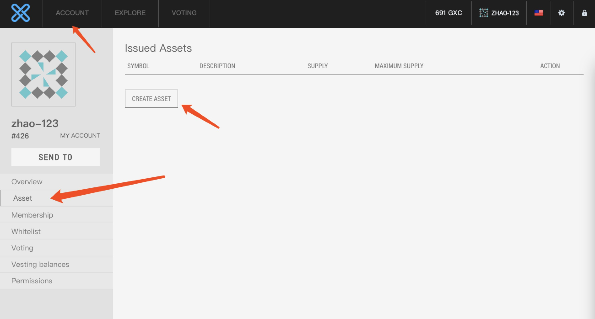
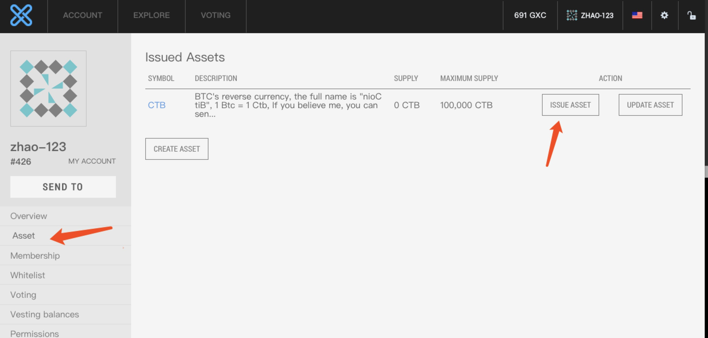
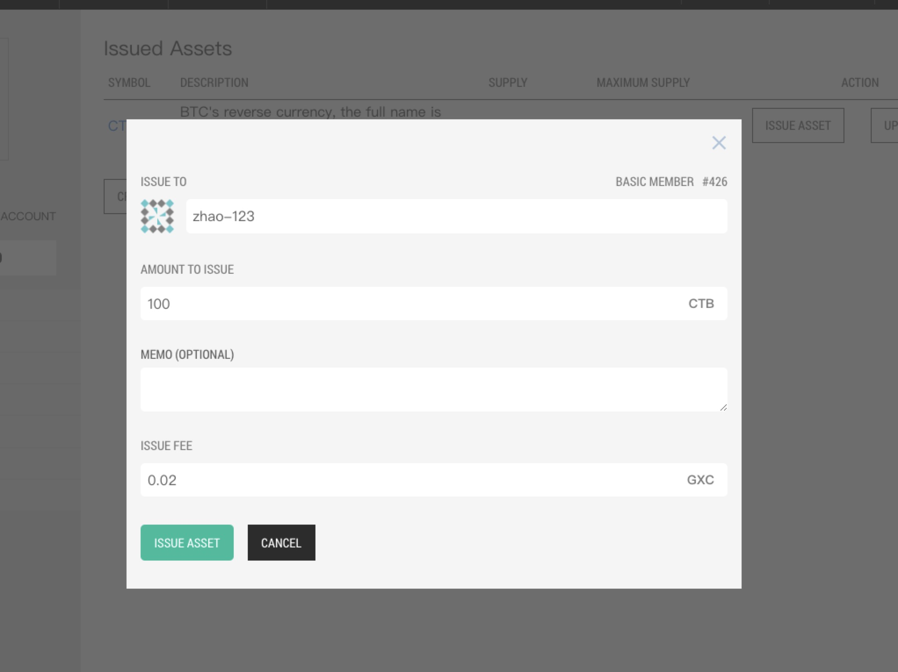

# How to create and issue new asset

## 1. Create an asset

- Open [Online Wallet](https://wallet.gxb.io)
- Import your account




After completing the form, click "create assets", the confirmation page will pop up, and click "send confirmation" to complete the creation of assets.

Different lengths of assets require different burning fees (before creating an asset, you want to send enough GXS to the account):

```
3 charactors 1000 GXS
4 charactors 800 GXS
5 charactors 500 GXS
```

## 2. Issue asset

After the creation of the asset, you need to issue the asset




## 3. Considerations and best practices

**1) Send a specific amount to the foundation account under the current market share**

**2) The assets are distributed and used uniformly by the foundation account**

**3) Avoid direct issuance to non-foundation accounts**
