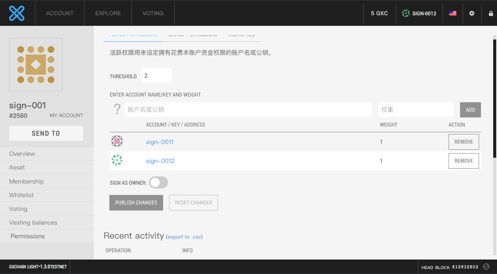
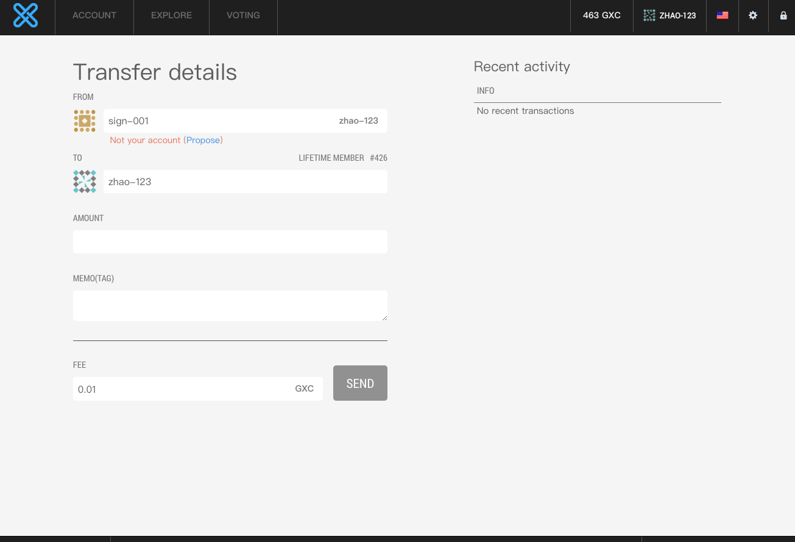
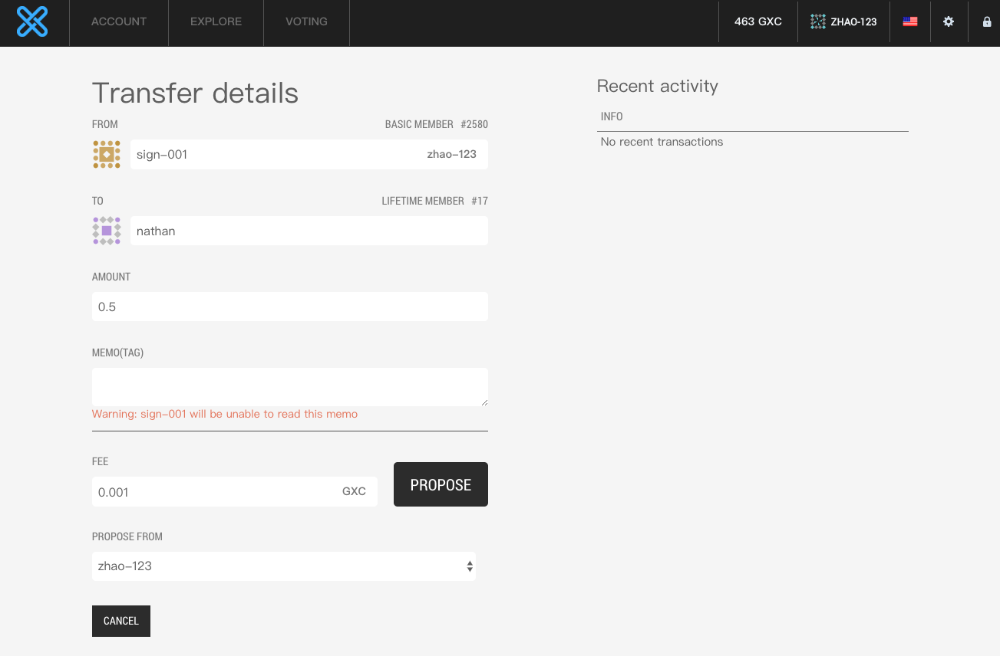
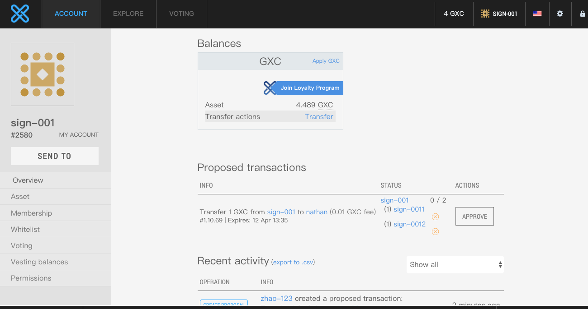
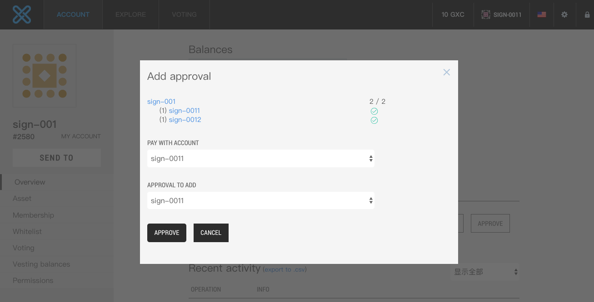
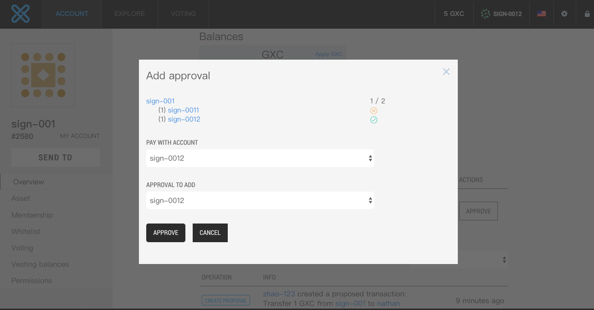
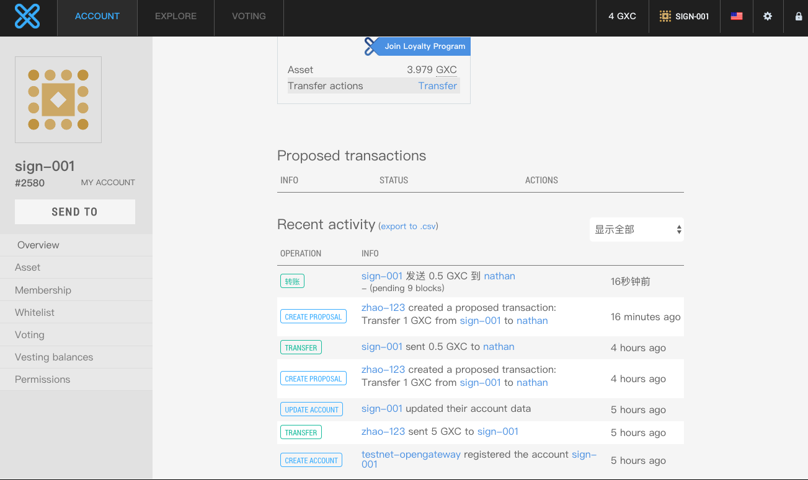

# Multi-signature tutorial

GXChain supports multiple signatures, this tutorial explains how to use multi-signature transfer on GXChain

## Set up a multi-signed account

Use the web wallet to create an account, and open the web wallet permission page, add a sub-account to control the assets of the account, and update the account information.

The threshold value represents the sum of the weights required to control the funds of the account. Assuming the threshold is 2, the account assets can be controlled as long as the sum of any weights is added to the sub-account exceeding the threshold.

Create a `sign-001` account here and send the permissions to the two sub-accounts `sign-0011` and `sign-0012`, and import the two sub-accounts into different wallets. The weights of the two sub-accounts are respectively 1. A threshold of 2 means that only the two accounts agree, and the funds in the `sign-001` account can be transferred out.

## Initiate a transfer through a proposal

To control the assets of a multi-signed account, it is necessary to obtain the consent of multiple sub-accounts whose sum of weights is not lower than the threshold. We can initiate a transfer using the method of initiating a transfer and getting approval from the sub-account. First, we first use any account to initiate a proposal transaction. The transfer party of the transaction is the multi-sign account `sign-001`.

On the transfer page, set the transfer account to `sign-001`. If there is no permission for the account, you will be prompted (proposal) and click "Proposal" to initiate the proposal transaction.

Click on the offer to initiate a proposal transaction

At this point, on the `sign-001` account page, a proposal to be approved will be displayed, as shown below:

## Multi-sign account approval proposal

We use the `sign-0011` and `sign-0012` accounts to agree to the proposal to control the transfer of assets.

Approve the proposal under the `sign-0011` account

Both accounts are approved and approved, and the transfer is initiated.

