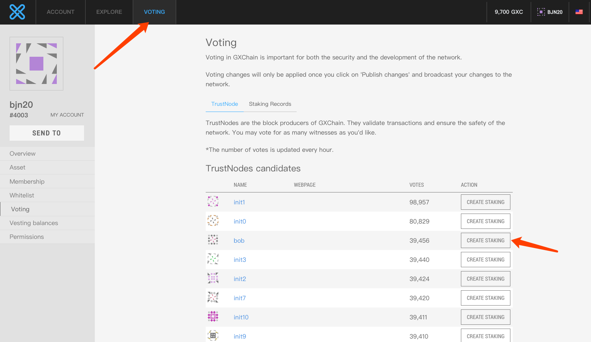
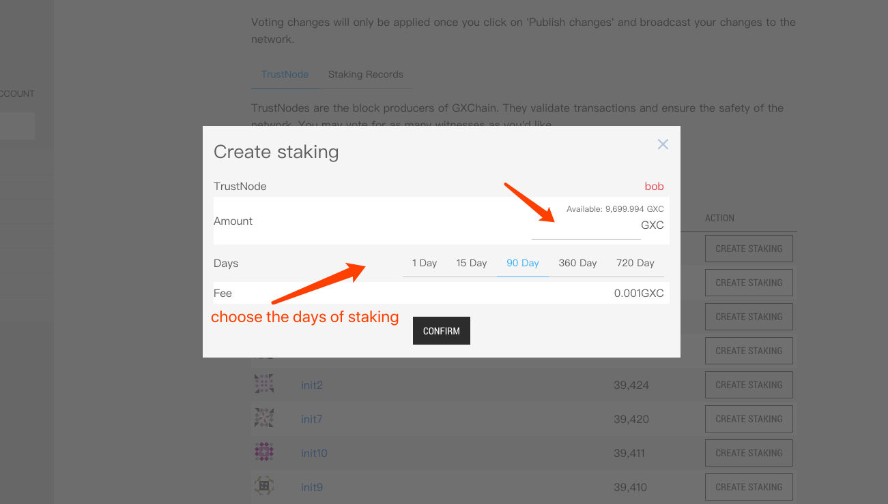
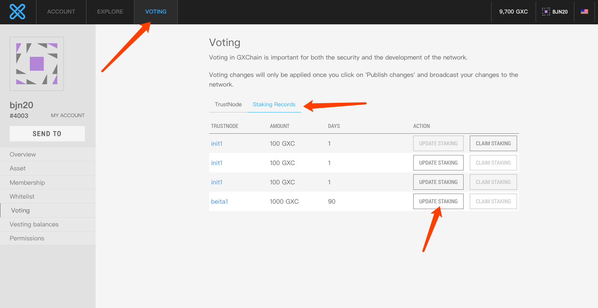
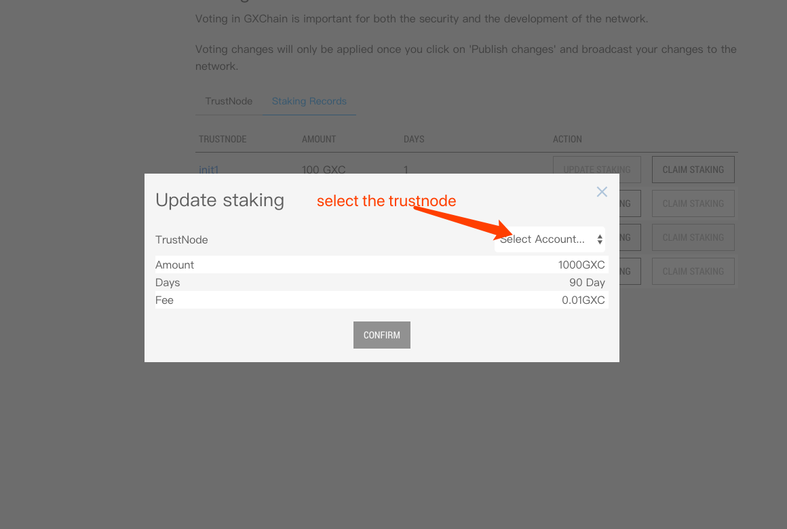
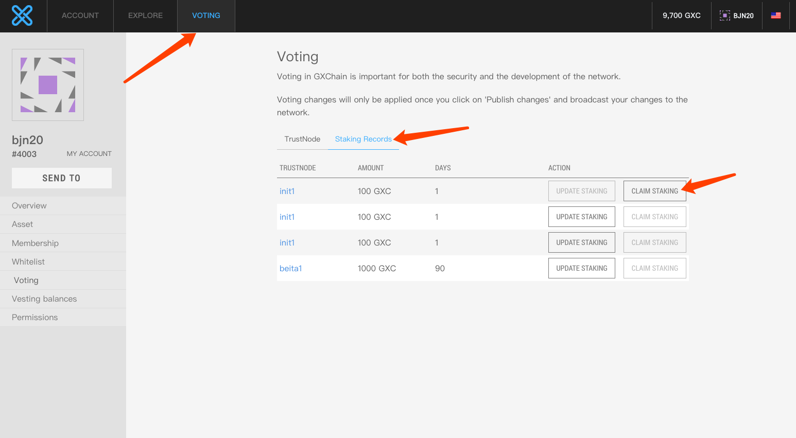
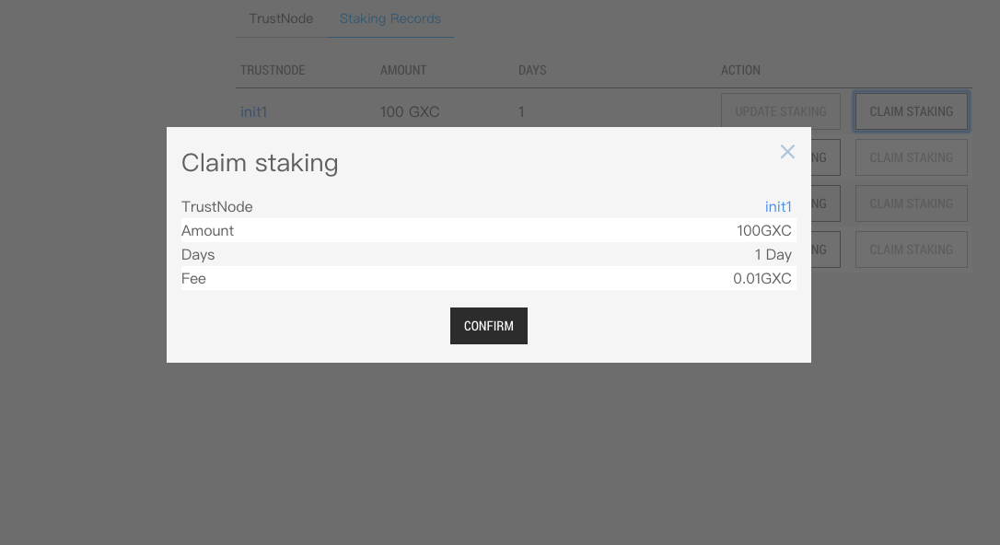
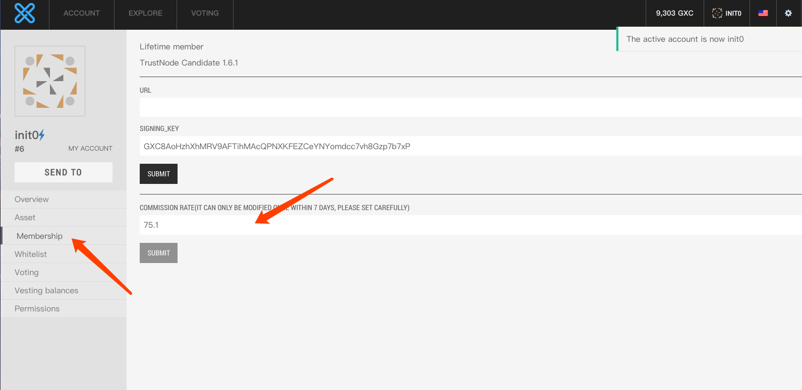
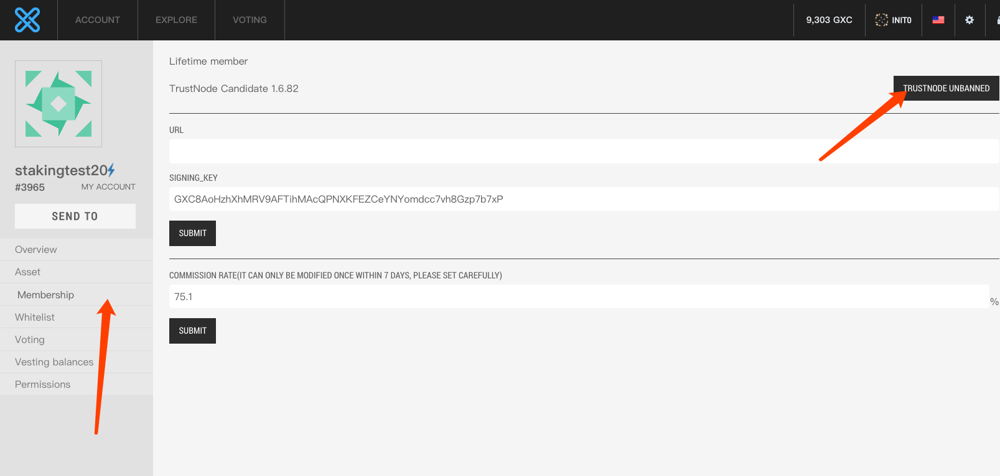
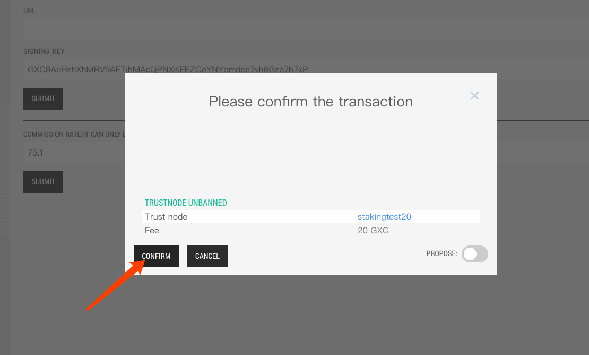

# How to vote by staking

This document briefly describes how to conduct staking voting operations through wallets, and the public trustnodes' operations on staking

## 1.Create staking vote
### 1.1 Use web wallet
Visit the [GXC Web wallet](https://wallet.gxb.io), import the private key and create a staking vote as shown below




An account can create up to 10 staking votes, if you want to create a new staking vote, you need to get back the previous vote

### 1.2 Use cli_wallet
Launch the latest`cli_wallet`
- [Cli_wallet Introduce](./cli_wallet.md)

Use the `cli_wallet` tool to create a staking vote , the specific command is as follows

#### staking\_create
**Interface：** `signed_transaction staking_create(account_id_type owner,
 asset amount, witness_id_type wit_id,string program_id,uint32_t weight,uint32_t days,bool broadcast = false)`

**Description：** Create a staking vote, each account can create a maximum of 10 staking votes, with a minimum of 1GXC staking each time with a precision of 100,000

**Parameter：**

Param | Type | Description
---|---|---
owner | account_id_type | owner
amount | asset | Asset type and quantity
wit_id | witness_id_type | trustnode
program_id | string | id of staking type
weight | uint32_t | weight of per vote
days | uint32_t | staking days
broadcast | bool | whether to broadcast

Now there are five types of voting on the testnet:
program_id | weight | days
---|---|---
1 | 1 | 90
2 | 2 | 360
3 | 4 | 720
4 | 1 | 15
5 | 1 | 1

Use `cli_wallet` to check
```bash
get_object 2.0.0
```

`program_id`,`weight`and `days` must be correspond one-to-one, otherwise no staking vote can be generated

**Example：**  
```bash 
unlocked >>> staking_create 1.2.4003 {"asset_id":1.3.1,"amount":10000000} 1.6.1 "5" 1 1 true
staking_create 1.2.4003 {"asset_id":1.3.1,"amount":10000000} 1.6.1 "5" 1 1 true
{
  "ref_block_num": 60329,
  "ref_block_prefix": 1685676398,
  "expiration": "2020-02-24T08:43:09",
  "operations": [[
      80,{
        "fee": {
          "amount": 100,
          "asset_id": "1.3.1"
        },
        "owner": "1.2.4003",
        "trust_node": "1.6.1",
        "amount": {
          "amount": 10000000,
          "asset_id": "1.3.1"
        },
        "program_id": "5",
        "weight": 1,
        "staking_days": 1,
        "extensions": []
      }
    ]
  ],
  "extensions": [],
  "signatures": [
    "1f1f862c111133bb8559448466457a1371b93fac2dd879641e8eeac585668ec0ab53302acce904bcf01f4282f7d86db1a309cec1c52b4899012b47fec925096c48"
  ]
}
```
Here, the account 1.2.4003 mortgaged 100GXC to the public trust node 1.6.1, the voting type was 5, the weight of each vote was 1, and the number of mortgage days was 1.

## 2.Uptade staking vote

### 2.1 Use web wallet



### 2.2 Use cli_wallet
Use the `cli_wallet tool` to update the vote objects, the specific command is as follows
#### staking\_update
**Interface：** `signed_transaction staking_update(account_id_type owner,staking_id_type stak_id,
witness_id_type wit_id,bool broadcast)`

**Description：** Update the existing staking which has not expired, and replace the trustnode

**Parameter：**

Param | Type | Description
---|---|---
owner | account_id_type | owner
stak_id | staking_id_type | the id of staking object 
wit_id | witness_id_type | the trustnode
broadcast | bool | whether to broadcast
**Example：**  
```bash 
unlocked >>> staking_update 1.2.4003 1.27.10135 1.6.2 true
staking_update 1.2.4003 1.27.10135 1.6.2 true
{
  "ref_block_num": 60677,
  "ref_block_prefix": 4124334596,
  "expiration": "2020-02-24T09:00:51",
  "operations": [[
      81,{
        "fee": {
          "amount": 100,
          "asset_id": "1.3.1"
        },
        "owner": "1.2.4003",
        "trust_node": "1.6.2",
        "staking_id": "1.27.10135",
        "extensions": []
      }
    ]
  ],
  "extensions": [],
  "signatures": [
    "2077cdda0c83a371a5f5179ea6d1a5a003c5b4a4eb88fb6fa9c7040b741cda7ece650d50c34187d2610a3ee62fcda20a0a1325ee931286484e91f3be9e8f53f5f6"
  ]
}
```
Here the staking voting object 1.27.10135 held by the 1.2.4003 account is updated from node 1.6.1 to node 1.6.2

## 3.Claim staking
### 3.1 Use web wallet


### 3.2 Use cli_wallet
Use the `cli_wallet` tool to claim the voting object. The specific command is as follows
#### staking\_claim
**Interface：** `signed_transaction staking_claim(account_id_type owner,staking_id_type stak_id,bool broadcast)`

**Description：** Retrieve existing and expired stakings

**Parameter：**

Parameter | Type | Description
---|---|---
owner | account_id_type | owner
stak_id | staking_id_type | the id of staking object
broadcast | bool | whether to broadcast


**Example：**  
```bash 
unlocked >>> staking_claim 1.2.22 1.27.63 true
staking_claim 1.2.22 1.27.63 true
{
  "ref_block_num": 61110,
  "ref_block_prefix": 2114490568,
  "expiration": "2020-02-24T09:22:48",
  "operations": [[
      82,{
        "fee": {
          "amount": 100,
          "asset_id": "1.3.1"
        },
        "owner": "1.2.22",
        "staking_id": "1.27.63",
        "extensions": []
      }
    ]
  ],
  "extensions": [],
  "signatures": [
    "1f78d527787651dbc77e27b94fd0c41449551899467ee110ded3fe8a04237d117413182a744778a8af45c8f8243ff5d4720a62bda2c1e721d3b12d11d5bd6e322f"
  ]
}
```
Here, the 1.27.63 of the mortgage voting object held by the 1.2.22 account is retrieved

## 4.Public trustnode set the commission of vote

### 4.1 Use web wallet

### 4.2 Use cli_wallet
Use the `cli_wallet`tool to set the commission. The specific command is as follows
#### witness_set_commission

**Interface：** `signed_transaction witness_set_commission(string witness_name,
uint32_t commission_rate,string fee_asset_symbol,bool broadcast)`

**Description：** public trustnode set the commission of vote

**Parameter：**

Parameter | Type | Description
---|---|---
witness_name | string | owner
commission_rate | uint32_t | commission rate
fee_asset_symbol | string | the asset of fee
broadcast | bool | whether to broadcast

The dividend ratio is [0,1000] ‰, and the time interval is 604800s, and the one-time fee is 20GXC

**Example：**  
```bash 
unlocked >>> witness_set_commission 1.6.1 751 GXC true
witness_set_commission 1.6.1 751 GXC true
{
  "ref_block_num": 61371,
  "ref_block_prefix": 3908095067,
  "expiration": "2020-02-24T09:36:00",
  "operations": [[
      83,{
        "fee": {
          "amount": 2000000,
          "asset_id": "1.3.1"
        },
        "witness": "1.6.1",
        "witness_account": "1.2.6",
        "commission_rate": 751,
        "extensions": []
      }
    ]
  ],
  "extensions": [],
  "signatures": [
    "200f64822acee6fecb610fbfdf7d348739497ce04a3e9a70f42c5a0ecc4ad0977f38a8391ea42fee2894eb9f1419188b19326a7fa981fafd873cbbf0c286388ff9"
  ]
}
```
Node 1.6.1 adjusted the rate to 751‰

## 5.Unban the node

### 5.1 Use web wallet



### 5.2 Use cli_wallet
Use the `cli_wallet` tool to remove the banned node. The specific command is as follows
#### witness_unbanned
**Interface：** `signed_transaction witness_unbanned(string witness_name,string fee_asset_symbol,bool broadcast)`

**Description：** remove the banned node

**Parameter：**

Parameter | Type | Description
---|---|---
witness_name | string | witness_name
fee_asset_symbol | string | fee_asset_symbol
broadcast | bool | whether to broadcast

A node in the block queue will be banned if it loses too many blocks within a period of time. Unlocking a node requires 20GXC 

**Example：**  
```bash 
unlocked >>> witness_unbanned stakingtest20 GXC true
witness_unbanned stakingtest20 GXC true
{
  "ref_block_num": 61738,
  "ref_block_prefix": 630819173,
  "expiration": "2020-02-24T09:54:39",
  "operations": [[
      84,{
        "fee": {
          "amount": 2000000,
          "asset_id": "1.3.1"
        },
        "witness": "1.6.82",
        "witness_account": "1.2.3965",
        "extensions": []
      }
    ]
  ],
  "extensions": [],
  "signatures": [
    "1f566a75da026321e47be96d2052533181bdcf75e52e4bdd4c35ec64444341a75c15bb4a4028dc1a540f03533c716fbf07a711a523621e9139acd463fb0aa8300c"
  ]
}
```


