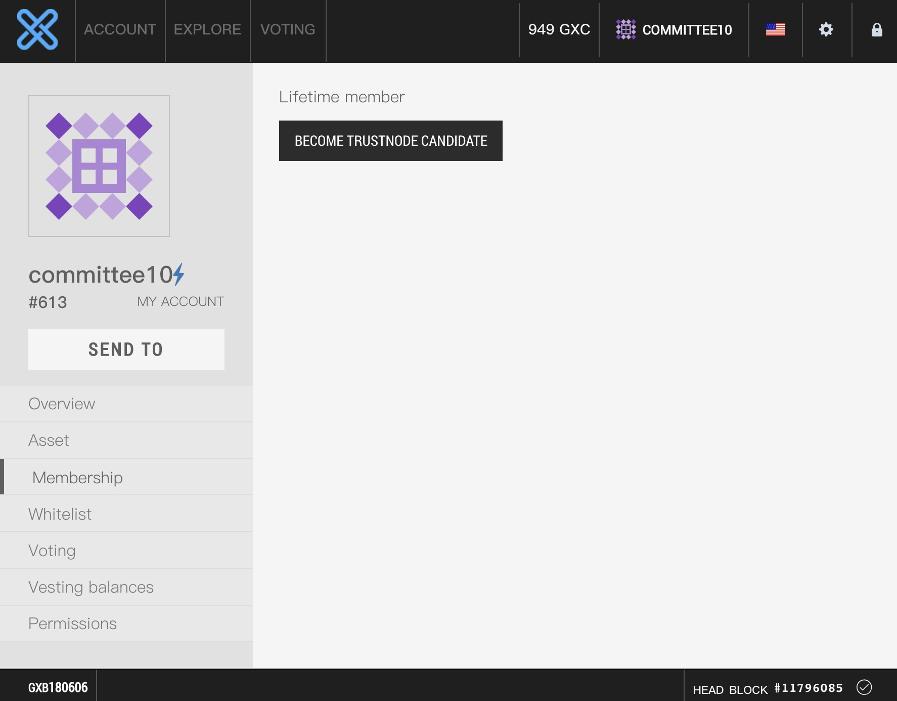
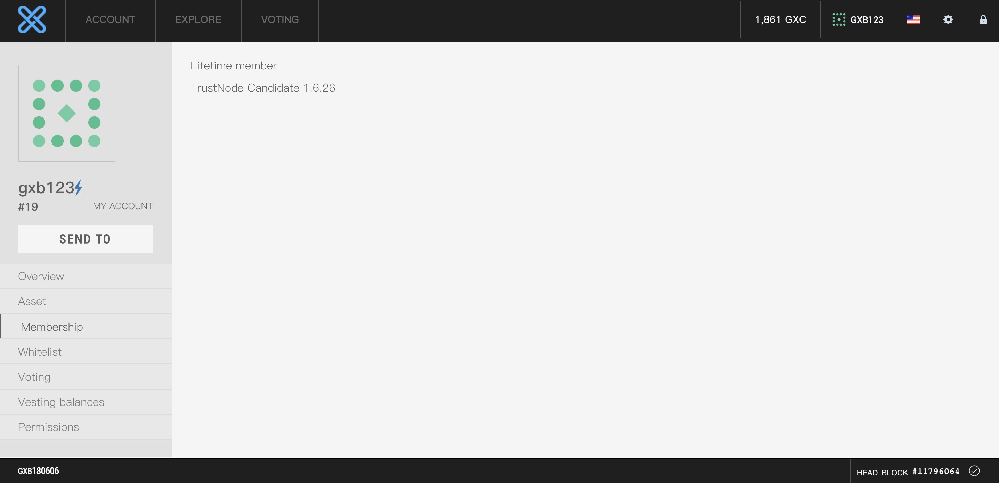
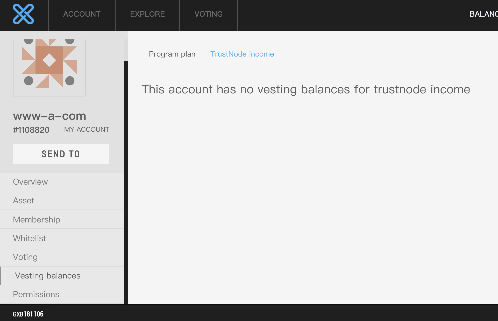

# How to become trustnode candidate

This document describes how to become a TrustNode in the GXChain network.

## Steps

1. Upgrade to trustnode candidate in online wallet
2. Run trustnode

### 1.Create TrustNode

#### Buy Lifetime Subscription
Download the latest version of light wallet，or visit[Online Wallet](https://wallet.gxb.io), following below steps to buy lifetime subscription。


#### Become TrustNode Candidate
Click on "Become TrustNode Candidate" to upgrade to a trustnode candidate in one key press.



::: warning
To create a TrustNode, you need to burn a broadcast fee of 1.5 GXC and mortgage 10,000 GXC. Please confirm that the account balance is greater than 10001.5 GXC.

After the TrustNode is created, check its witness_id. When starting the public node program, you need to bring this parameter.
:::


#### Find witness_id
Witness id is the id of TrustNode, after you become a TrustNode candidate, you can find your ``witness_id`` in the page.



::: warning
witness_id would be a parameter when you launch a witness_node
:::

### 2.Deployment
#### Recommended system configuration

- System: **Ubuntu 14.04 64-bit**, **4.4.0-63-generic**
- Memory: 32 GB+
- Disk: 200 GB+

::: warning Dependency

* install ntp
``` bash
sudo apt-get install ntp
```

* install libstdc++-7-dev
```bash
apt-get update
apt-get install software-properties-common
add-apt-repository ppa:ubuntu-toolchain-r/test
apt-get update
apt-get install libstdc++-7-dev
```
* if you want to run the witness_node with plugins, you should install libcurl3
```bash
apt-get install libcurl3 -y
```

:::


Download the latest version of ``TrustNode``
```bash
curl 'https://raw.githubusercontent.com/gxchain/gxb-core/dev_master/script/gxchain_install.sh' | bash
```

Start TrustedNode

```bash
./programs/witness_node/witness_node --data-dir=trusted_node -w '"1.6.10"' \
--private-key '["GXC73Zyj56MHUEiCbWfhfJWjXAUJafGUXmwGeciFxprU5QEv9mhMU", "5Jainounrsmja4JYsgEYDQxpNYmMj98FRVSPhz2R7Pg8yaZh9Ks"]' &
```

::: warning Parameter introduction
- --data-dir block data storage
- -w witness\_id
- --private-key [active\_public\_key, active\_private\_key] The above two parameters must be correct, otherwise it will affect the block production.
- & daemon mode
:::

It takes about 24 hours to fully synchronize the block. You can view the block synchronization progress through the background log file witness\_node\_data\_dir/logs/witness.log, and visit the [Block Explorer] (https://block.gxb.io/) to view the latest block. .

```bash
Generated block #367 with timestamp 2017-08-05T20:46:30 at time 2017-08-05T20:46:30
```

### 3. View the public letter node out of the block reward
If elected as an active public node, each package will have a corresponding GXC reward. The block reward will be deposited into the account's pending balance, and you need to apply for it. You can view and claim the reward through PC wallet or web wallet.

