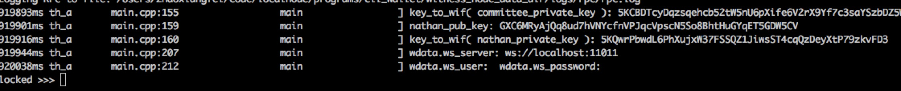
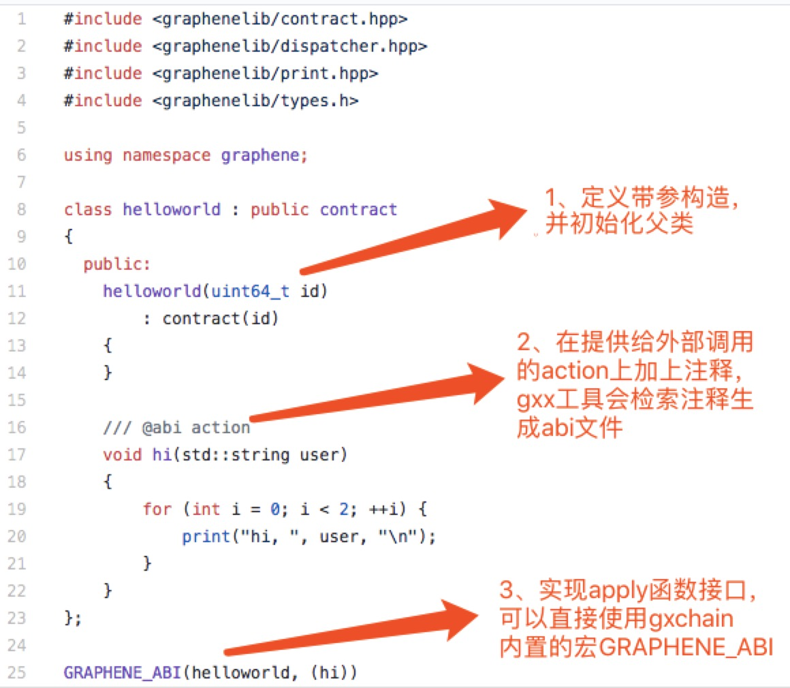
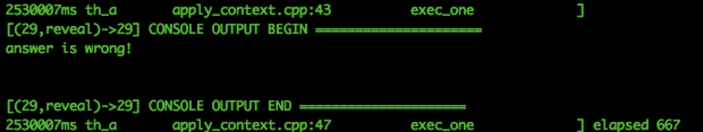

# Quick start
## Overview

This tutorial provides guidance for GXChain smart contract development, including contract development, deployment, debugging, and common errors.

The GXChain smart contract is developed in C++, compiled by the [Webassembly](https://webassembly.org/) virtual machine and deployed on the GXChain blockchain network. The compiled smart contract includes the abi file and the wast file, the `abi` file is the interface file defined by the contract, and the `wast` file is the bytecode file executed by the Webassembly virtual machine.  

**Before developing a smart contract, you need to do the following:**

- Experience in C++ language development
- Experience with Linux or Mac
- Compile the source to start the local private chain or download the release program to connect to the test network (source compilation tutorial point [here](https://github.com/gxchain/gxb-core)）


### 1. Start witness_node

You need to compile the source code to start the private chain, and then switch to the directory where the witness_node program is located, use the following command to start the node, the `data` directory to save the configuration information, the generated block information, etc. Start the private chain tutorial click [here](../guide/private_chain.md )

```bash
./witness_node -d data
```

**It is recommended to synchronize the test network node and then develop the contract. Start the test network node tutorial click [here](../guide/testnet.md)**


Switch to the `cli_wallet` directory, start the `cli_wallet` client and connect to the `witness_node`. The `cli_wallet` program features include creating accounts, deploying contracts, calling contracts, and more. (`chain-id` is replaced with your `chain-id`)

```bash
./cli_wallet -sws://localhost:11011 --chain-id=679beed54a9081edfd3ede349a0aa1962ea2dc9d379808fecce56226cb199c84
```




### 2. Create a new wallet


You need to create a new password for your wallet, and the wallet password is used to unlock your wallet. In the tutorial we use the following password: `supersecret`, you can also use a combination of letters and numbers to create your own password.

```bash
>>> set_password supersecret
```

Now you can unlock your new wallet:

```bash
unlock supersecret
```

### 3. Claim initial balances

To add assets to your wallet, you need the account name and the private key of the account.
In the example, we will import the `nathan` account initialized in `my-genesis.json` into the existing wallet by the `import_key` command:

```bash
import_key nathan 5KQwrPbwdL6PhXujxW37FSSQZ1JiwsST4cqQzDeyXtP79zkvFD3
```

::: warning note
* `nathan` will be used to define the account name in the initial file. If you have modified the `my-genesies.json` file, you can fill in a different name. Also, please note that `5KQwrPbwdL6PhXujxW37FSSQZ1JiwsST4cqQzDeyXtP79zkvFD3` is the private key defined in `config.ini`
:::

Now that we have imported the private key into the wallet, the balance initialized in `my-genesis.json` needs to be claimed by the `import_balance` command.

```bash
import_balance nathan ["5KQwrPbwdL6PhXujxW37FSSQZ1JiwsST4cqQzDeyXtP79zkvFD3"] true
```

You can view your account by the following command:

```bash
get_account nathan
```

Use the following command to get the account balance:

```bash
list_account_balances nathan
```

### 4. Create account

Now we will create a new account `alpha` so that we can revolve in the two accounts `nathan` and `alpha`.

Usually we use an existing account to create a new account because the registrar is required to pay the registration fee. Also, the registrar's account needs to enter the state of `Also, there is the requirement lifetime member (LTM)`. So we must upgrade the account `nathan` to the LTM state and the `upgrade_account` command to upgrade the account before creating a new account:

```bash
upgrade_account nathan GXC true
```
In the returned information, you will find `2106-02-07T06:28:15` on the side of `membership_expiration_date`. If you see `1970-01-01T00:00:00`, it means that the previous operation has an error and the `nathan` upgrade failed.

After a successful upgrade, we can register a new account with `nathan`, but first we need to have the public key for the new account. Generate a public-private key pair by using the `suggest_brain_key` command:

```bash
suggest_brain_key
```

Call the `register_account` / `register_account2` interface to create a new account.

```bash
register_account alpha GXC6vQtDEgHSickqe9itW8fbFyUrKZK5xsg4FRHzQZ7hStaWqEKhZ GXC6vQtDEgHSickqe9itW8fbFyUrKZK5xsg4FRHzQZ7hStaWqEKhZ nathan nathan 10 true
```

Transfer some assets to the account using the `transfer3` command

```bash
transfer3 nathan alpha 1000 GXC test GXC true
```

Use the following command to get the asset balance:

```bash
list_account_balances alpha
```
## Hello World

Before reading this tutorial, assume that you have already read the [Overview](#Overview)

### 1. Function introduction

####  1.0 Introduction

[Hello World](https://github.com/gxchain/gxb-core/tree/dev_master/contracts/examples/helloworld)
This is the simplest GXChain contract, and we can master the basic process of smart contract development through this contract. The contract implements a `hi` action, which is the interface provided by the contract to the external call. The function is to print the `hi user ` string to the console twice. 


####  1.1 Compile contract
Smart contracts include xxx.hpp files and xxx.cpp files, which need to be compiled into xxx.wast files and xxx.abi files to be deployed on the blockchain. You can compile the wast and abi files using the gxx tool provided by GXChain, which can be found in the directory `~/gxb-core/build/tools/gxx`.

```bash
./gxx -o /Users/zhaoxiangfei/code/gxb-core/contracts/examples/helloworld/helloworld.wast /Users/zhaoxiangfei/code/gxb-core/contracts/examples/helloworld/helloworld.cpp

./gxx -g /Users/zhaoxiangfei/code/gxb-core/contracts/examples/helloworld/helloworld.abi /Users/zhaoxiangfei/code/gxb-core/contracts/examples/helloworld/helloworld.hpp
```
####  1.2 Deployment contract

You can deploy the Hello World contract, `hello` for the contract username, `nathan` for the account that pays the fee, `0 0` for the virtual machine type and version, `/Users/zhaoxiangfei/code/gxb-core/contracts/examples/helloworld` is the contract path, GXC indicates the fee type, and true indicates the broadcast.

```bash
deploy_contract hello nathan 0 0 /Users/zhaoxiangfei/code/gxb-core/contracts/examples/helloworld GXC true
```

::: warning note
* When deploying the contract, the account that pays the fee must have imported the private key (the above payment account is `nathan`), and the account balance is sufficient to pay the handling fee.
:::

####  1.3 Call contract

You can attach assets when you call the contract interface. This will send the asset to the contract account. The assets of the contract account can only be controlled by the contract's own code.

```bash

call_contract nathan hello null hi "{\"user\":\"gxchain!!!\"}" GXC true

call_contract nathan hello {"amount":10000000,"asset_id":1.3.1} hi "{\"user\":\"gxchain!!!\"}" GXC true

```

::: warning // @abi payable means attached assets
```cpp
// @abi action
// @abi payable
void hi(std::string user)
{
	    {
        for (int i = 0; i < 2; ++i) {
            print("hi, ", user, "\n");
        }
    }
}
```
:::

### 2. Code

The `Hello World` Smart Contract contains only one action and is the simplest smart contract.

The development contract requires **to define a contract class and provide an apply interface**, which can be defined using the system-provided `GRAPHENE_ABI`.



The directory where the header file is located is `/Users/zhaoxiangfei/code/gxb-core/contracts/graphenelib` (change to your directory). After importing the header file, you can use the built-in type of the contract and the built-in api function. The next tutorial analyzes a more complex smart contract - red envelope contract.

## 红包合约简介

在阅读本篇教程之前，假定您已经阅读完了[入门指导](#入门指导)

### 1. 功能简介与部署调用

####  1.0 合约功能

[红包合约](https://github.com/gxchain/gxb-core/tree/dev_master/contracts/examples/redpacket)是一个相对复杂的合约，通过对红包合约的分析，我们来说明多索引表、内置API调用等功能的使用方式。

红包合约包括三个action：创建红包（issue）、打开红包（open）、关闭红包（close)。
> 注：调用创建红包（issue）接口可以附带资产；如果红包未抢完，发行者可以关闭红包，余额退还。
> 发红包需要设置一个口令（公钥），抢红包时，需要使用口令对应的私钥对自己用户id进行签名才可以抢成功。

- **调用发红包接口，调用过程与结果反馈如下**
```bash
# 发红包 pubkey为随机生成的口令 ：下面调用表示发5个红包，总金额为11 GXC（1.3.1表示GXC资产）
unlocked >>> call_contract nathan redpacket {"amount":1100000,"asset_id":1.3.1} issue "{\"pubkey\":\"GXC81z4c6gEHw57TxHfZyzjA52djZzYGX7KN8sJQcDyg6yitwov5b\",\"number\":5}" GXC true
{
  "ref_block_num": 15124,
  ...
  ...
  ...
  "signatures": [
    "1f7fade01ef08d986282164c1428fee37ecc5817c4e6bdc7c160220cf965b881d7417874ab22be48047becf62936e6a060a3e06c65e3548e90a72ddc1720794db3"
  ]
}
# 查看合约账户资产，当前合约只有一个用户发红包，所以金额为一个用户发送的资产11 GXC
unlocked >>> list_account_balances redpacket
11 GXC

# 查看红包table信息，subpackets是随机分成的5个子红包序列，pub_key用来验证签名
unlocked >>> get_table_objects redpacket packet 0 -1 10
[{
    "issuer": 17,
    "pub_key": "GXC81z4c6gEHw57TxHfZyzjA52djZzYGX7KN8sJQcDyg6yitwov5b",
    "total_amount": {
      "amount": 1100000,
      "asset_id": 1
    },
    "number": 5,
    "subpackets": [
      350531,
      150227,
      390591,
      66767,
      141884
    ]
  }
]

```

抢红包，需要知道发红包口令对应的私钥。即发红包时创建的口令为：GXC81z4c6gEHw57TxHfZyzjA52djZzYGX7KN8sJQcDyg6yitwov5b，那么需要知道该口令对应的私钥（此口令的私钥为5J9vj4XiwVQ2HNr22uFrxgaaerqrPN7xZQER9z2hwSPeWdbMKBM）。然后使用私钥对用户instanceid进行签名（签名方式使用cli_wallet提供了sign_string方法，instanceid为为账号id的最后一个字段，例如nathan的账号id是1.2.17，那么他的instanceid是17）

- **调用抢红包接口，调用过程与结果反馈如下**
```bash
#使用私钥对instanceid进行签名
unlocked >>> get_account_id nathan
"1.2.17"
unlocked >>> sign_string 5J9vj4XiwVQ2HNr22uFrxgaaerqrPN7xZQER9z2hwSPeWdbMKBM 17
"1f1d104d5750beba9fd4b0637ce69cf54721a57cce91ca81904653307eb72b0a840bd8a80c58df0a7be206a4c5c5b1fa0d96d497667e54579e717d499d0a3498b2"

#调用接口 抢红包
call_contract nathan redpacket null open "{\"issuer\":\"nathan\",\"sig\":\"1f1d104d5750beba9fd4b0637ce69cf54721a57cce91ca81904653307eb72b0a840bd8a80c58df0a7be206a4c5c5b1fa0d96d497667e54579e717d499d0a3498b2\"}" GXC true
#合约账户所剩余额
list_account_balances redpacket
unlocked >>> list_account_balances redpacket
7.09409 GXC
#合约账户剩余红包分配序列，由5个减少为4个，减少的项为390591，代表3.90591个GXC 被抢走
unlocked >>> get_table_objects redpacket packet 0 -1 10
[{
    "issuer": 17,
    "pub_key": "GXC81z4c6gEHw57TxHfZyzjA52djZzYGX7KN8sJQcDyg6yitwov5b",
    "total_amount": {
      "amount": 1100000,
      "asset_id": 1
    },
    "number": 5,
    "subpackets": [
      350531,
      150227,
      66767,
      141884
    ]
  }
]
# 抢红包记录
unlocked >>> get_table_objects redpacket record 0 -1 10
[{
    "packet_issuer": 17,
    "accounts": [{
        "account_id": 17,
        "amount": 390591
      }
    ]
  }
]

```
::: warning 提示
get_table_objects的参数分别为：

redpacket（合约名）、record（表名）、0（lower）、-1（upper）、10（limit）
:::

- **调用关闭红包接口，该接口只能由发红包的用户调用，会将未抢完的红包返回给用户，调用过程与结果反馈如下**

```bash
# 您可以使用如下命令关闭红包
unlocked >>> call_contract nathan redpacket null close "{}" GXC true

# 获取合约账户资产余额
unlocked >>> list_account_balances redpacket
0 GXC
```

####  1.1 编译合约

您可以使用如下命令编译智能合约的abi文件和wast文件

```bash
# 其中的redpacket.cpp所在路径需要替换为你自己的路径
./gxx -g /Users/zhaoxiangfei/code/gxb-core/contracts/examples/redpacket/redpacket.abi /Users/zhaoxiangfei/code/gxb-core/contracts/examples/redpacket/redpacket.cpp

# 其中的redpacket.cpp所在路径需要替换为你自己的路径
./gxx -o /Users/zhaoxiangfei/code/gxb-core/contracts/examples/redpacket/redpacket.wast /Users/zhaoxiangfei/code/gxb-core/contracts/examples/redpacket/redpacket.cpp
```

#### 1.2  部署合约

您可以使用如下命令部署Redpacket红包合约

```bash
# 需要将智能合约所在路径替换为你自己的路径
deploy_contract redpacket nathan 0 0 /Users/zhaoxiangfei/code/gxb-core/contracts/examples/redpacket GXC true
```

#### 1.3 调用合约

```bash
# 发红包 
unlocked >>> call_contract nathan redpacket {"amount":1100000,"asset_id":1.3.1} issue "{\"pubkey\":\"GXC81z4c6gEHw57TxHfZyzjA52djZzYGX7KN8sJQcDyg6yitwov5b\",\"number\":5}" GXC true

# 抢红包
call_contract nathan redpacket null open "{\"issuer\":\"nathan\",\"sig\":\"1f1d104d5750beba9fd4b0637ce69cf54721a57cce91ca81904653307eb72b0a840bd8a80c58df0a7be206a4c5c5b1fa0d96d497667e54579e717d499d0a3498b2\"}" GXC true

# 您可以使用如下命令关闭红包
unlocked >>> call_contract nathan redpacket null close "{}" GXC true
```

### 2. 代码解析

红包合约代码包含了内置API的调用，多索引表的使用。通过分析红包合约，我们来简略说明如何使用它们，合约框架可以参考上篇教程[Hello World合约简介](#hello-world合约简介)。
- 注释 // @abi payable表示该action可以附带资产，用来生成正确的abi文件
```cpp
// @abi action
// @abi payable
void issue(std::string pubkey, uint64_t number){
	...
}
```

- 使用断言graphene_assert，失败时回滚action
```cpp
graphene_assert(pubkey.size() > prefix_len, "invalid public key");
graphene_assert(pubkey.substr(0, prefix_len) == prefix, "invalid public key");
```

- 调用[内置API](./develop.html#内置api)
```cpp
//引入相关头文件，内置API文档，请点击“内置API”
int64_t total_amount = get_action_asset_amount();
```

- 多索引表简单介绍

```cpp
//每一个多索引表称为一个table，在合约开发中，定义为一个类。
//注释部分是用来生成abi文件的，详细内容请查看abi文件详解部分
//@abi table packet i64
struct packet {
    uint64_t                issuer;
    std::string             pub_key;
    contract_asset          total_amount;
    uint32_t                number;
    vector<int64_t>         subpackets;							// 可以定义复杂类型

    uint64_t primary_key() const { return issuer; }				// 定义一个主键函数，返回的值作为主键索引是唯一的。

    GRAPHENE_SERIALIZE(packet, (issuer)(pub_key)(total_amount)(number)(subpackets))
};

//定义多索引表类型
typedef graphene::multi_index<N(packet), packet> packet_index;
//声明多索引表类型的一个实例
packet_index            packets;

//增加
packets.emplace(owner, [&](auto &o) {
    o.issuer = owner;
    ...
});
//修改
packets.modify(packet_iter, sender, [&](auto &o) {
            o.subpackets.erase(subpacket_it);
});
//删除
packets.erase(packet_iter);
``` 
## bank合约简介

在阅读本篇教程之前，假定您已经阅读完了[入门指导](#入门指导)

### 1. 功能简介与部署调用

####  1.0 合约功能

[bank](https://github.com/gxchain/gxb-core/tree/dev_master/contracts/examples/bank)合约提供了代币存取功能。共包含两个action接口，一个为储存接口，用户调用该接口时，附加的代币资产为用户需要储存的资产。第二个为提现接口，可以指定提取一定数量的资产到指定账户。包含一个`account table`，存储的内容为用户id以及其所储存的资产列表。

- **调用储存资产接口，调用过程与结果反馈如下**
```bash
//nathan调用deposit接口储存10GXC到bank合约
unlocked >>> call_contract nathan bank {"amount":1000000,"asset_id":1.3.1} deposit "{}" GXC true
{
  {
  "ref_block_num": 36472,
  "ref_block_prefix": 290922209,
  "expiration": "2018-11-20T09:19:40",
  "operations": [[
  ...
  ...
}
//查看合约内account table，获取账户储存的资产,asset_id表示GXC，owner为instance id，17表示nathan账户
unlocked >>> get_table_objects bank account 0 -1 10
[{
    "owner": 17,
    "balances": [{
        "amount": 1000000,
        "asset_id": 1
      }
    ]
  }
]
```
- **调用提现资产接口，调用过程与结果反馈如下**

```bash
//nathan调用提现资产接口，提取1GXC到hello账户
unlocked >>> call_contract nathan bank null withdraw "{\"to_account\":\"hello\",\"amount\":{\"asset_id\":1,\"amount\":100000}}" GXC true
{
  "ref_block_num": 36733,
  "ref_block_prefix": 1321509121,
  "expiration": "2018-11-20T09:42:10",
  ...
  ...
}
//提现之后，查看hello账户余额
unlocked >>> list_account_balances hello
1 GXC
```
####  1.1 编译合约

您可以使用如下命令编译智能合约的abi文件和wast文件

```bash
# 其中的bank.cpp所在路径需要替换为你自己的路径
./gxx -g /Users/zhaoxiangfei/code/contracts_work/bank/bank.abi /Users/zhaoxiangfei/code/contracts_work/bank/bank.cpp

# 其中的bank.cpp所在路径需要替换为你自己的路径
./gxx -o /Users/zhaoxiangfei/code/contracts_work/bank/bank.wast /Users/zhaoxiangfei/code/contracts_work/bank/bank.cpp
```

#### 1.2  部署合约

您可以使用如下命令部署bank银行存取合约

```bash
# 需要将智能合约所在路径替换为你自己的路径
deploy_contract bank nathan 0 0 /Users/zhaoxiangfei/code/contracts_work/bank GXC true
```

#### 1.3 调用合约

```bash
# 储存资产接口调用方式
call_contract nathan bank {"amount":1000000,"asset_id":1.3.1} deposit "{}" GXC true

# 提现资产接口调用方式
call_contract nathan bank null withdraw "{\"to_account\":\"hello\",\"amount\":{\"asset_id\":1,\"amount\":100000}}" GXC true
```

### 2.代码解析

bank合约包括两个action接口和一个table，本篇教程主要分析合约的功能逻辑的实现。

存储用户id以及资产列表的table
```cpp
//主键为用户instance_id，balances字段为用户储存的资产列表
//@abi table account i64
struct account {
    uint64_t owner;
    std::vector<contract_asset> balances;  //复杂类型vector，元素为contract_asset内置类型

    uint64_t primary_key() const { return owner; }

    GRAPHENE_SERIALIZE(account, (owner)(balances))
};
```
储存资产的action，该接口没有参数。当你想调用该接口储存资产时，通过附加资产传送来达到目的。该接口逻辑功能为，获取附加资产信息（资产id，资产数量），遍历持久化table account，将储存的资产信息添加到table中。

:::warning 提示
修改table中的字段时，需要调用GXChain提供的modify接口修改，不可以直接使用遍历得到的迭代器修改，find方法返回的迭代器类型是const的。
:::
```cpp
// payable用来表名该action调用时可以附加资产
// @abi action
// @abi payable
void deposit()
{
    // 通过get_action_asset_amount与get_action_asset_id获取调用action时附加的资产id和资产数量
    int64_t asset_amount = get_action_asset_amount();
    uint64_t asset_id = get_action_asset_id();
    contract_asset amount{asset_amount, asset_id};

    // 获取调用者id
    uint64_t owner = get_trx_sender();
    auto it = accounts.find(owner);
    //如果调用者尚未存储过资产，则为其创建table项，主键为用户instance_id
    if (it == accounts.end()) {
        accounts.emplace(owner, [&](auto &o) {
            o.owner = owner;
            o.balances.emplace_back(amount);
        });
    } else {
        uint16_t asset_index = std::distance(it->balances.begin(),
                                             find_if(it->balances.begin(), it->balances.end(), [&](const auto &a) { return a.asset_id == asset_id; }));
        if (asset_index < it->balances.size()) {
            // contract_asset类重载了+=运算符，当用户往资产上继续存储时，可以直接添加
            accounts.modify(it, 0, [&](auto &o) { o.balances[asset_index] += amount; });
        } else {
            accounts.modify(it, 0, [&](auto &o) { o.balances.emplace_back(amount); });
        }
    }
}

```

提现资产的action，该接口有两个参数，第一个参数为账户名（非账户id），第二个资产为提现的资产（资产id和提现的数量）。该函数的功能为校验请求通过之后，调用内置提现api（withdraw_asset），将资产从合约提现到指定账户。详细功能查看如下注释：
```cpp
// @abi action
void withdraw(std::string to_account, contract_asset amount)
{
    //根据用户名 获取用户instance_id，此为需要提现到的账户
    int64_t account_id = get_account_id(to_account.c_str(), to_account.size());
    graphene_assert(account_id >= 0, "invalid account_name to_account");
    graphene_assert(amount.amount > 0, "invalid amount");

    // 获取action调用者id
    uint64_t owner = get_trx_sender();
    auto it = accounts.find(owner);
    graphene_assert(it != accounts.end(), "owner has no asset");

    int asset_index = 0;
    for (auto asset_it = it->balances.begin(); asset_it != it->balances.end(); ++asset_it) {
        if ((amount.asset_id) == asset_it->asset_id) {
            graphene_assert(asset_it->amount >= amount.amount, "balance not enough");
            if (asset_it->amount == amount.amount) {
                //当用户某个资产提取完毕时，清空列表中该资产
                accounts.modify(it, 0, [&](auto &o) {
                    o.balances.erase(asset_it);
                });
                //当用户资产列表为空时，即用户提现完了所有资产，清空用户列表
                if (it->balances.size() == 0) {
                    accounts.erase(it);
                }
            } else {
                accounts.modify(it, 0, [&](auto &o) {
                    o.balances[asset_index] -= amount;
                });
            }
            break;
        }
        asset_index++;
    }
    //内置api，提现资产到指定账户
    withdraw_asset(_self, account_id, amount.asset_id, amount.amount);
}
```
## riddle合约简介

在阅读本篇教程之前，假定您已经阅读完了[入门指导](#入门指导)

### 1. 功能简介与部署调用

####  1.0 合约功能

[riddle合约](https://github.com/gxchain/gxb-core/tree/dev_master/contracts/examples/riddle)是一个谜题合约，包括两个action接口，一个table。用户可以通过issue接口，创建一个谜题以及答案的哈希值保存到区块链上。reveal接口则用来验证谜题的回答是否正确，即验证回答的哈希值是否与谜题答案对应的哈希值一致。

- **创建谜题以及哈希答案**

```bash
//生成答案对应的sha256哈希值，答案明文为4
zhaoxiangfei@zhaoxiangfeideMacBook-Pro:~$ echo -n "4" | shasum -a 256
4b227777d4dd1fc61c6f884f48641d02b4d121d3fd328cb08b5531fcacdabf8a

//创建一个内容为`2+2=？`的谜题，答案为4。
unlocked >>> call_contract nathan riddle null issue "{\"question\":\"2 + 2 = ?\", \"hashed_answer\":\"4b227777d4dd1fc61c6f884f48641d02b4d121d3fd328cb08b5531fcacdabf8a\"}" GXC true
{
  "ref_block_num": 39138,
  "ref_block_prefix": 3499868408,
  "expiration": "2018-11-20T13:37:00",
  "operations": [[
      75,{
        "fee": {
          "amount": 100,
          "asset_id": "1.3.1"
        },
        "account": "1.2.17",
        "contract_id": "1.2.29",
        "method_name": "issue",
        "data": "0932202b2032203d203f4b227777d4dd1fc61c6f884f48641d02b4d121d3fd328cb08b5531fcacdabf8a",
        "extensions": []
      }
    ]
  ],
  "extensions": [],
  "signatures": [
    "1f0982608581765be0119c2af2261dd161b60e9ff5f02d07ff69c486e0ef2e52ef3187544f035d169de640386c87e24f2c61194693ac82d708f6177745d6dfb5a5"
  ]
}
```
- **验证提交的回答是否正确,输出成功或失败**

验证提交的答案，错误提交，控制台显示如下：

验证提交的答案，正确提交，控制台显示如下：


####  1.1 编译合约

您可以使用如下命令编译智能合约的abi文件和wast文件

```bash
# 其中的riddle.cpp所在路径需要替换为你自己的路径
./gxx -g /Users/zhaoxiangfei/code/contracts_work/riddle/riddle.abi /Users/zhaoxiangfei/code/contracts_work/riddle/riddle.cpp

# 其中的riddle.cpp所在路径需要替换为你自己的路径
./gxx -o /Users/zhaoxiangfei/code/contracts_work/riddle/riddle.wast /Users/zhaoxiangfei/code/contracts_work/riddle/riddle.cpp
```

#### 1.2  部署合约

您可以使用如下命令部署riddle谜题合约

```bash
# 需要将智能合约所在路径替换为你自己的路径
deploy_contract riddle nathan 0 0 /Users/zhaoxiangfei/code/contracts_work/riddle GXC true
```

#### 1.3 调用合约

```bash
生成答案的sha256哈希值
echo -n "4" | shasum -a 256
# 创建谜题和答案的哈希值
call_contract nathan riddle null issue "{\"question\":\"2 + 2 = ?\", \"hashed_answer\":\"4b227777d4dd1fc61c6f884f48641d02b4d121d3fd328cb08b5531fcacdabf8a\"}" GXC true

# 提交谜题回答的调用方式
# 错误答案
call_contract nathan riddle null reveal "{\"issuer\":\"nathan\", \"answer\":\"3\"}" GXC true
# 正确答案
call_contract nathan riddle null reveal "{\"issuer\":\"nathan\", \"answer\":\"4\"}" GXC true
```

### 2.代码解析

该合约包括一个table，用来存储谜题以及答案的哈希值，当谜题被解开后，清除table中的破解的谜题项。table主键为issuer（instance_id），由于主键是唯一的，所以每个用户只能同时在链上创建一个谜题。包括两个action，功能为创建谜题和提交回答。谜题答案以哈希值的方式保存在table中。

```cpp
// @abi table record i64
struct record {
    uint64_t            issuer;             //主键是唯一的，如果一个用户创建多个谜题，不能使用用户id为主键
    std::string         question;
    checksum256         hashed_answer;      //checksum256 内置哈希值类型

    uint64_t primary_key() const { return issuer; }

    GRAPHENE_SERIALIZE(record, (issuer)(question)(hashed_answer))
};
```

- 创建谜题，提交谜题明文内容以及答案的哈希值，哈希值需要在链下运算生成，采用sha256算法生成哈希
```cpp
/// @abi action
void issue(const std::string& question, const checksum256& hashed_answer)
{
    // 获取调用者的instance_id，作为record table的主键
    uint64_t owner = get_trx_sender();
    records.emplace(owner, [&](auto &p) {
            p.issuer = owner;
            p.question = question;
            p.hashed_answer = hashed_answer;
    });
}
```
- 提交答案，由合约进行验证，合约内置了sha256方法，可以在链上校验提交的回答是否满足条件
```cpp
/// @abi action
void reveal(const std::string& issuer, const std::string& answer)
{
    int64_t issuer_id = get_account_id(issuer.c_str(), issuer.size());
    graphene_assert(issuer_id >= 0, "issuer not exist");
    auto iter = records.find(issuer_id);
    graphene_assert(iter != records.end(), "no record");

    // sha256验证提交的回答是否为答案
    checksum256 hashed_answer;
    sha256(const_cast<char *>(answer.c_str()), answer.length(), &hashed_answer);

    // 谜题被破解后则从table中删除，回收内存
    if (iter->hashed_answer == hashed_answer) {
        print("reveal success! \n");
        records.erase(iter);
    } else {
        print("answer is wrong! \n");
    }
}
```

## linear\_vesting\_asset合约简介

在阅读本篇教程之前，假定您已经阅读完了[入门指导](#入门指导)

### 1. 功能简介与部署调用

####  1.0 合约功能

[linear_vesting_asset合约](https://github.com/gxchain/gxb-core/tree/dev_master/contracts/examples/linear_vesting_asset)的功能是向某一个账户按时间线性释放资产。用户可以创建一个资产释放项，包含接收释放资产的账户，冻结时间，释放时间。描述为：账户A通过合约向账户B线性释放一笔资产。可以指定冻结xx时间（xx表示冻结时间）后，开始释放，总共xx时间（xx表示释放时间）释放完，资产释放是线性的。

- **创建线性释放资产项**
```bash
// 创建一个到hello账户的线性资产释放项，冻结时间为30s，释放时间为120s
call_contract nathan vesting {"amount":1000000,"asset_id":1.3.1} vestingcreate "{\"to\":\"hello\",\"lock_duration\":30,\"release_duration\":120}" GXC true
unlocked >>> get_table_objects vesting vestingrule 0 -1 10
[{
    "account_id": 22,
    "vesting_amount": 1000000,
    "vested_amount": 0,
    "lock_time_point": 1542785150,
    "lock_duration": 30,
    "release_time_point": 1542785180,
    "release_duration": 120
  }
]
```
- **线性解冻合约**

```bash
// 解冻资产到hello账户
unlocked >>> call_contract nathan vesting null vestingclaim "{\"who\":\"hello\"}" GXC true
unlocked >>> list_account_balances hello
11 GXC
```
####  1.1 编译合约

您可以使用如下命令编译智能合约的abi文件和wast文件

```bash
# 其中的linear_vesting_asset.cpp所在路径需要替换为你自己的路径
./gxx -g /Users/zhaoxiangfei/code/contracts_work/linear_vesting_asset/linear_vesting_asset.abi /Users/zhaoxiangfei/code/contracts_work/linear_vesting_asset/linear_vesting_asset.cpp

# 其中的linear_vesting_asset.cpp所在路径需要替换为你自己的路径
./gxx -o /Users/zhaoxiangfei/code/contracts_work/linear_vesting_asset/linear_vesting_asset.wast /Users/zhaoxiangfei/code/contracts_work/linear_vesting_asset/linear_vesting_asset.cpp
```

#### 1.2  部署合约

您可以使用如下命令部署vesting线性释放资产合约

```bash
# 需要将智能合约所在路径替换为你自己的路径
deploy_contract vesting nathan 0 0 /Users/zhaoxiangfei/code/contracts_work/linear_vesting_asset GXC true
```

#### 1.3 调用合约
```bash
// 合约名 vesting，附加的资产为10 GXC（资产id为1.3.1），释放的账户为hello账户，冻结30s之后开始释放，经过120s的时间之后，完全完所有的资产。
call_contract nathan vesting {"amount":1000000,"asset_id":1.3.1} vestingcreate "{\"to\":\"hello\",\"lock_duration\":30,\"release_duration\":120}" GXC true

// 认领释放的资产到hello账户（必须30s之后才可以认领，30s为冻结时间）
call_contract nathan vesting null vestingclaim "{\"who\":\"hello\"}" GXC true
```

### 2.代码解析
- 该合约包含一个table（vestingrule，持久化存储保存了锁定资产数量、锁定时间、释放时间等字段）
```cpp
//@abi table vestingrule i64
struct vestingrule {
    uint64_t account_id;        //认领账户的id 主键，不能同时有两项向同一账户释放资产

    int64_t vesting_amount;     //初始锁定资产
    int64_t vested_amount;      //已释放资产

    int64_t lock_time_point;    //锁定开始时间
    int64_t lock_duration;      //锁定多久开始释放
    int64_t release_time_point; //释放开始时间
    int64_t release_duration;   //释放多久全部释放完毕

    uint64_t primary_key() const { return account_id; }

    GRAPHENE_SERIALIZE(vestingrule,
       (account_id)(vesting_amount)(vested_amount)(lock_time_point)(lock_duration)(release_time_point)(release_duration))
};
```

- 包含两个action（vestingcreate action用来创建一个线性释放资产项；vestingclaim action用来认领线性释放的资产）

```cpp
/// @abi action
/// @abi payable
void vestingcreate(std::string to, int64_t lock_duration, int64_t release_duration)
{
    // contract_asset_id是一个自定义变量，表示GXC资产，线性释放资产只支持GXC
    graphene_assert(contract_asset_id == get_action_asset_id(), "not supported asset");
    contract_asset ast{get_action_asset_amount(), contract_asset_id};
    int64_t to_account_id = get_account_id(to.c_str(), to.size());
    // 验证认领账户是否有效 以及该认领账户是否有已经锁定的资产
    graphene_assert(to_account_id >= 0, "invalid account_name to");
    auto lr = vestingrules.find(to_account_id);
    graphene_assert(lr == vestingrules.end(), "have been locked, can only lock one time");

    //创建资产释放项，在vestingrule table中添加一项，使用emplace接口
    vestingrules.emplace(0, [&](auto &o) {
        o.account_id = to_account_id;
        o.vesting_amount = ast.amount;
        o.vested_amount = 0;
        o.lock_time_point = get_head_block_time();
        o.lock_duration = lock_duration;
        o.release_time_point = o.lock_time_point + o.lock_duration;
        o.release_duration = release_duration;
    });
}

/// @abi action
void vestingclaim(std::string who)
{   
    // 验证认领账户id是否有效
    int64_t who_account_id = get_account_id(who.c_str(), who.size());
    graphene_assert(who_account_id >= 0, "invalid account_name to");

    // 验证该账户是否存在锁定待释放的资产
    auto lr = vestingrules.find(who_account_id);
    graphene_assert(lr != vestingrules.end(), "current account have no locked asset");

    // 验证资产是否经过了冻结时间，并计算可以认领的资产数量
    uint64_t now = get_head_block_time();
    graphene_assert(now > lr->release_time_point, "within lock duration, can not release");
    int percentage = (now - lr->release_time_point) * 100 / lr->release_duration;
    if (percentage > 100)
        percentage = 100;
    int64_t vested_amount = (int64_t)(1.0f * lr->vesting_amount * percentage / 100);
    vested_amount = vested_amount - lr->vested_amount;
    graphene_assert(vested_amount > 0, "vested amount must > 0");

    // 提现资产到认领账户
    withdraw_asset(_self, who_account_id, contract_asset_id, vested_amount);

    // 提现之后，修改资产认领项的vesting_amount、vested_amount字段
    vestingrules.modify(lr, 0, [&](auto &o) {
        o.vested_amount += vested_amount;
    });
    if (lr->vesting_amount == lr->vested_amount) {
        vestingrules.erase(lr);
    }
}
```


