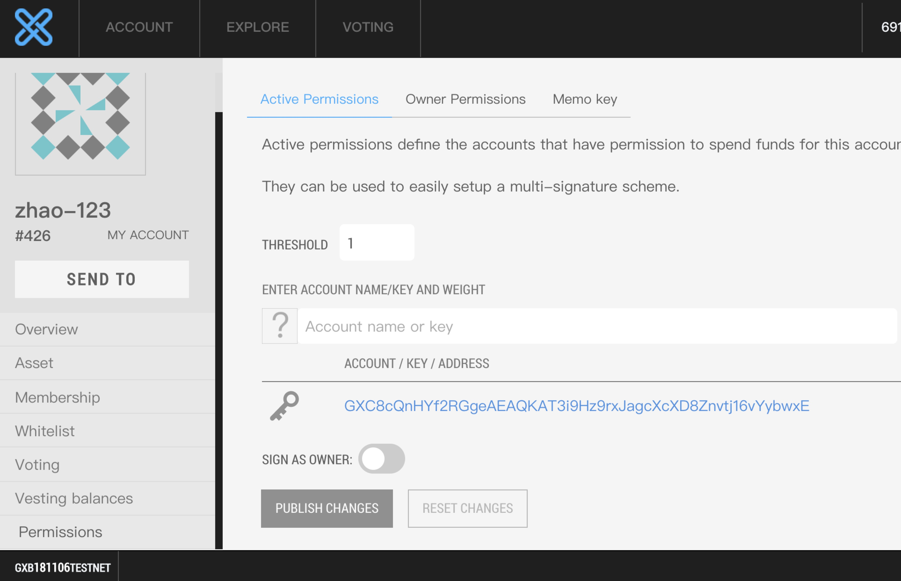
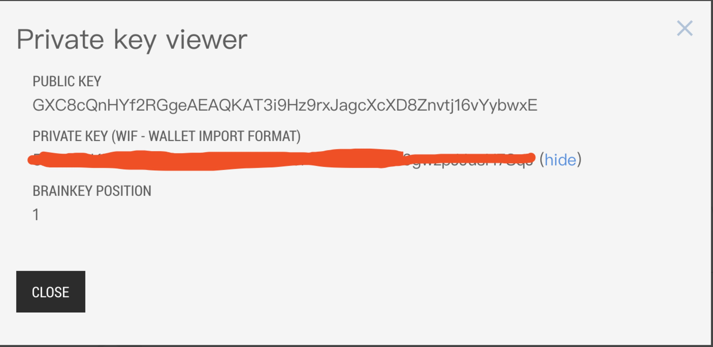
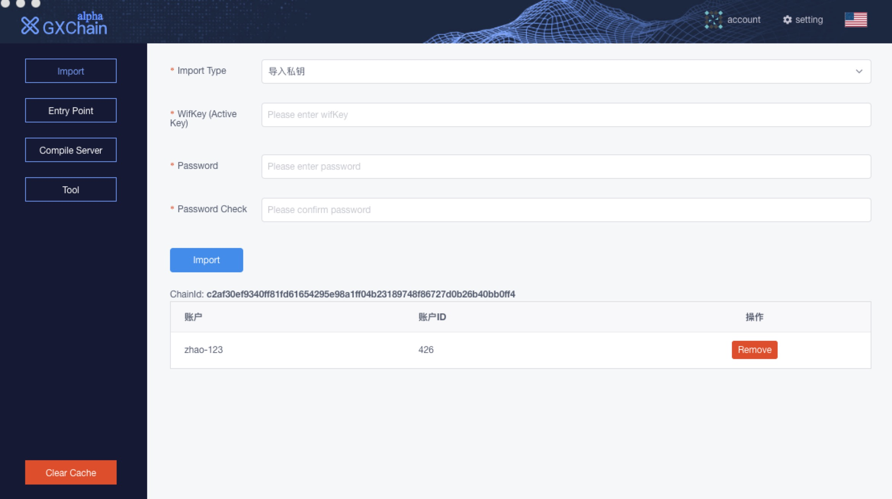
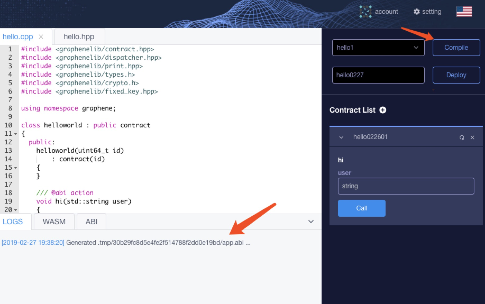
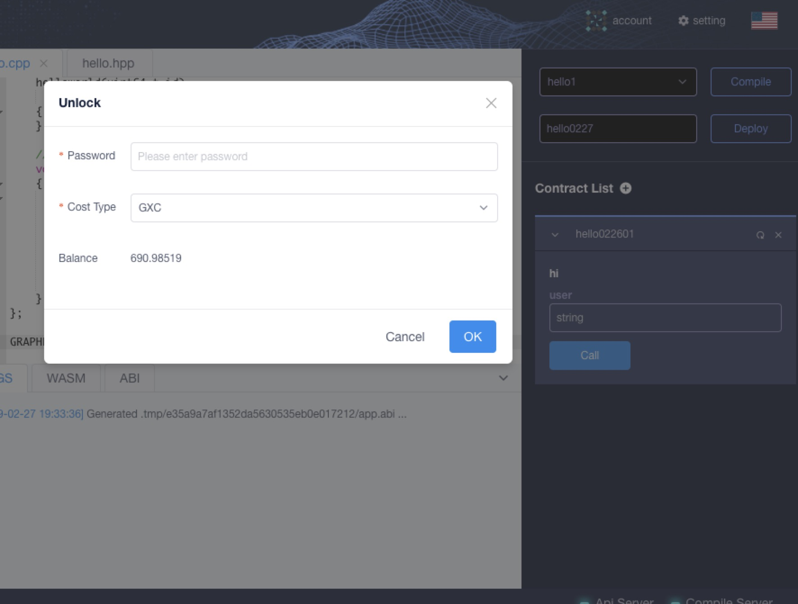
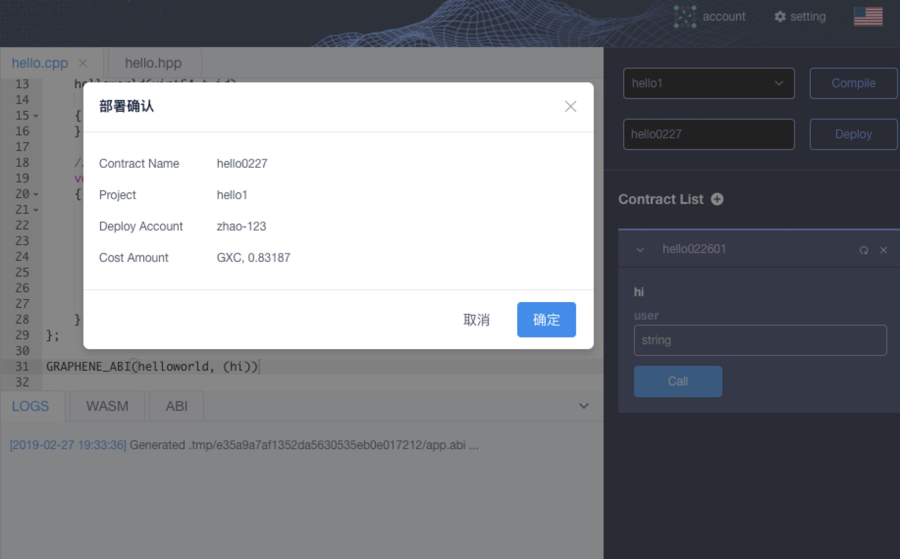
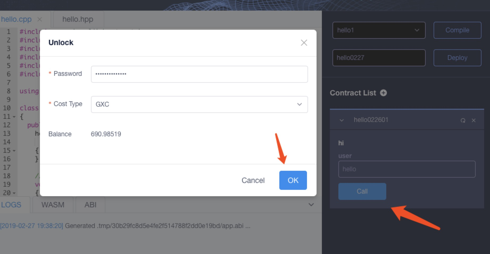
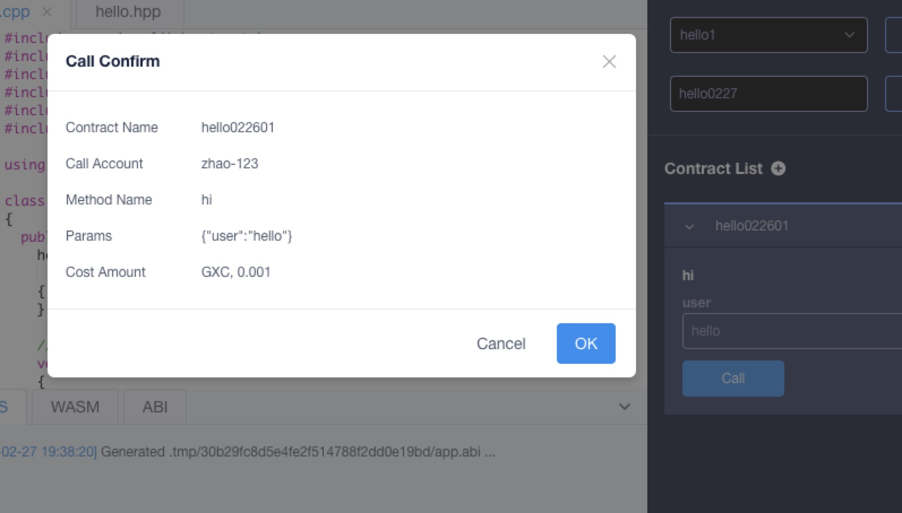

# Deploy, Call, and Update

## Smart Contract IDE

### 1. register account

Access test-net [online wallet](https://testnet.wallet.gxchain.org/#/) and refegister a wallet account

### 2. Claim test-net Token

After registration is completed, claim test-net token(use browser to access [https://testnet.gxchain.org/gxc/get_token?your_account_name](), Please replace your_account_name with your test web wallet account name)

### 3. IDE download
With the IDE, you can write, compile, deploy, and call the smart contract.

[click download](https://github.com/gxchain/gxchain-alpha/releases/latest)

### 4. Import account

Go to [Online Wallet](https://testnet.wallet.gxchain.org/#/) in Step 1  to find your own active permission private key.





Open the client again and import the account on the settings page.

::: warning Note
The password will not be uploaded to the server, if you forget it ,you should remove the account and re-import
:::



### 5. Select project template


### 6. Compile



### 7. Deploy

Need to unlock the wallet before deploying the contract





### 8. Call

Like deploying the contract, you also need to unlock your wallet first.





## Cli_wallet

### 1. GXChain source code compilation

If you don't want to use smart contract IDE tools, or want to build a more stable and reliable compilation environment; you can compile GXChain program locally, compile, deploy, and call smart contracts through command line; You can compile GXChain source code on ubuntu system and mac system.

- [Build on Ubuntu](https://github.com/gxchain/gxb-core/wiki/BUILD_UBUNTU)
- [Build on OS X](https://github.com/gxchain/gxb-core/wiki/BUILD_OS_X)

### 2. Create a contract by using a template

Create a helloworld contract with the `gxx` tool

```bash
gxx -n helloworld
```

### 3. Compile the contract, generate wast and abi

Compile the contract and generate wast and wasm files

```bash
gxx -o helloworld/helloworld.wast helloworld/helloworld.cpp
```
Generate abi file

```bash
gxx -g helloworld/helloworld.abi helloworld/helloworld.cpp
```

### 4. Deploy contract

Need to start cli_wallet, connect local node or remote testnet node

```bash
./programs/cli_wallet/cli_wallet -swss://testnet.gxchain.org --chain-id c2af30ef9340ff81fd61654295e98a1ff04b23189748f86727d0b26b40bb0ff4
```

Import wallet private key

```bash
# If it is a new wallet, you need to set an unlock password, here is 'mylocalpassword'

new >>> set_password mylocalpassword

# Unlock
locked >>> unlock mylocalpassword

# Import wallet private key
unlocked >>> import_key your_account_name your_private_key

# Deploy contract,the name of the contract is 'helloworld',the sender is 'your_account_name', '0' and '0' are vm type and vm version,'./helloworld' is the path of the wast/abi file and the 'GXC'means a kind of asset.
unlocked >>> deploy_contract helloworld your_account_name 0 0 ./helloworld GXC true
```

### 5. Call contract
After the contract is deployed successfully, you can call the contract using the call_contract interface.

```bash
unlocked >>> call_contract nathan helloworld null hi "{\"user\":\"zhuliting\"}" GXC true
```

### 6. Update contract

```bash
// 'hello120301' is contract name
unlocked >>> update_contract hello120301 zhao-123 /Users/zhaoxiangfei/code/contracts_work/example_contract_02/helloworld GXC true
```
