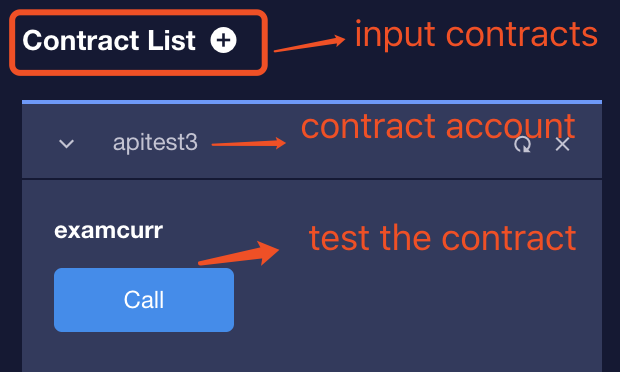

# Develop and API introduction

## Naming Rules

In the process of generating the abi interface file, will base32 encode the ACTION name and TABLE name, so there are restrictions on the naming rules.

ACTION, TABLE range: [1 ~ 5 a ~ z]

ACTION, TABLE length: no more than 13

class name range: [a ~ z 0 ~ 9]

class name length: unlimited

## Built-in type

The contract provides built-in types in addition to the basic types suppoerted by c++ syntax.

### contract\_asset

contract_asset class contains two fields
```cpp
int64_t     amount;
uint64_t    asset_id;
```
Use the `is_amount_within_range` member method to verify that the contract_asset amount is valid or not
```cpp
bool is_amount_within_range() const {
    return -max_amount <= amount && amount <= max_amount;
}
```


::: warning Note
In the contract_asset type, where `amount` represents the number of assets and it uses large members to store in the chain . For example, the accuracy of GXC assets is 5,1 GXC actually needs to be expressed as 1 * 100000 = 100000, that means, amount is 100000.

The asset_id indicates the instance_id of the asset (for example, if the asset id is 1.3.1, its instance_id is 1).
:::
You can learn the use of the `contract_asset` type refer to the `Bank` contract.

### signature

the definition of signature class  
```cpp
struct signature {
   uint8_t data[65];
};
```

example：
```cpp
void verify(checksum256 hash, std::string pub_key, signature sig)
{   
    print(pub_key, "\n");
    assert_recover_key(&hash, &sig, pub_key.c_str(), pub_key.length());
}
 ```


### public\_key
public_key class
```cpp
struct public_key {
   char data[33];
};
```


### checksum256
checksum256 class
```cpp
struct ALIGNED(checksum256) {
   uint8_t hash[32];
};
```

example：
```cpp
void issue(const std::string& question, const checksum256& hashed_answer)
{   
    uint64_t owner = get_trx_sender();
    records.emplace(owner, [&](auto &p) {
            p.issuer = owner;
            p.question = question;
            p.hashed_answer = hashed_answer;
    });
}  
```


### checksum160
checksum160 class
```cpp
struct ALIGNED(checksum160) {
   uint8_t hash[20];
};
```

### checksum512
checksum512 class
```cpp
struct ALIGNED(checksum512) {
   uint8_t hash[64];
};
```

### block\_id\_type
block_id_type class
```cpp
typedef struct checksum160      block_id_type;
```
## Built-in API
When you develop smart contracts on GXChain, you can call the built-in API to implement richer features.

| belong | api name | description |
| --- | --- | --- |
| <graphenelib/action.h> | current_receiver | Returns the instance_id of the current contract account( the last digit of the account id) |
| <graphenelib/action.h> | get_action_asset_id | Returns the asset instance_id sent to the contract by this call( the last digit of the asset id) |
| <graphenelib/action.h> | get_action_asset_amount | Returns the number of assets sent to the contract by this call |
| <graphenelib/asset.h> | withdraw_asset | Transfer assets from the current contract account to the other account |
| <graphenelib/asset.h> | get_balance | Get the balance of an asset in the account on the chain |
| <graphenelib/crypto.h> | sha1 | Obtain the encrypted data of the sha1 algorithm |
| <graphenelib/crypto.h> | sha256 | Obtain the encrypted data of the sha256 algorithm |
| <graphenelib/crypto.h> | sha512 | Obtain the encrypted data of the sha512 algorithm |
| <graphenelib/crypto.h> | ripemd160 | Obtain the encrypted data of the ripemd160 algorithm |
| <graphenelib/crypto.h> | assert_recover_key | Verify that the given signature and hash can recover the public key |
| <graphenelib/global.h> | get_head_block_num | Get the head block number |
| <graphenelib/global.h> | get_head_block_id | Get the head block hash |
| <graphenelib/global.h> | get_block_id_for_num | Get the specified block hash |
| <graphenelib/global.h> | get_head_block_time | Get the time of the block, return the value in seconds |
| <graphenelib/global.h> | get_trx_sender | Get the instance_id of the account that called the contract |
| <graphenelib/global.h> | get_trx_origin | Get the instance_id of the original account |
| <graphenelib/global.h> | get_account_id | Get the instance_id of the account by the account name |
| <graphenelib/global.h> | get_account_name_by_id | Obtain an account name by the account instance id |
| <graphenelib/global.h> | get_asset_id | Get the instance_id of the asset by the asset name |
| <graphenelib/global.h> | read_transaction | Read serialized data of the current transaction |
| <graphenelib/global.h> | transaction_size | Get the length of  the current transaction data after it has been serialized|
| <graphenelib/global.h> | expiration | Get  expiration time of the transaction |
| <graphenelib/global.h> | tapos_block_num | Returns the block number referenced by the transaction |
| <graphenelib/global.h> | tapos_block_prefix | Return the block ID referenced by the transaction  (the second 32-bit number) |
| <graphenelib/action.h> | read_action_data | Read data of the current action |
| <graphenelib/action.h> | action_data_size|Returns the number of bytes needed to get the current action data |
| <graphenelib/action.h> | send_inline      | Inline execute action |
| <graphenelib/action.hpp> | unpack_action_data | Deserialize the current action data into a defined action object |
| <graphenelib/system.h> | graphene_assert | If the assertion fails, interrupt the execution of this contract and roll all states |
| <graphenelib/system.h> | graphene_assert_message | If the assertion fails, interrupt the execution of this contract and roll all states |
| <graphenelib/system.h> | print | Print log |


### current\_receiver

**Function:** `uint64_t current_receiver()`

**Head file:** `<graphenelib/action.h>`

**Description:** Returns the instance_id of the current contract account( the last digit of the account id)

**Return value:** Instance_id

**Example:**

```cpp
// @abi action
void examcurr(){
    uint64_t ins_id = current_receiver();
    print("current contract account id: ", ins_id, "\n");
}
```


### get\_action\_asset\_id

**Function:** `uint64_t get_action_asset_id()`

**Head file:** `<graphenelib/action.h>`

**Description:** Return the asset instance_id sent to the contract by this call

**Return value:** Returns 0 means the action has no attached assets, otherwise returns instance_id    

**Example:**

```cpp
// @abi action
void examgetast(){
    uint64_t ast_id = get_action_asset_id();
    print("call action asset id: ",ast_id, "\n");
}
```

### get\_action\_asset\_amount

**Function:** `int64_t get_action_asset_amount()`

**Head file:** `<graphenelib/action.h>`

**Description:** Returns the number of assets sent to the contract by this call

**Return value:** Returns 0 means the contract has no accompanying assets, otherwise means the number of assets attached and the quantity needs to be divided by 100,000   

**Example:**

```cpp
//get_action_asset_amount
// @abi action
void examgetamo(){
    int64_t amount = get_action_asset_amount();
    print("call action asset amount: ",amount,"\n");      
}
```
### inline\_transfer

**Function:**`void inline_transfer(uint64_t from, uint64_t to, uint64_t asset_id, int64_t amount, const char* data, uint32_t length)`

**Head file:**`<graphenelib/asset.h>`

**Description:** Transfer the assets of the current contract to an external account

**Params:**

Params | Type | Description
---|---|---
from | uint64_t | Must be \_self
to   | uint64_t | The instance_id of the receiver account
asset_id | uint64_t | Asset id used to transfer
amount | int64_t | Transfer amount, this number contains the accuracy of the asset, for example, if you want to transfer 1 GXC, you should write 100000
data | const char* | The first address of the data string(memo)
length | uint32_t | Length of the data string

**Example:**

```cpp
// @abi action
void examwith(uint64_t from,uint64_t to, uint64_t asset_id, int64_t amount){
    std::string memo = "withdraw";
    inline_transfer(from,to,asset_id,amount, memo.c_str(), memo.size());
    print("inline_transfer example\n");
}
```

### withdraw\_asset

**Function:** `void withdraw_asset(uint64_t from, uint64_t to, uint64_t asset_id, int64_t amount)`

**Head file:** `<graphenelib/asset.h>`

**Description:** Transfer assets from the current contract account to the other account

**Params:**

Params | Type | Description
---|---|---
from | uint64_t | Must be \_self
to   | uint64_t | The instance_id of the receiver account
asset_id | uint64_t | Asset id used to transfer
amount | int64_t | Transfer amount, this number contains the accuracy of the asset, for example, if you want to transfer 1 GXC, you should write 100000

**Example:**

```cpp
// @abi action
void examwith(uint64_t from,uint64_t to, uint64_t asset_id, int64_t amount){
    withdraw_asset(from,to,asset_id,amount);
    print("withdraw_asset example\n");
}
```


### get\_balance

**Function:** `int64_t get_balance(int64_t account, int64_t asset_id)`

**Head file:** `<graphenelib/asset.h>`

**Description:** Get the balance of an asset in the account on the chain

**Return value:** The balance

**Params:**

Params | Type | Description
---|---|---
account | int64_t | Account's instance_id
asset_id | int64_t | Asset's instance_id

**Example:**

```cpp
// @abi action
void examgetbl(int64_t account, int64_t asset_id){
    int64_t balance = get_balance(account, asset_id);
    print("account balance: ",balance,"\n");
}
```

### sha1

**Function:** `void sha1(const char *data, uint32_t length, checksum160 *hash)`

**Head file:** `<graphenelib/crypto.h>`

**Description:** Obtain the encrypted data of the sha1 algorithm


**Params:**

Params | Type | Description
---|---|---
data | const char* | Data start address
length | uint32_t | Data length
hash | checksum160* | Hash value

**Example:**

```cpp
// @abi action
void examsha1(std::string data){
    checksum160 hash;
    sha1(data.c_str(),data.length(),&hash);
    printhex(hash.hash,20);
    print("\n");
}
```

### sha256

**Function:** `void sha256(const char *data, uint32_t length, checksum256 * hash)`

**Head file:** `<graphenelib/crypto.h>`

**Description:** Obtain the encrypted data of the sha256 algorithm


**Params:**

Params | Type | Description
---|---|---
data | const char* | Data start address
length | uint32_t | Data length
hash | checksum256* | Hash value

**Example:**

```cpp
// @abi action
void examsha25(std::string data){
    checksum256 hash;
    sha256(data.c_str(),data.length(),&hash);
    printhex(hash.hash,32);
    print("\n");
}
```


### sha512

**Function:** `void sha512(const char *data, uint32_t length, checksum512 * hash)`

**Head file:** `<graphenelib/crypto.h>`

**Description:** Obtain the encrypted data of the sha512 algorithm

**Params:**

Params | Type | Description
---|---|---
data | const char* | Data start address
length | uint32_t | Data length
hash | checksum512* | Hash value

**Example:**

```cpp
// @abi action
void examsha512(std::string data){
    checksum512 hash;
    sha512(data.c_str(),data.length(),&hash);
    printhex(hash.hash,64);
    print("\n");
}
```


### ripemd160

**Function:** `void ripemd160(const char *data, uint32_t length, checksum160 * hash)`

**Head file:** `<graphenelib/crypto.h>`

**Description:** Obtain the encrypted data of the ripemd160 algorithm

**Params:**

Params | Type | Description
---|---|---
data | const char* | Data start address
length | uint32_t | Data length
hash | checksum160* | Hash value

**Example:**

```cpp
// @abi action
void examripemd(std::string data){
    checksum160 hash;
    ripemd160(data.c_str(),data.length(),&hash);
    printhex(hash.hash,20);
    print("\n");
}
```

### assert\_recover\_key

**Function:** `void assert_recover_key(const checksum256 *digest,const signature *sig,
                              const char *pub, uint32_t publen);`

**Head file:** `<graphenelib/crypto.h>`

**Description:** Verify that the given signature and hash can recover the public key

**Params:**

Params | Type | Description
---|---|---
data | const checksum256* | Sha256 hash
sig | const signature* | Signature value of the string
pub | const char* | Public key(in hexadecimal format)
publen | uint32_t | Plulic key length

**Example:**

```cpp
// @abi action
void examrecover(checksum256 dig,signature sig,std::string pkey)
{
    assert_recover_key(&dig,&sig,pkey.c_str(), pkey.length());
}
```


### get\_head\_block\_num

**Function:** `int64_t get_head_block_num()`

**Head file:** `<graphenelib/global.h>`

**Description:** Return the latest block number

**Return value:** The head block number

**Example:**

```cpp
// @abi action
void examgetnum(){
    int64_t head_num = get_head_block_num();
    print("head block num: ",head_num, "\n");
}
```

### get\_head\_block\_id

**Function:** `void get_head_block_id(checksum160* hash)`

**Head file:** `<graphenelib/global.h>`

**Description:** Get the head block hash

**Params:**

Params | Type | Description
---|---|---
hash | checksum160* | The head block hash value

**Example:**

```cpp
// @abi action
void examgetid(){
    checksum160 block_hash;
    get_head_block_id(&block_hash);
    printhex(block_hash.hash,20);
    print("\n");
}
```


### get\_block\_id\_for\_num

**Function:** `void get_block_id_for_num(checksum160* hash, uint32_t block_num)`

**Head file:** `<graphenelib/global.h>`

**Description:** Get the specified block hash

**Params:**

Params | Type | Description
---|---|---
hash | checksum160* | The specified block hash
block_num | uint32_t | The specified block num

**Example:**

```cpp
// @abi action
void examidnum(){
    checksum160 block_hash;
    get_block_id_for_num(&block_hash,1);             //get the hash of first block
    printhex(block_hash.hash,20);
    print("\n");
}
```


### get\_head\_block\_time

**Function:** `int64_t get_head_block_time()`

**Head file:** `<graphenelib/global.h>`

**Description:** Get the time of the latest block, return the value in seconds

**Return Value:** The time of the latest block

**Example:**

```cpp
// @abi action
void examgettime(){
    int64_t head_time;
    head_time = get_head_block_time();
    print("head block time: ",head_time,"\n");
}
```


### get\_trx\_sender

**Function:** `uint64_t get_trx_sender()`

**Head file:** `<graphenelib/global.h>`

**Description:** Get the instance_id of the account that called the contract

**Return Value:** Instance_id of the account

**Example:**

```cpp
// @abi action
void examgettrx(){
    uint64_t sender_id;
    sender_id = get_trx_sender();
    print("call action instance id: ",sender_id, "\n");
}
```

### get\_trx\_origin

**Function:** `uint64_t get_trx_origin()`

**Head file:** `<graphenelib/global.h>`

**Description:** Get the instance_id of the original account 

**Return Value:** Original account instance_id 

**Example:**

```cpp
// @abi action
void examgetori(){
    uint64_t origin_id;
    origin_id = get_trx_origin();
    print("original instance id: ",origin_id, "\n");
}
```

### get\_account\_id

**Function:** `int64_t get_account_id(const char * data, uint32_t length)`

**Head file:** `<graphenelib/global.h>`

**Description:** Get the instance_id of the account by the account name

**Return Value:** Returns the instance_id of the account if the account exists, or -1 if the account does not exist

**Params:**

Params | Type | Description
---|---|---
data | const char* | Account name( such as `nathan`)
length | uint32_t | Account name length( such as the length of `nathan` is 6)

**Example:**

```cpp
// @abi action
void examgetacid(std::string data){
    int64_t acc_id;
    acc_id = get_account_id(data.c_str(), data.length());
    print("account id: ",acc_id, "\n");
}
```

### get\_account\_name\_by\_id

**Function:** `int64_t get_account_name_by_id(array_ptr<char> data, size_t buffer_size, int64_t account_id)`

**Head file:** `<graphenelib/global.h>`

**Description:** Obtain an account name by the account instance id

**Return Value:** Returns 0 if the account exists, or -1 if the account does not exist

**Params:**

Params | Type | Description
---|---|---
data | const char* | Account name
length | uint32_t | Account name length
account_id | int64_t | Account instance_id

**Example:**

```cpp
// @abi action
void examgetname(int64_t accid){
    char data[65]={0};
    int64_t result;
    result = get_account_name_by_id(data,65,accid);
    print(static_cast<const char*>data,"\n");
}
```

### get\_asset\_id

**Function:** `int64_t get_asset_id(const char * data, uint32_t length)`

**Head file:** `<graphenelib/global.h>`

**Description:** Get the instance_id of the asset by the asset name

**Return Value:** Returns the instance_id of the asset if the asset exists, or -1 if the asset does not exist

**Params:**

Params | Type | Description
---|---|---
data | const char* | Asset name
length | uint32_t | The length of asset name

**Example:**

```cpp
// @abi action
void examassid(std::string data){
    int64_t assid;
    assid = get_asset_id(data.c_str(),data.length());
    print("asset id: ",assid, "\n");
}
```

### read\_transaction

**Function:** `int read_transaction(char* dst, uint32_t dst_size)`

**Head file:** `<graphenelib/global.h>`

**Description:** Extract serialized data of the current transaction to the param dst

**Return Value:** When dst_size is 0, it returns the number of bytes required for reading; when dst_size is not 0, it returns the number of bytes actually read (The minimum value of dst_size is also the minimum value of transaction size )

**Params:**

Params | Type | Description
---|---|---
dst | char* | The pointer to receive the read buffer data
dst_size | uint32_t | The read data size

**Example:**

```cpp
// @abi action
void examreadtrx(){
    int dwsize;
    dwsize =transaction_size();
    char* pBuffer = new char[dwsize];
    uint32_t size = read_transaction(pBuffer,dwsize);
    delete[] pBuffer;
}
```

### transaction\_size

**Function:** `int transaction_size()`

**Head file:** `<graphenelib/global.h>`

**Description:** Get the length of the data of the current transaction which has been serialized

**Return Value:** The length of the data

**Example:**

```cpp
// @abi action
void examtrxsize(){
    int dwsize;
    dwsize =transaction_size();
    print("the size of the serialize trx: ",dwsize,"\n");
}
```

### expiration

**Function:** `uint64_t expiration()`

**Head file:** `<graphenelib/global.h>`

**Description:** Get transaction expiration time

**Return Value:** The transaction expiration time

**Example:**

```cpp
// @abi action
void exampira(){
    uint64_t timenum = expiration();
    print("the expiration time: ", timenum, "\n");
}
```


### tapos\_block\_num

**Function:** `int tapos_block_num()`

**Head file:** `<graphenelib/global.h>`

**Description:** Returns the block number referenced by the transaction

**Return Value:** The block number

**Example:**

```cpp
// @abi action
void examtapnum(){
    uint64_t tapos_num;
    tapos_num = tapos_block_num();
    print("ref block num: ",tapos_num, "\n");
}
```


### tapos\_block\_prefix

**Function:** `uint64_t tapos_block_prefix()`

**Head file:** `<graphenelib/global.h>`

**Description:** Get the block ID of the transaction reference (the second 32-bit number)

**Return Value:** Return the block ID of the transaction reference (the second 32-bit number)

**Example:**

```cpp
// @abi action
void examtappre(){
    uint64_t tapos_prefix;
    tapos_prefix = tapos_block_prefix();
    print("ref block id: ",tapos_prefix, "\n");
}
```


### read\_action\_data

**Function:** `uint32_t read_action_data( void* msg, uint32_t len )`

**Head file:** `<graphenelib/action.h>`

**Description:** Read the data of the current action

**Return Value:** Return the number of bytes of data actually read. If len is 0, the number of bytes required for reading will be returned.
**Params:**

Params | Type | Description
---|---|---
msg | void* | The pointer to receive the read buffer data
len | uint32_t | Buffer size

**Example:**

```cpp
// @abi action
void examract(uint64_t num,std::string number){
    auto size = action_data_size();
    char *buffer = static_cast<char*>(malloc(size));
    read_action_data((void*)buffer,size);
    printhex(buffer,size);
}
```

### action\_data\_size

**Function:** `uint32_t action_data_size()`

**Head file:** `<graphenelib/action.h>`

**Description:** Returns the number of bytes required to read the current action data

**Return Value:** The number of bytes

**Example:**

```cpp
// @abi action
void examrasize(uint64_t num,std::string number){
    auto size = action_data_size();
    print("size: ", size, "\n");
}
```

### send\_inline

**Function:** `void send_inline(char *serialized_action, size_t size)`

**Head file:** `<graphenelib/action.h>`

**Description:** Inline execute action（
Generally, by constructing an action and inlining the action through its send member method, its internal implementation is send\_inline，[Inline action](#inline-action)）

### unpack\_action\_data

**Function:** `T unpack_action_data()`

**Head file:** `<graphenelib/action.hpp>`

**Description:** Deserialize the current action data into a defined action object

**Return Value:** Action object

**Example:**

```cpp
struct myaction {
    uint64_t num;
    std::string name;

    GRAPHENE_SERIALIZE(myaction,(num)(name))
};
// @abi action
void examupact(uint64_t num,std::string name){
    auto my = unpack_action_data<myaction>();
    print(my.name, "\n");
}
```

### graphene\_assert

**Function:** `void graphene_assert(uint32_t test, const char* msg)`

**Head file:** `<graphenelib/system.h>`

**Description:** If the assertion fails, interrupt the execution of this contract and roll all states

**Params:**

Params | Type | Description
---|---|---
test | uint32_t | Assertion
msg | const char* | Message

**Example:**

```cpp
// @abi action
void examassert(){
    uint64_t number=1;
    graphene_assert(number == 1, "wrong!");
}
```


### graphene\_assert\_message

**Function:** `void graphene_assert_message(uint32_t test, const char* msg, uint32_t msg_len)`

**Head file:** `<graphenelib/system.h>`

**Description:** If the assertion fails, interrupt the execution of this contract and roll all states


**Params:**

Params | Type | Description
---|---|---
test | uint32_t | Assertion
msg | const char* | Message
msg_len | uint32_t | Message size

**Example:**

```cpp
// @abi action
void examassmsg(){
    uint64_t number=1;
    std::string msg = "wrong!!!";
    graphene_assert_message(number == 1, msg.c_str(),msg.length());
}
```


### print

**Function:** `void print(const char* ptr)`

**Head file:** `<graphenelib/system.h>`

**Description:** Print log（Please click [Contract Debug](debug.html#print)）


**Params:**

Params | Type | Description
---|---|---
ptr | const char* | Log

**Example:**

```cpp
// @abi action
void examprint(){
    print("example example example!!!\n");
}
```

### example

The sample contract for api usage has been deployed to the test network, which can be tested by the IDE client, click to view [contract source](./question.html#Built-in_api_example),contract name is `apitest3`



## Inline action

### Description

GXChain supports one contract to call another contract and supports payment accounts to set ram fees. For examples :`User --> contract_A --> contract_B`, for contract `contract_B`, `User` is the original caller, and `contract_A` is sender.

However, cross-contract calls are limited by the number of layers: no more than three contracts in   call chain. Such as : `User -> contract_A -> contract_B -> contract_C`, if the number of call levels is greater than 3, the execution will be  terminated. If the call chain forms a loop, it will also terminate execution.

The ram resource used in the contract, the payment account can be set to the following four identities:

| ram_fee payer | Description |
| --- | --- |
| 0 | Contract account itself (same as \_slef) |
| \_self | Contract account itself (same as 0） |
| sender | Contract call account |
| original | The account originally calls the contract , which is used as the starting call account in the cross-contract call. |

### Example

`contract_A --> contract_B`, `contract_A` contract calls `contract_B` contract.
1. Construct an action in `contract_A` containing `contract_B` account id/account name, action name, parameters, calling account (\_self), additional assets.
2. Call the send method of the action to complete the cross-contract call.

```cpp
#contract_b
···
void hi(std::string name,uint64_t number)
{
    ···
}
···
#contract_A
···
struct param {
    std::string name;
    uint64_t number;
};


void inlinecall(uint64_t con_b_id, std::string con_b_name){

    param par{"hello", 100};

    // 1: When constructing an action, use the contract account id
    action contract_b_id(con_b_id, N(hi), std::move(par), _self, {1000, 1});
    contract_b_id.send();

    // 2: When constructing an action, use the contract account name
    action contract_b_name(con_b_name, N(hi), std::move(par), _self, {1000,1});
    contract_b_name.send();
}
···
```

## Multi-index table

#### <a name="index"></a>index
* [Introduction to multi-index table](#smart_contract_storage_brief_introduction)
* [Example](#example)
* [Define_type](#define_type)
* [Emplace](#add)
* [Erase](#delete)
* [Find](#find)
* [Modify](#modify)


### <a name="smart_contract_storage_brief_introduction"></a>Introduction to multi-index table
The data must be stored in units of C++ class instances, so the stored C++ classes must be defined in the contract. Each class has a table, similar to a single table in the sql database. The difference is that it has the following characteristics:
>Support for multi index   

>Joint indexing is not supported  

>Only the primary key is unique  

>Index type only supports uint64_t type

>If you want to use a string as an index, you must use the `uint64_t string_to_name(string str)` in the contract library to convert the string to uint64_t. The string length is limited to 12 characters and can only include ([az].[1 -5]) a total of 32 characters

>For indexes other than the primary key, when there are multiple record index values, the acquired object is the earliest inserted record.  

>Support for additions and deletions   


### <a name="example"></a>example code
```cpp
#include <graphenelib/contract.hpp>
#include <graphenelib/dispatcher.hpp>
#include <graphenelib/multi_index.hpp>
#include <graphenelib/print.hpp>

using namespace graphene;

class multindex : public contract
{
    struct offer;

  public:
    multindex(uint64_t id)
        : contract(id)
        , offers(_self, _self)
    {
    }

    //@abi action
    void additem(uint64_t i1, uint64_t i2, std::string name)
    {
        uint64_t pk = offers.available_primary_key();
        print("pk=", pk);
        offers.emplace(0, [&](auto &o) {
            o.id = pk;
            o.idx1 = i1;
            o.idx2 = i2;
            o.stringidx = graphenelib::string_to_name(name.c_str());
        });
    }

    //@abi action
    void getbypk(uint64_t key)
    {
        auto it = offers.find(key);
        if (it != offers.end()) {
            dump_item(*it);
        }
    }

    //@abi action
    void getbyidx1(uint64_t key)
    {
        auto idx = offers.template get_index<N(idx1)>();
        auto matched_offer_itr = idx.lower_bound(key);
        if (matched_offer_itr != idx.end()) {
            dump_item(*matched_offer_itr);
        }
    }

    //@abi action
    void getbyidx2(uint64_t key)
    {
        auto idx = offers.template get_index<N(idx2)>();
        auto matched_offer_itr = idx.lower_bound(key);
        if (matched_offer_itr != idx.end()) {
            dump_item(*matched_offer_itr);
        }
    }

    //@abi action
    void getbystring(std::string key)
    {
        auto idx = offers.template get_index<N(stringidx)>();
        auto matched_offer_itr = idx.lower_bound(N(key));
        if (matched_offer_itr != idx.end()) {
            dump_item(*matched_offer_itr);
        }
    }

  private:
    void dump_item(const offer &o)
    {
        print("offer.id:", o.id, "\n");
        print("offer.idx1:", o.idx1, "\n");
        print("offer.idx2:", o.idx2, "\n");
        graphenelib::name n;
        n.value = o.stringidx;
        print("offer.stringidx:", n.to_string().c_str(), "\n");
    }

  private:
    //@abi table offer i64
    struct offer {
        uint64_t id;
        uint64_t idx1;
        uint64_t idx2;
        uint64_t stringidx;

        uint64_t primary_key() const { return id; }

        uint64_t by_index1() const { return idx1; }

        uint64_t by_index2() const { return idx2; }

        uint64_t by_stringidx() const {return stringidx; }

        GRAPHENE_SERIALIZE(offer, (id)(idx1)(idx2)(stringidx))
    };

    typedef multi_index<N(offer), offer,
                        indexed_by<N(idx1), const_mem_fun<offer, uint64_t, &offer::by_index1>>,
                        indexed_by<N(idx2), const_mem_fun<offer, uint64_t, &offer::by_index2>>,
                        indexed_by<N(stringidx), const_mem_fun<offer, uint64_t, &offer::by_stringidx>>>
        offer_index;

    offer_index offers;
};

GRAPHENE_ABI(multindex, (additem)(getbypk)(getbyidx1)(getbyidx2)(getbystring))

```


### <a name="define_type"></a>Define type
```cpp
private:
    //@abi table offer i64
    struct offer {
        uint64_t id;
        uint64_t idx1;
        uint64_t idx2;
        uint64_t stringidx;

        uint64_t primary_key() const { return id; }

        uint64_t by_index1() const { return idx1; }

        uint64_t by_index2() const { return idx2; }

        uint64_t by_stringidx() const {return stringidx; }

        GRAPHENE_SERIALIZE(offer, (id)(idx1)(idx2)(stringidx))
    };

    typedef multi_index<N(offer), offer,
        indexed_by<N(idx1), const_mem_fun<offer, uint64_t, &offer::by_index1>>,
        indexed_by<N(idx2), const_mem_fun<offer, uint64_t, &offer::by_index2>>,
        indexed_by<N(stringidx), const_mem_fun<offer, uint64_t, &offer::by_stringidx>>> offer_index;
    offer_index offers;
```

Must add comments //@abi table offer i64    

`offer` is table name, Can't exceed 12 characters and can only be `[a-z] 1-5]`,and can only start  with letters or `.` .

`i64` is an index type.

Struct offer{...} is a normal c++ class.

`GRAPHENE_SERIALIZE(offer, (id)(idx1)(idx2)(stringidx))` is used to serialize the table such as `GRAPHEN_SERIALIZE (typename, (field1)(field2)(field3)(field4)...)`.

`uint64_t primary_key() const { return id; }` Specify a unique primary key, the function name and type of this code are fixed and cannot be changed.The other three functions are used to define the secondary index.


The definition of index
```cpp
typedef multi_index<N(offer), offer,  
    indexed_by<N(idx1), const_mem_fun<offer, uint64_t, &offer::by_index1>>,  
    indexed_by<N(idx2), const_mem_fun<offer, uint64_t, &offer::by_index2>>,  
    indexed_by<N(stringidx), const_mem_fun<offer, uint64_t, &offer::by_stringidx>>>  offer_index;  

`offer` is consistent with the offer in '//@abi table offer i64', `offer` is used to specify the type name previously defined
```

```cpp
indexed_by<N(idx1), const_mem_fun<offer, uint64_t, &offer::by_index1>>,
    const_mem_fun<offer, uint64_t, &offer::by_index1>

// There are secondary indexes here and a table can define up to 16 secondary indexes.
// N(idx1) used to define the index name
```

In the contract constructor you need to use the contract's \_self (contract id) to initialize an instance of a multi-index type.
```cpp
    multindex(uint64_t id)
        : contract(id)
        , offers(_self, _self)
    {}
```
[go_back](#index)  


#### <a name="add"></a>Emplace
```cpp
uint64_t pk = offers.available_primary_key();
print("pk=", pk);
offers.emplace(0, [&](auto &o) {
    o.id = pk;
    o.idx1 = i1;
    o.idx2 = i2;
    o.stringidx = graphenelib::string_to_name(name.c_str());
});
```
`uint64_t pk = offers.available_primary_key()` The next legal primary key used to obtain the auto-increment primary key, or you can specify it yourself

```cpp
offers.emplace(0, [&](auto &o) {  
    o.id = pk;  
    o.idx1 = i1;  
    o.idx2 = i2;  
    o.stringidx = graphenelib::string_to_name(name.c_str());  
});
```
Inserting an object with a lambda expression to assign a value to the newly added object `o`
`o.stringidx = graphenelib::string_to_name(name.c_str())` is a way that uses a string type to query.

[go_back](#index)  


#### <a name="delete"></a>Erase
Please read [Find](#find) first  
To delete an object by table's iterator, you should call the find function to find the iterator of the object you want to delete.

`offers.erase(it)` 'it' is an iterator of the object which you want find.

[go_back](#index)  


#### <a name="find"></a>Find
```cpp
auto idx = offers.template get_index<N(stringidx)>();
auto matched_offer_itr = idx.lower_bound(N(key));
if (matched_offer_itr != idx.end()) {
    dump_item(*matched_offer_itr);
}
```

`auto idx = offers.template get_index<N(stringidx)>()`Get the index of the offer table name as `stringidx`, the offer table has 4 indexes, one is the primary key index, and the other 3 secondary indexs are `idx1`, `idx2`, `stringidx`  

`auto matched_offer_itr = idx.lower_bound(N(key))`Find the object of the string key by the primary key index and return its iterator `matched_offer_itr`

[go_back](#index)  


#### <a name="modify"></a>Modify

Modify objects by their iterators and lambda expressions

```cpp
offers.modify(it, 0, [&](auto &o) {
  o.idx1 = 1000;
});
```
[go_back](#index)  
