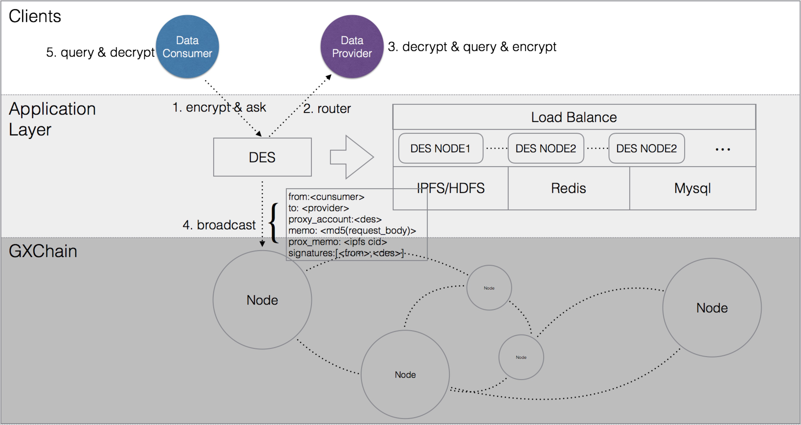

# DES
## Background of the project

'GongXinBao' Data Exchange 1.0 is the world's first decentralized data exchange,Through the blockchain technology, the complete process of decentralized, reliable and reliable data transactions is realized.And introduce data source rights protection, data copyright deposit, personal privacy protection, credit contribution proof \(POCS\) and other mechanisms, after the optimization of the data transaction process, the complete transaction process can be completed in 500ms, the efficiency of data transactions is comparable to traditional centralized trading methods.

After the 1.0 version was officially launched and commercialization was promoted for some time, some shortcomings were also found, mainly reflected in the following aspects:
1. Accessors need to deploy separate 'box', increasing the complexity of the architecture
2. A large number of broadcast operations are performed in GXChain, and the total block size increases rapidly, and the content of many broadcasts is not meaningful in the block.
3. A large number of functions depend on the GXChain, and frequent upgrades of the GXChain will result in increased maintenance costs for node managers and limited product flexibility.
3. Blockchain nodes and data transaction box are bidirectionally communicated via Websocket, and single node load and stability are difficult to control.
4. In the alliance market data transaction, the access party malicious data fraud problem

The data transaction version 2.0 design will further simplify the data transaction process and provide more reliable, efficient and stable services under the premise of ensuring decentralization, stability and functional consistency. The new version will bring the following features:
1. Add sdk installation mode and http call mode, reducing architectural complexity
2. Provide separate data exchange service DES, reduce chain broadcast, reduce GXChain load, and reduce block size
3. Add http call mode, DES supports load balancing to ensure the stability of data transaction process
4. Introduce BaaS services, store data in sidechains, provide deposit and verification interfaces, use deposit certificates and data verification to further improve data fraud and reduce data fraud motives

## V-2.0 Technical Architecture

### **2.1 Architecture diagram**



### **2.2 Participant description**

* Merchant: the data buyer;

* DES\(Data Exchange Service\): Data exchange service, providing functions such as withholding fee and data temporary storage;

* Datasource: Data seller;

### **2.3 Process description**


The following describes the complete process of a data transaction:

- step 1: [Datasource] Registering with DES
- step 2: [Merchant] Call product information interface
- step 3: [DES] Return product information and online data source list
- step 4: [Merchant] Call the transaction creation interface to create a data transaction, specify the query data source, and encrypt the input parameters using the data source public\_key
- step 5: [DES] Verify the merchant’s signature, verify that the balance is sufficient, create a data transaction, generate a unique request\_id and return
- step 6: [DES] Bring a merchant to initiate a data transaction message and send a data transaction request to the specified data source
- step 7: [Datasource] Receive the request, decrypt the message body, process the request, use the buyer public_key to encrypt the data and then return the DES
- step 8: [DES] Get encrypted data, save it on IPFS network, call agent accounting
- step 9: [DES] Data and request\_id to establish mapping
- step 10: [Merchant] Get data via request\_id

## 1 DES market interface definition

### 1.1 Account binding

```bash
POST /market/account/bind
{
    "accountId":"1.2.11", //Account id
    "merchantId":14, //Platform user id
    "serviceUrl":"http://gxb.io/service", //Data source service address
    "timestamp":150918591212, //Timestamp
    "signature":"Private.sign('1.2.11|14|http://gxb.io/service|150918591212')" //signature
}

{
    "code":1,
    "msg":"成功"
}
```

### 1.2 category release（Internal）

```bash
POST /market/category/create
{
    "categoryName":"普惠金融"
}

{
    "code":1,
    "msg":"成功",
    "data":{
        "categoryId": 1,
        "categoryName": "普惠金融"
    }
}
```

### 1.3 product release

```bash
POST /market/product/create
{
    "productName": "KYC认证",
    "logoImgBase64": "Base64.encode(imgByte)", //Product logo, size limit is required
    "brieDesc": "123",
    "voteThrehold":0.7, // Voting threshold, 0.7 means 70% vote, the operation takes effect
    "categoryId": 1, 
    "price": { 
        "amount": 100000,
        "assetId":"1.1"
    },
    "privacy":false, // Whether user privacy is involved
    "input":{ 
        "name": {
            "type": "string",
            "desc": "姓名",
            "required":true,
            "sample": "张三"
        },
        "idcard": {
            "type": "string",
            "desc": "身份证号",
            "required":true,
            "sample": "330102128901016666"
        },
        "photo": {
            "type": "string",
            "desc": "自拍照base64",
            "required":true,
            "sample": "6Ieq5ouN54WnYmFzZTY0..."
        }
    },
    "output":{ 
        "result": {
            "type": "boolean",
            "desc": "是否匹配",
            "sample": true
        }
    }
}

{
    "code":1,
    "msg":"成功"
}
```

### 1.4 Invite/Apply as data source

> Verification logic: If the current account is already in the member list of the product, the member is invited to join, and the existing members are automatically filtered in the members; if the current account is not in the members list, the application is added (ignoring the members parameter)
>
> Notification logic: 1. Email notification of existing members 2. Notification Center
>
> More restrictive restrictions: the same account cannot be used to initiate the same application multiple times. Accounts that are rejected 5 times in a row will not be able to initiate the application within 3 days. The invited account must be bound to the account on the GXChain.

```bash
POST /market/product/:productId/members/add
{
    "members":[14,15]
}

{
"code":1,
    "msg":"成功",
    "data":{
        "voteId":1,
        "expireAt":1501230180812, //expire time = timestamp + 2*24*3600 //Valid for 2 days
    }
}
```

### 1.6 Update product information

```bash
POST /market/product/:productId/update
{
    "productName": "KYC认证",
    "logoImgBase64": "Base64.encode(imgByte)", //Product logo, size limit is required
    "briefDesc": "通过姓名、身份证号和自拍照验证是否一致",
    "price":{
        "amount":990000,
        "assetId":"1.1"
    },
    "categoryId": 1, 
    "privacy":false, // Whether user privacy is involved
    "input":{ 
        "name": {
            "type": "string",
            "desc": "姓名",
            "sample": "张三"
        },
        "idcard": {
            "type": "string",
            "desc": "身份证号",
            "sample": "330102128901016666"
        },
        "photo": {
            "type": "string",
            "desc": "自拍照base64",
            "sample": "6Ieq5ouN54WnYmFzZTY0..."
        }
    },
    "output":{ 
        "result": {
            "type": "boolean",
            "desc": "是否匹配",
            "sample": true
        }
    }
}

{
    "code":1,
    "msg":"成功",
    "data":{
        "voteId":1,
        "expireAt":1501230180812, //expire time = timestamp + 2*24*3600 //Valid for 2 days
    }
}
```

### 1.7 Product information change vote

```bash
POST /market/product/vote
{
    "agree": 1, // Agree: 1, Disagree: 0
    "voteId": 1
}

{
    "code":1,
    "msg":"成功"
}
```

### 1.8 Product List
> shareStatus=1 is free market, 0 is alliance market

```bash
GET /market/product/list/:categoryId/:shareStatus?page=1&limit=20
{
    "code":1,
    "msg":"成功",
    "total":15, //A total of 15 records
    "data":[{
        "productId":1,
        "productName":"KYC认证",
        "logoUrl": "https://des-developer-test.oss-cn-hangzhou.aliyuncs.com/product/logo/logo_20180627205612_L8Ky6BKr.png",
        "briefDesc": "通过姓名、身份证号和自拍照验证是否一致",
        "privacy":false, // Whether user privacy is involved
        "price":{
            "amount":"990000",
            "assetId":"1.1"
        }
    }]
}
```

### 1.9 Product Details

```bash
GET /market/product/:productId

{
    "code":1,
    "msg":"成功",
    "data":{
        "productName": "KYC认证",
        "logoUrl": "https://des-developer-test.oss-cn-hangzhou.aliyuncs.com/product/logo/logo_20180627205612_L8Ky6BKr.png",
        "briefDesc": "通过姓名、身份证号和自拍照验证是否一致",
        "price":{
            "amount":"990000",
            "assetId":"1.1"
        },
        "categoryId": "1", 
        "privacy":false, // Whether user privacy is involved
        "input":{ 
            "name": {
                "type": "string",
                "desc": "姓名",
                "sample": "张三"
            },
            "idcard": {
                "type": "string",
                "desc": "身份证号",
                "sample": "330102128901016666"
            },
            "photo": {
                "type": "string",
                "desc": "自拍照base64",
                "sample": "6Ieq5ouN54WnYmFzZTY0..."
            }
        },
        "output":{ 
            "result": {
                "type": "boolean",
                "desc": "是否匹配",
                "sample": true
            }
        }
    }
}
```

### 1.10 Product corresponding voting list

```bash
GET /market/product/<:productId>/votes/:type?page=1&limit=20 //productId为all则获取全部, Type=0(no vote) 1 (passed) 2（已拒绝）

{
    "code":1,
    "msg":"成功",
    "total":25, //25 records in total
    "data":[{
        "voteId":1,
        "productId":1,
        "productName":"kyc认证",
        "createDate":"2018-03-12T12:23:10",//Create time
        "status":"INPROGRESS" //INPROGRESS|PASS|REJECT Vote | agree | reject
        "requester":14,//Apply for a business
        "type": "APPLY" //APPLY|ADD_MEMBER|UPDATE_PRODUCT Apply to join|Invite to join|Update product
    }]
}
```

### 1.11 Product voting details

```bash
GET /market/product/votes/:voteId

{
    "code":1,
    "msg":"成功",
    "data":<item>
}

// ============================ Item may result in enumeration ===============================

{
    "voteId":1,
    "productId":1,
    "status":"INPROGRESS" //INPROGRESS|PASS|REJECT
    "requester":14,
    "type": "APPLY", 
    "members":[{
        "merchantId":14,
        "authorizerName": "草虫", 
        "merchantName": "杭州存信数据科技有限公司",
        "logoUrl": "http://www.gxb.io/files/merchant/201610/11/1_yzXExf.jpg", //logo
        "merchantAddress": "https://gxb.io", 
    }]
}

{
    "voteId":1,
    "productId":1,
    "requester":14,
    "type": "ADD_MEMBER", 
    "members":[{
        "merchantId":16,
        "authorizerName": "草虫", 
        "merchantName": "杭州存信数据科技有限公司", 
        "logoUrl": "http://www.gxb.io/files/merchant/201610/11/1_yzXExf.jpg", //logo
        "merchantAddress": "https://gxb.io", 
        },{
        "merchantId":15,
        "authorizerName": "草虫", 
        "merchantName": "杭州存信数据科技有限公司", 
        "logoUrl": "http://www.gxb.io/files/merchant/201610/11/1_yzXExf.jpg", //logo
        "merchantAddress": "https://gxb.io", 
    }]
}

{
    "voteId":1,
    "productId":1,
    "requester":14,
    "type": "UPDATE_PRODUCT", 
    "from":{
        "productName": "KYC认证",
        "briefDesc": "通过姓名、身份证号和自拍照验证是否一致",
        "price":{
            "amount":990000,
            "assetId":"1.1"
        },
        "categoryId": 1, 
        "privacy":false, 
        "input":{ 
            "name": {
                "type": "string",
                "desc": "姓名",
                "required":true,
                "sample": "张三"
            },
            "idcard": {
                "type": "string",
                "desc": "身份证号",
                "required":true,
                "sample": "330102128901016666"
            },
            "photo": {
                "type": "string",
                "desc": "自拍照base64",
                "required":true,
                "sample": "6Ieq5ouN54WnYmFzZTY0..."
            }
        },
        "output":{ 
            "result": {
                "type": "boolean",
                "desc": "是否匹配",
                "sample": true
            }
        }
    },
    "to":{
        "productName": "KYC认证",
        "briefDesc": "通过姓名、身份证号和自拍照验证是否一致",
        "price":{
            "amount":990000,
            "assetId":"1.1"
        },
        "categoryId": 1, 
        "privacy":false, 
        "input":{ // 
            "name": {
                "type": "string",
                "desc": "姓名",
                "required":true,
                "sample": "张三"
            },
            "idcard": {
                "type": "string",
                "desc": "身份证号",
                "required":true,
                "sample": "330102128901016666"
            },
            "photo": {
                "type": "string",
                "desc": "自拍照base64",
                "required":true,
                "sample": "6Ieq5ouN54WnYmFzZTY0..."
            }
        },
        "output":{ 
            "result": {
                "type": "boolean",
                "desc": "是否匹配",
                "sample": true
            }
        }
    }
}
```

### 1.12 Consumer details

```bash
GET /market/dataexchange/log?gmtCreatedFrom=2018-01-01&gmtCreatedTo=2018-01-02&productId=1&pageNo=1&pageSize=20

{
    "code": 1,
    "msg": "",
    "data": [{
        "id": 16,
        "requestId": "Qma2L9V1rVHBAMMSNLrqCRS1wicv7mhFWtou8JJDL5khCh", 
        "productId": 1, 
        "productName": "学历信息1", 
        "amount": 0, 
        "gmtCreated": 1523416611000 //time
    }],
    "total": null
}
```

### 1.13 data query

```bash
GET /market/dataexchange/detail?gmtCreatedFrom=2018-01-01&gmtCreatedTo=2018-01-02&toAccount=1.2.11&requestId=fb17941dce8dc78d6275b04afbb4a5202f7fd4defca4918cf21c913abe706d4e&txid=fb17941dce8dc78d6275b04afbb4a5202f7fd4defca4918cf21c913abe706d4e

{
    "code": 1,
    "msg": "",
    "data": [{
        "id": 16,
        "gmtCreated": 1523416611000, 
        "fromAccount": "1.2.19", //Data source account
        "toAccount": "1.2.323", //Initiate an account
        "requestId": "Qma2L9V1rVHBAMMSNLrqCRS1wicv7mhFWtou8JJDL5khCh", 
        "txid": "d150b067f5f740ef8e0c755a6ee1e462f63d4ecf" 
    }],
    "total": null
}
```

### 1.14 Monthly bill

```bash
GET /market/bill/month?date=2018-05-01

{
    "code": 1,
    "msg": "",
    "data": {
        "code": 0,
        "msg": null,
        "data": [{
            "productId": 1, 
            "productName": "学历信息1", 
            "transferCount": 16, //Monthly calls
            "unitPrice": 0.001, 
            "consumeAmount": 0.016 
        },{
            "productId": 2,
            "productName": "学历信息2", 
            "transferCount": 1,
            "unitPrice": 1,
            "consumeAmount": 1
        }],
        "total": null
    },
    "total": null
}
```

### 1.15 Monthly account information

```bash
GET /market/bill/monthTotal?date=2018-05-01

{
    "code": 1,
    "msg": "",
    "data": {
        "date": null,
        "consumeAmount": 0.022, //total
        "incomeAmount": 106.91608, 
        "transferCount": 3, 
        "balance": 0, 
        "average": null
    },
    "total": null
}
```

### 1.16 Consumption information

```bash
# Consumption information for the last 30 days (7 days interception use)
GET /market/bill/recent

#Displayed in reverse order by date
{
    "code": 1,
    "msg": "",
    "data": [{
            "date": 1527350400000,
            "consumeAmount": 0, 
            "incomeAmount": 0, 
            "transferCount": 0, 
            "balance": null,
            "average": null
        },{
            "date": 1527264000000,
            "consumeAmount": 0,
            "incomeAmount": 0,
            "transferCount": 0,
            "balance": null,
            "average": null
    }],
    "total": null
}
```

### 1.17 Account information

```bash
GET /market/bill/total

{
    "code": 1,
    "msg": "",
    "data": {
        "overview": {
            "date": null,
            "consumeAmount": 1.06, 
            "incomeAmount": null,
            "transferCount": null,
            "balance": 0, 
            "average": 0.02465 //Average daily consumption
        },
        "productList": [{
                "productId": 1, 
                "productName": "学历信息1", 
                "logoUrl": "https://des-developer-test.oss-cn-hangzhou.aliyuncs.com/product/logo/logo_20180627205612_L8Ky6BKr.png",
                "transferCount": 22, 
                "unitPrice": 0.001, 
                "consumeAmount": 0.06 
            },{
                "productId": 2,
                "productName": "学历信息2",
                "logoUrl": "https://des-developer-test.oss-cn-hangzhou.aliyuncs.com/product/logo/logo_20180627205612_L8Ky6BKr.png",
                "transferCount": 1,
                "unitPrice": 1,
                "consumeAmount": 1
        }]
    },
    "total": null
}
```

## 2 DES interface definition

### 2.1 Data source registration service

When the sdk or box of the data source is started, register the service with DES and declare it online.

> The client needs to send a heartbeat packet for 30s, the expiration time is 50s, and the registration request is not received within 50s, the data source status becomes offline.

```bash
POST /api/datasource/heartbeat
{
    "account":"1.2.11",
    "products":[1,2],
    "timestamp":15089110248010, // Valid for 3 seconds
    "signature":"d787ad8d787ad8d787ad8d787ad8d787ad8d787ad8d787ad8d787ad8d787ad8d787ad8d787ad8" // Private.sign("1.2.11|15089110248010")
}
```

### 2.2 Query data product information

Merchants query DES for data product information

```bash
GET /api/product/:product_id
```

Return result：

```bash
{
    "product": {
        "productId": 1,
        "productName": "KYC认证",
        "briefDesc": "123",
        "categoryId": 1,
        "price": {
            "amount": 100000,
            "asset_id":"1.1"
        },
        "datasources":["1.2.10","1.2.12","1.2.15","1.2.18"], // Alliance member
        "issuer": 14, // Publisher id
        "privacy":false, // Whether user privacy is involved
        "input":{ 
            "name": {
                "type": "string",
                "desc": "姓名",
                "required":true,
                "sample": "张三"
            },
            "idcard": {
                "type": "string",
                "desc": "身份证号",
                "required":true,
                "sample": "330102128901016666"
            },
            "photo": {
                "type": "string",
                "desc": "自拍照base64",
                "required":true,
                "sample": "6Ieq5ouN54WnYmFzZTY0..."
            }
        },
        "output":{ 
            "result": {
                "type": "boolean",
                "desc": "是否匹配",
                "sample": true
            }
        }
    },
    "des":{
        "account_id":"1.2.17",
        "percent":10000
    },
    "onlineDatasources": [
        {"account_id":"1.2.10","publicKey":"GXC****"}
    ]
}
```

### 2.3 Create a data transaction

Merchant initiates a data transaction request

```bash
POST /api/request/create/:product_id/[/:version]
[{
    "params":"HUI712124DMOKF23F2G23H8FG1H8GH482GH34GH83H9KD1K0D1K0F10DQK0S0K1210E12E==", // Encryption request parameter packet
    "nonce":150123121123123,
    "requestParams":{
        "from": "1.2.20", // Transfer from this account, the amount of transfer is amount
        "to": "1.2.11", // Transfer to this account, data source account
        "proxy_account":"1.2.17", // Agent billing party
        "percent":10000, // Percentage of amount, transfer to proxy_account
        "amount": { 
            "amount": 50000, 
            "asset_id": "1.1"
        },
        "memo": "68b329da9893e34099c7d8ad5cb9c940", // Request parameter MD5 value
        "expiration": "2017-12-09T07:58:39", // Authorization expiration time, also the validity period of signatures，expiration < now + maximum_time_until_expiration
        "signatures": [
            "xxxx" // The caller (authorizer) signs the request_params structure with its own private key
        ]
    }
}]
```

Return result:

```bash
{
    "request_id":"f4d6d30fb9d33813e801869723cfe75d20380f71dca43079b72a9c580fd3732e"
}
```

### 2.4 Query data transaction status

Merchants get transaction status via request\_id

```bash
GET /api/request/:request_id
```

Return result:

```bash
{
    "status":"IN_PROGRESS", // IN_PROGRESS, FINISHED
    "total": 4, // Initiating a request to 4 data sources, there should be 4 results
    "datasources":[{
        "status":"SUCCESS", //SUCCESS, FAIL, NONE, TIMEOUT
        "comment": "余额不足",
        "datasource":"1.2.11", //Data source id
        "nonce":150123121123123,
        "data":"<encrypted_data>", // Data encrypted with the merchant\'s public key
        "txid":"f4d6d30fb9d33813e801869723cfe75d20380f71dca43079b72a9c580fd3732e" // Transaction id, which can be queried by the block explorer
    }]
}
```

## 3 Witness interface definition

Witness adds agent billing operation proxy\_transfer, corresponding transaction broadcast initiated by DES

### 3.1 proxy\_transfer

```js
{
        "proxy_memo": "QmbTuAu2zM53Rj8rk8J2o7mCzHJr6vf8WdjYyiq5SNaDBF", // Filled in by proxy_count
        "fee": {  // Fee, paid by proxy_account
          "amount": 166015, // int64_t
          "asset_id": "1.3.0"
        },
        "request_params": {  // Caller (authorizer) initiated
          "from": "1.2.20",  // Transfer from this account, the amount of transfer is amount
          "to": "1.2.11",    // Transfer to this account
          "proxy_account":"1.2.17", // Agent billing party
          "percent":10000,    // Percentage of amount, transfer to proxy_account
          "amount": {    
            "amount": 50000,  
            "asset_id": "1.1"
          },
          "memo": "68b329da9893e34099c7d8ad5cb9c940", // string
          "expiration": "2017-12-09T07:58:39", // Authorization expiration time, also the validity period of signatures，expiration < now + maximum_time_until_expiration
          "signatures": [
            "xxxx" // The caller (authorizer) signs the request_params structure with its own private key
          ]
        },
        "extensions": []
      }   "extensions": []
}
```

## 4 Data source interface definition

The data source should follow a specific interface definition in response to a data transaction request initiated by DES

::: tip rule
There is data returning http status code 200, no data returning http status code 404
:::

### 4.1 Data source interface

Recommended interface definition:

```
POST /data/request
```

Incoming parameters:

```js
{
    "params" : "HUI712124DMOKF23F2G23H8FG1H8GH482GH34GH83H9KD1K0D1K0F10DQK0S0K1210E12E", //Encryption request parameter packet
    "publicKey": "GXC7XzFVivuBtuc2rz3Efkb41JCN4KH7iENAx9rch9QkowEmc4UvV", // Requester public key
    "productId": 1, 
}
```

Outgoing parameter(Return the data into a JSON String, call DESClient.encrypt\(jsonString\) to generate):

```js
{
    "data": "HUI712124DMOKF23F2G23H8FG1H8GH482GH34GH83H9KD1K0D1K0F10DQK0S0K1210E12E" //Encrypted return packet
}
```