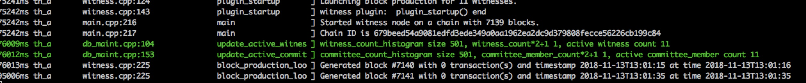
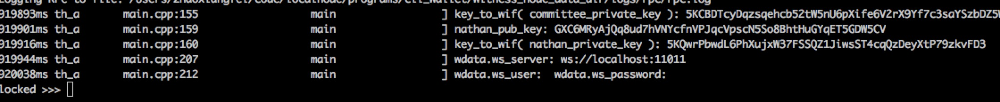
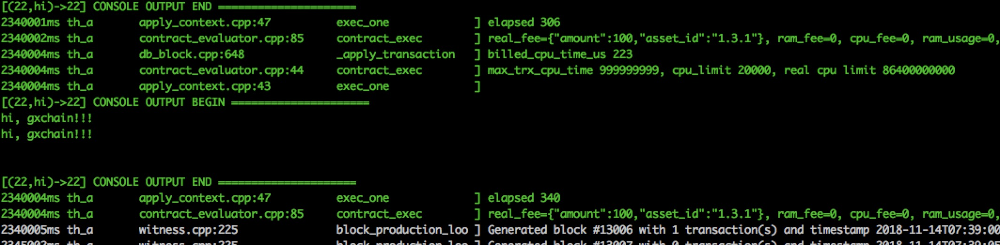
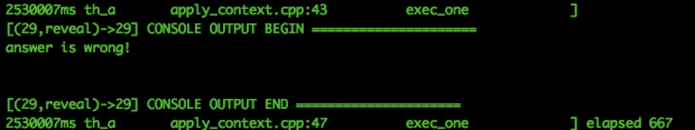
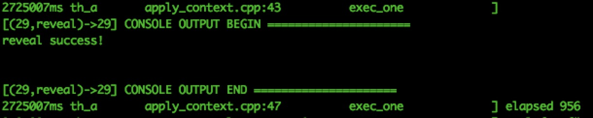

# Inicio rápido
## Guía introductoria

El propósito de este tutorial es proporcionar orientación sobre el desarrollo de contratos inteligentes de GXChain, incluido el desarrollo de contratos, la implementación, la depuración y la categorización de errores comunes.


El contrato inteligente GXChain está escrito en lenguaje C++ y desplegado en la red blockchain GXChain después de compilar con la máquina virtual [Webassembly](https://webassembly.org/). Los contratos inteligentes compilados incluyen principalmente el archivo `abi`, que es el archivo de interfaz definido por el contrato, y el archivo fuiste, que es el archivo de código de bytes ejecutado por la máquina virtual webassembly. GXChain utiliza la máquina virtual WebAssembly para admitir contratos inteligentes escritos en varios idiomas, como C + + y TypeScript.


**Antes de desarrollar un contrato inteligente, debe hacer lo siguiente:**

- Conocimiento del desarrollo del lenguaje C++
- Conocimientos de los comandos del sistema Linux y Mac
- Compile el código fuente localmente, inicie la cadena privada local o conéctese a la red de prueba ([tutorial](https://github.com/gxchain/gxb-core) de compilación de código fuente aquí)


**Términos relacionados:**

- **Acción**：la interfaz externa proporcionada por el contrato inteligente, puede interactuar con el front-end y la `acción` invocada por el usuario se registra en el bloque.
- **Tabla**：el contrato proporciona almacenamiento persistente, similar a la tabla de la base de datos, admite varios índices y la tabla se almacena en el objeto de cuenta de contrato.

**Introducción de herramientas：**

- **witness_node**：Un programa de nodo, puede ejecutar diferentes funciones bajo diferentes configuraciones. Por ejemplo, durante el desarrollo del contrato, el puerto RPC se inicia para interactuar con cli_wallet para invocar el contrato a consulta tabla. 
- **cli_wallet**：Un programa de billetera de línea de comandos, se utiliza principalmente para administrar la billetera e interactuar con witness_node programa.  Los comandos incluyen: contrato de implementación, contrato de llamada, contrato de actualización, tabla de consulta, etc. (utilice el comando `help` y el comando `gethelp` para ver cómo se utiliza la herramienta). 
- **gxx**：se utiliza para compilar archivos de `C++` en archivos abi y archivos wasm para su implementación en GXChain.
- **gxc-smart-contract-ide**: a través del IDE de contrato inteligente, puede escribir, compilar, implementar e invocar contratos inteligentes. [Haga clic en la descarga](https://github.com/gxchain/gxchain-alpha/releases/latest).


### 1. Inicie la cadena privada local

Después de la compilación, cambie al directorio donde reside el programa witness_node y utilice el siguiente comando para iniciar el nodo de salida local, los datos para guardar la información de configuración, la información de bloque generada, etc. Inicie el tutorial de cadena privada local haciendo [clic aquí](../advanced/private_chain.md)

```bash
./witness_node -d data
```

Después del inicio, como se muestra en la siguiente figura (registre el ID de la cadena, que cli_wallet utilizará cuando se conecte):



Después de ejecutar el nodo de bloque, cambie al directorio cli_wallet y ejecute el siguiente comando para iniciar el cliente cli_wallet para interactuar con el nodo de bloque, incluida la creación de cuentas, la implementación de contratos, la llamada a contratos y otras funciones, que se pueden probados por el cliente cli_wallet. (chain-id cambia a su propio ID)

```bash
./cli_wallet -sws://localhost:11011 --chain-id=679beed54a9081edfd3ede349a0aa1962ea2dc9d379808fecce56226cb199c84
```

Después del inicio, se ve como este:(Inicio inicial muestra new)




### 2. Crear una nueva billetera

Primero necesitas crear una nueva contraseña para tu billetera, que se usa para desbloquear tu billetera. En el tutorial se utiliza la siguiente contraseña: `supersecret`, también se puede utilizar una combinación de letras y números para crear su propia contraseña. Por favor, introduzca el siguiente comando para crear:


```bash
>>> set_password supersecret
```

Ahora puedes desbloquear tu billetera recién creada：

```bash
unlock supersecret
```

### 3. reclamar el saldo inicial

La cuenta de activos se incluye en la cuenta de billetera. Para agregar una cuenta de billetera a tu billetera, debes conocer el nombre de la cuenta y la clave privada de la cuenta. En nuestro ejemplo, importa la cuenta `Nathan` inicializada en my-genesis.json al billetera existente a través del comando `import_key`:


```bash
import_key nathan 5KQwrPbwdL6PhXujxW37FSSQZ1JiwsST4cqQzDeyXtP79zkvFD3
```

::: warning Pronto
* `Nathan` se utilizará para definir el nombre de cuenta en el archivo inicial. Si ha modificado el archivo `my-genesies.json`, puede escribir un nombre diferente. Además, tenga en cuenta que `5KQwrPbwdL6PhXujxW37FSSQZ1JiwsST4cqQzDeyXtP79zkvFD3` es la clave privada definida en el `config.ini`
:::

Ahora que hemos importado la clave privada en la billetera, la balanza se inicializó en my-genesis.json, debe ser reclamado por el comando `import_balance` sin ninguna tarifa de declaración:

```bash
import_balance nathan ["5KQwrPbwdL6PhXujxW37FSSQZ1JiwsST4cqQzDeyXtP79zkvFD3"] true
```

Puede ver su cuenta con el siguiente comando:

```bash
get_account nathan
```

Obtenga el saldo de la cuenta con el siguiente comando:

```bash
list_account_balances nathan
```

### 4. Crear una cuenta

Ahora vamos a crear una nueva cuenta `alpha` para que podamos transferir dinero de ida y vuelta entre las cuentas de `nathan` y `alpha`.

Por lo general, utilizamos una cuenta existente para crear una nueva cuenta porque el registrador tiene que pagar una cuota de inscripción. Además, la cuenta del registrador debe entrar en el estado de Also, there is the requirement lifetime member (LTM). Así que tenemos que actualizar la cuenta `Nathan` al estado LTM antes de crear una nueva cuenta, utilizando el comando `upgrade_account` para actualizar la cuenta:


```bash
upgrade_account nathan GXC true
```

En la información devuelta, encontrará `2106-02-07T06:28:15` junto a `membership_expiration_date`. Si usted ve `1970-01-01T00:00:00`, significa que hay un error en la operación anterior y `nathan` no pudo actualizar con éxito. 
Después de la actualización exitosa, podemos registrar la nueva cuenta a través de `nathan`, pero primero necesitamos tener la clave pública de la nueva cuenta. El comando `suggest_brain_key` se utiliza para generar el par de claves pública-privada:

```bash
// Generar par de claves
suggest_brain_key
```

A continuación, llame a la interfaz  register\_account/register\_account2  para crear una nueva cuenta

```bash
register_account alpha GXC6vQtDEgHSickqe9itW8fbFyUrKZK5xsg4FRHzQZ7hStaWqEKhZ GXC6vQtDEgHSickqe9itW8fbFyUrKZK5xsg4FRHzQZ7hStaWqEKhZ nathan nathan 10 true
```

Utilice el comando  transfer3  para transferir algunos activos a una cuenta

```bash
transfer3 nathan alpha 1000 GXC test GXC true
```

Utilice el siguiente comando para ver el saldo de activos:

```bash
list_account_balances alpha
```
## Presentación del contrato Hello World

Antes de leer este tutorial, supongamos que ha leído la guía introductoria

### 1. Introducción de la función y llamada de implementación

####  1.0 funciones contractuales

[El contrato Hello World](https://github.com/gxchain/gxb-core/tree/dev_master/contracts/examples/helloworld) es uno de los contratos GXChain más ágiles. Al analizar este contrato, podemos captar el marco básico del desarrollo de contratos inteligentes. El contrato implementa una `acción Hi`, que es la interfaz proporcionada por el contrato a la llamada externa, imprimiendo dos veces el `usuario HI (el parámetro para invocar la acción)` de la cadena a la consola con el siguiente resultado:




####  1.1 compilación del contrato
El contrato inteligente incluye archivo xxx.hpp y xxx.cpp, que debe compilarse en archivo xxx.wast y xxx.abi antes de que pueda implementarse en la cadena de bloques. Puede compilar archivos wast y abi utilizando la herramienta gxx  proporcionada por GXChain, que se puede encontrar en el directorio `~/gxb-core/build/tools/gxx`. Puede cambiar al directorio donde se encuentra gxx y compilar utilizando el siguiente comando:


```bash
//compilar archivos  wast, reemplace la ruta con su propio
./gxx -o /Users/zhaoxiangfei/code/gxb-core/contracts/examples/helloworld/helloworld.wast /Users/zhaoxiangfei/code/gxb-core/contracts/examples/helloworld/helloworld.cpp

//compilar archivos abi, reemplace la ruta con su propio
./gxx -g /Users/zhaoxiangfei/code/gxb-core/contracts/examples/helloworld/helloworld.abi /Users/zhaoxiangfei/code/gxb-core/contracts/examples/helloworld/helloworld.hpp
```
####  1.2 Implementación del contrato

Puede usar el siguiente comando para implementar Hello World, Hello para contratar el nombre de usuario (el comando de implementación de contrato creará una cuenta de contrato , los activos de la cuenta de contrato pueden controlar a través de contratos), nathan para pagar la cuenta de tarifas, 0 0 significa máquina virtual tipo y versión, /Users/zhaoxiangfei/code/gxb-core/contracts/examples/helloworld para contratos (**incluyendo archivo wast y abi**), GXC indica el tipo de cuota, y true indica si se emite o no.

```bash
//implementar el contrato
deploy_contract hello nathan 0 0 /Users/zhaoxiangfei/code/gxb-core/contracts/examples/helloworld GXC true
```

::: warning Atención
* Cuando se despliega el contrato, la cuenta que paga la tarifa de manejo debe haber importado la clave privada (el comando anterior paga la cuenta como `Nathan`), y el saldo de la cuenta es suficiente para pagar la tarifa de manejo
:::

####  1.3 invocación del contrato

Puede invocar la interfaz de contrato con el siguiente comando y la interfaz de contrato de invocación de GXChain puede adjuntar la opción de envío de activos. La invocación del activo adicional envía el activo a la cuenta de contrato. Los activos de una cuenta de contrato no se controlan excepto por una API de retirada `withdraw_asset`, que es un código dentro del propio contrato.
```bash
// Los activos no transportados
call_contract nathan hello null hi "{\"user\":\"gxchain!!!\"}" GXC true

// Activos acumulados (acción para activos acumulados, que se rellenarán en el contrato///@abi pagadero) 
call_contract nathan hello {"amount":10000000,"asset_id":1.3.1} hi "{\"user\":\"gxchain!!!\"}" GXC true

```

::: warning Las definiciones de acción con activos transferidos
```cpp
// @abi action
// @abi payable
void hi(std::string user)
{
	    {
        for (int i = 0; i < 2; ++i) {
            print("hi, ", user, "\n");
        }
    }
}
```
:::

### 2. Análisis de código

El contrato inteligente Hello World contiene solo una acción, que es el contrato inteligente más simple. Podemos utilizar esto como un ejemplo para analizar el marco básico de los contratos inteligentes. 
El desarrollo de contratos implica definir una clase de contrato y proporcionar una interfaz de aplicación que se puede definir mediante el `GRAPHENE_ABI` suministrado por el sistema.


Arriba, se completa un contrato inteligente básico. El directorio del archivo de cabecera es `/Users/zhaoxiangfei/code/gxb-core/contracts/graphenelib` (cambiar a su directorio correspondiente), durante el desarrollo de contrato, después de introducir el archivo de cabecera relevante, puede utilizar los tipos integrados y funciones integradas de api de contratos. El siguiente tutorial analiza un contrato inteligente más complejo-el contrato de envolventes rojos.


## Presentación al contrato de Bolsos Rojos

Antes de leer este tutorial, supongamos que ha leído la guía introductoria

### 1. Introducción de la función y llamada de implementación

####  1.0 funciones contractuales

[El contrato de Bolsos Rojos](https://github.com/gxchain/gxb-core/tree/dev_master/contracts/examples/redpacket) es un contrato relativamente complejo. A través del análisis del contrato de Bolsos Rojos, explicaremos el uso de la tabla multi-índice, la llamada API incorporada y otras funciones. 

El contrato de Bolsos Rojos consta de tres acciones: emitir(issue), abrir（open） y cerrar（close).
> Nota: la llamada cree la interfaz del bolso rojo (issue) se puede asociar los activos; si los bolsos rojos no se ajustan, el emisor puede cerrarlo y devolver el saldo. Debe establecer una contraseña (clave pública) para enviar un bolso rojo. Para poder agarrar un bolso rojo, usted necesita firmar su ID de usuario con la clave privada correspondiente a la contraseña.


- **Llamar la interfaz para enviar bolso rojo, el proceso y los resultados de la retroalimentación como el siguiente:**
```bash
# pubkey es una contraseña generada aleatoriamente: la siguiente llamada significa que se envían 5 bolsos rojos con una cantidad total de 11 GXC (1.3.1 significa activos GXC)
unlocked >>> call_contract nathan redpacket {"amount":1100000,"asset_id":1.3.1} issue "{\"pubkey\":\"GXC81z4c6gEHw57TxHfZyzjA52djZzYGX7KN8sJQcDyg6yitwov5b\",\"number\":5}" GXC true
{
  "ref_block_num": 15124,
  ...
  ...
  ...
  "signatures": [
    "1f7fade01ef08d986282164c1428fee37ecc5817c4e6bdc7c160220cf965b881d7417874ab22be48047becf62936e6a060a3e06c65e3548e90a72ddc1720794db3"
  ]
}
# Compruebe los activos de la cuenta de contrato, en el contrato actual sólo hay un usuario enviando bolsos rojos, por lo que la cantidad de un activo enviado por un usuario 11 GXC
unlocked >>> list_account_balances redpacket
11 GXC

# Para la información de la tabla de los paquetes rojos, los subpaquetes se dividen aleatoriamente en 5 secuencias de paquetes rojos, y el pub_key se utiliza para verificar la firma
unlocked >>> get_table_rows redpacket packet 0 -1
[{
    "issuer": 17,
    "pub_key": "GXC81z4c6gEHw57TxHfZyzjA52djZzYGX7KN8sJQcDyg6yitwov5b",
    "total_amount": {
      "amount": 1100000,
      "asset_id": 1
    },
    "number": 5,
    "subpackets": [
      350531,
      150227,
      390591,
      66767,
      141884
    ]
  }
]

```

Para agarrar un bolso rojo, es necesario conocer la clave privada correspondiente a la contraseña de envío de un bolso rojo. Los bolsos rojos de pelo se crean cuando la contraseña es: GXC81z4c6gEHw57TxHfZyzjA52djZzYGX7KN8sJQcDyg6yitwov5b, debe conocer la contraseña de la clave privada correspondiente (la contraseña de clave privada es 5j9vj4xiwvq2hnr22ufrxgaaerqrpn7xzqer9z2hwspewdbmkbm). El método sign_string se proporciona mediante cli_wallet. El Instance ID es el último campo del ID de cuenta. Por ejemplo, el ID de cuenta de Nathan es 1.2.17, por lo que su Instance ID es 17.


- **Llame para agarrar un bolso rojo, el proceso y los resultados de la retroalimentación como sigue:**
```bash
#firmar el Instance ID utilizando la clave privada
unlocked >>> get_account_id nathan
"1.2.17"
unlocked >>> sign_string 5J9vj4XiwVQ2HNr22uFrxgaaerqrPN7xZQER9z2hwSPeWdbMKBM 17
"1f1d104d5750beba9fd4b0637ce69cf54721a57cce91ca81904653307eb72b0a840bd8a80c58df0a7be206a4c5c5b1fa0d96d497667e54579e717d499d0a3498b2"

#Llame para agarrar un bolso rojo
call_contract nathan redpacket null open "{\"issuer\":\"nathan\",\"sig\":\"1f1d104d5750beba9fd4b0637ce69cf54721a57cce91ca81904653307eb72b0a840bd8a80c58df0a7be206a4c5c5b1fa0d96d497667e54579e717d499d0a3498b2\"}" GXC true
#saldo de la cuanta del contrato inteligente
list_account_balances redpacket
unlocked >>> list_account_balances redpacket
7.09409 GXC
#La secuencia de distribución de los bolsos rojos restantes en la cuenta de contrato se reduce de 5 a 4, y el artículo reducido es 390591, lo que representa la pérdida de 3,90591 GXC
unlocked >>> get_table_rows redpacket packet 0 -1
[{
    "issuer": 17,
    "pub_key": "GXC81z4c6gEHw57TxHfZyzjA52djZzYGX7KN8sJQcDyg6yitwov5b",
    "total_amount": {
      "amount": 1100000,
      "asset_id": 1
    },
    "number": 5,
    "subpackets": [
      350531,
      150227,
      66767,
      141884
    ]
  }
]
# el registro de agarrar bolsos rojos
unlocked >>> get_table_rows redpacket record 0 -1
[{
    "packet_issuer": 17,
    "accounts": [{
        "account_id": 17,
        "amount": 390591
      }
    ]
  }
]

```

- **La llamada de interfaz para cerrar el bolso rojo, a la que solo puede llamar el usuario que envió el bolso rojo. El bolso rojo sin terminar será devuelto al usuario. El proceso de llamada y los comentarios de resultados son los siguientes**

```bash
# Puede cerrar el bolso  rojo mediante el siguiente comando
unlocked >>> call_contract nathan redpacket null close "{}" GXC true

# Obtener el saldo de activos de la cuenta de contrato
unlocked >>> list_account_balances redpacket
0 GXC
```

####  1.1 Compilación del contrato

Puede compilar el archivo abi y el archivo wast para el contrato inteligente mediante el siguiente comando：

```bash
# Donde redpacket.cpp se encuentra, es necesario reemplazarlo con su propia ruta de acceso
./gxx -g /Users/zhaoxiangfei/code/gxb-core/contracts/examples/redpacket/redpacket.abi /Users/zhaoxiangfei/code/gxb-core/contracts/examples/redpacket/redpacket.cpp

# Donde redpacket.cpp se encuentra, es necesario reemplazarlo con su propia ruta de acceso
./gxx -o /Users/zhaoxiangfei/code/gxb-core/contracts/examples/redpacket/redpacket.wast /Users/zhaoxiangfei/code/gxb-core/contracts/examples/redpacket/redpacket.cpp
```

#### 1.2  Implementación del contrato

Puede utilizar el siguiente comando para implementar el contrato Bolsos Rojos

```bash
# Debe reemplazar la ruta de acceso donde reside el contrato inteligente con su propia ruta de acceso
deploy_contract redpacket nathan 0 0 /Users/zhaoxiangfei/code/gxb-core/contracts/examples/redpacket GXC true
```

#### 1.3 Invocación del contrato

```bash
# enviar bolso rojo
unlocked >>> call_contract nathan redpacket {"amount":1100000,"asset_id":1.3.1} issue "{\"pubkey\":\"GXC81z4c6gEHw57TxHfZyzjA52djZzYGX7KN8sJQcDyg6yitwov5b\",\"number\":5}" GXC true

# agarrar bolso rojo
unlocked >>> call_contract nathan redpacket null open "{\"issuer\":\"nathan\",\"sig\":\"1f1d104d5750beba9fd4b0637ce69cf54721a57cce91ca81904653307eb72b0a840bd8a80c58df0a7be206a4c5c5b1fa0d96d497667e54579e717d499d0a3498b2\"}" GXC true

# puede utilizar el siguiente comando para cerrar bolso rojo
unlocked >>> call_contract nathan redpacket null close "{}" GXC true
```

### 2.  Análisis de código

El código de contrato Bolso Rojo contiene llamadas a la api integrada y el uso de tablas de varios índices. Analizando los contratos Bolso Rojo, vamos a explicar brevemente cómo usarlos. El marco del contrato se puede encontrar en la introducción al contrato Hello World en el tutorial anterior.

- nota //@abi payable significa que la acción se puede cargar con activos para producir los archivos abi correctos
```cpp
// @abi action
// @abi payable
void issue(std::string pubkey, uint64_t number){
	...
}
```

- Utilizar graphene_assert,  revertir la acción cuando falle
```cpp
graphene_assert(pubkey.size() > prefix_len, "invalid public key");
graphene_assert(pubkey.substr(0, prefix_len) == prefix, "invalid public key");
```

- Llamar a la API integrada
```cpp
//Importar archivo de encabezado relacionado, api integrada documento, por favor haga clic en¨api integrada
int64_t total_amount = get_action_asset_amount();
```

- Una breve introducción a las tablas de varios índices

```cpp
//Cada tabla de índice múltiple se denomina tabla y, en el desarrollo del contrato, se define como una clase.
//La sección de comentarios se utiliza para generar el archivo abi. Consulte la sección Detalles del archivoabi para obtener más información.
//@abi table packet i64
struct packet {
    uint64_t                issuer;
    std::string             pub_key;
    contract_asset          total_amount;
    uint32_t                number;
    vector<int64_t>         subpackets;							// 可以定义复杂类型

    uint64_t primary_key() const { return issuer; }				// 定义一个主键函数，返回的值作为主键索引是唯一的。

    GRAPHENE_SERIALIZE(packet, (issuer)(pub_key)(total_amount)(number)(subpackets))
};

//Definar el tipo de tabla de índice múltiple
typedef graphene::multi_index<N(packet), packet> packet_index;
//Declarar una instancia del tipo de tabla multi-indexado
packet_index            packets;

//Aumentar
packets.emplace(owner, [&](auto &o) {
    o.issuer = owner;
    ...
});

//Modificar
packets.modify(packet_iter, sender, [&](auto &o) {
            o.subpackets.erase(subpacket_it);
});

//Eliminar
packets.erase(packet_iter);
``` 
## Presentación al contrato de bank


Antes de leer este tutorial, supongamos que ha leído la guía introductoria

### 1. Introducción de la función y llamada de implementación

####  1.0 funciones contractuales

[El contrato bank](https://github.com/gxchain/gxb-core/tree/dev_master/contracts/examples/bank) proporciona acceso a los tokens. Hay dos interfaces de acción, una para la interfaz de almacenamiento. Cuando el usuario llama a la interfaz, el recurso de token adicional es el activo que el usuario necesita almacenar. La segunda es la interfaz de retirada, que especifica el retiro de un cierto número de activos a una cuenta especificada. Contiene una `account table` que almacena el ID de usuario y la lista de activos que almacena.


- **llama a la interfaz de activos almacenados, el proceso y los resultados de la retroalimentación como el siguiente:**
```bash
//Nathan llama a la interfaz de deposit para almacenar 10GXC en el contrato bank
unlocked >>> call_contract nathan bank {"amount":1000000,"asset_id":1.3.1} deposit "{}" GXC true
{
  {
  "ref_block_num": 36472,
  "ref_block_prefix": 290922209,
  "expiration": "2018-11-20T09:19:40",
  "operations": [[
  ...
  ...
}
//Vea la tabla de cuentas en el contrato para obtener los activos almacenados en la cuenta, el asset_id representa GXC, el propietario es ID de instancia y 17 representa la cuenta Nathan
unlocked >>> get_table_rows bank account 0 -1
[{
    "owner": 17,
    "balances": [{
        "amount": 1000000,
        "asset_id": 1
      }
    ]
  }
]
```
- **llamar a la interfaz de retirada de activos, el proceso y los resultados de la retroalimentación como el siguiente:**

```bash
//nathan llamar a la interfaz de retirada de activos，Retira 1GXC a tu cuenta de Hello.
unlocked >>> call_contract nathan bank null withdraw "{\"to_account\":\"hello\",\"amount\":{\"asset_id\":1,\"amount\":100000}}" GXC true
{
  "ref_block_num": 36733,
  "ref_block_prefix": 1321509121,
  "expiration": "2018-11-20T09:42:10",
  ...
  ...
}
//ver el saldo de activos de la cuanta Hello después de retirada 
unlocked >>> list_account_balances hello
1 GXC
```
####  1.1 Compilación del contrato

Puede compilar el archivo abi y el archivo wast para el contrato inteligente mediante el siguiente comando：

```bash
# Donde bank.cpp se encuentra, es necesario reemplazarlo con su propia ruta de acceso
./gxx -g /Users/zhaoxiangfei/code/contracts_work/bank/bank.abi /Users/zhaoxiangfei/code/contracts_work/bank/bank.cpp

# Donde bank.cpp se encuentra, es necesario reemplazarlo con su propia ruta de acceso
./gxx -o /Users/zhaoxiangfei/code/contracts_work/bank/bank.wast /Users/zhaoxiangfei/code/contracts_work/bank/bank.cpp
```

#### 1.2  Implementación del contrato 

Puede utilizar el siguiente comando para implementar el contrato bank

```bash
# Debe reemplazar la ruta de acceso donde reside el contrato inteligente con su propia ruta de acceso
deploy_contract bank nathan 0 0 /Users/zhaoxiangfei/code/contracts_work/bank GXC true
```

#### 1.3 Invocación del contrato

```bash
# método de invocar la interfaz de los activos de almacenamiento
call_contract nathan bank {"amount":1000000,"asset_id":1.3.1} deposit "{}" GXC true

# método de invocar la interfaz de los activos de retirada
call_contract nathan bank null withdraw "{\"to_account\":\"hello\",\"amount\":{\"asset_id\":1,\"amount\":100000}}" GXC true
```

### 2.Análisis de código

El contrato bank incluye dos interfaces de acción y una tabla. Este tutorial se centra en la implementación de la lógica funcional del contrato.
Una tabla que almacena el ID de usuario y la lista de activos
```cpp
//La clave principal es el instance_id de usuario, el campo debalances es la lista de activos almacenados del usuario
//@abi table account i64
struct account {
    uint64_t owner;
    std::vector<contract_asset> balances;  //tipo complejo vector， el elemento es el tipo integrado contract_asset

    uint64_t primary_key() const { return owner; }

    GRAPHENE_SERIALIZE(account, (owner)(balances))
};
```
La action que almacena el activo, que no tiene parámetros. Si desea llamar a esta interfaz para almacenar activos, hágalo transfiriendo activos adicionales. La función lógica de la interfaz es obtener información adicional del activo (ID de activo, número de activos), atravesar table account persistente y añadir la información del activo almacenado a la tabla.

:::warning Nota
Al modificar los campos de la tabla, debe llamar a la interfaz de modify proporcionada por GXChain. No puede modificar directamente el iterador obtenido a través del recorrido. El tipo de iterador devuelto por el método Find es const.
:::
```cpp
// payable se usa para nombrar la tabla: los activos se pueden adjuntar cuando se llama a la acción
// @abi action
// @abi payable
void deposit()
{
    // Get_action_asset_amount y get_action_asset_id se utilizan para obtener el ID de activo adicional y el número de activos cuando se llama a la acción
    int64_t asset_amount = get_action_asset_amount();
    uint64_t asset_id = get_action_asset_id();
    contract_asset amount{asset_amount, asset_id};

    // Obtiene el identificador de llamada
    uint64_t owner = get_trx_sender();
    auto it = accounts.find(owner);
    //Si el llamador aún no ha almacenado el activo, se crea un elemento de tabla para él, con la clave principal siendo el usuario instance_id
    if (it == accounts.end()) {
        accounts.emplace(owner, [&](auto &o) {
            o.owner = owner;
            o.balances.emplace_back(amount);
        });
    } else {
        uint16_t asset_index = std::distance(it->balances.begin(),
                                             find_if(it->balances.begin(), it->balances.end(), [&](const auto &a) { return a.asset_id == asset_id; }));
        if (asset_index < it->balances.size()) {
            // La clase contract_asset sobrecarga el operador + =, que puede agregar directamente cuando el usuario continúa almacenando en el recurso
            accounts.modify(it, 0, [&](auto &o) { o.balances[asset_index] += amount; });
        } else {
            accounts.modify(it, 0, [&](auto &o) { o.balances.emplace_back(amount); });
        }
    }
}

```

La acción para retirar activos, la interfaz tiene dos parámetros. El primer parámetro es el nombre de cuenta ( no es ID de cuenta) y el segundo activo es el activo de retirar (ID de activo y cantidad de retiro). La función de esta función es una forma de retirar un activo de un contrato en una cuenta especificada llamando a la api de retirada integrada (withdraw_asset) después de que se pase una solicitud validada. Para las funciones detalladas, consulte las siguientes notas:
```cpp
// @abi action
void withdraw(std::string to_account, contract_asset amount)
{
    //Obtiene el usuario instance_id en función del nombre de usuario, que es la cuenta a la que se requiere el efectivo
    int64_t account_id = get_account_id(to_account.c_str(), to_account.size());
    graphene_assert(account_id >= 0, "invalid account_name to_account");
    graphene_assert(amount.amount > 0, "invalid amount");

    // Obtiene el identificador de  la llamada 
    uint64_t owner = get_trx_sender();
    auto it = accounts.find(owner);
    graphene_assert(it != accounts.end(), "owner has no asset");

    int asset_index = 0;
    for (auto asset_it = it->balances.begin(); asset_it != it->balances.end(); ++asset_it) {
        if ((amount.asset_id) == asset_it->asset_id) {
            graphene_assert(asset_it->amount >= amount.amount, "balance not enough");
            if (asset_it->amount == amount.amount) {
                //Cuando el usuario finaliza la extracción de un activo, el activo de la lista se vacía
                accounts.modify(it, 0, [&](auto &o) {
                    o.balances.erase(asset_it);
                });
                //Cuando la lista de activos de usuario está vacía, es decir, el usuario retira todos los activos y vacía la lista de usuarios
                if (it->balances.size() == 0) {
                    accounts.erase(it);
                }
            } else {
                accounts.modify(it, 0, [&](auto &o) {
                    o.balances[asset_index] -= amount;
                });
            }
            break;
        }
        asset_index++;
    }
    //api incorporada, retirada de activos a la cuenta especificada
    withdraw_asset(_self, account_id, amount.asset_id, amount.amount);
}
```
## Presentación al contrato de riddle

Antes de leer este tutorial, supongamos que ha leído la guía introductoria

### 1. Introducción de la función y llamada de implementación

####  1.0 funciones contractuales


[El contrato de riddle](https://github.com/gxchain/gxb-core/tree/dev_master/contracts/examples/riddle) es un contrato de adivinanzas que consta de dos interfaces de action y una table. A través de la interfaz de issue, los usuarios pueden crear un valor hash del puzzle y responder y guardarlo en la cadena de bloques. La interfaz reveal se utiliza para verificar si la respuesta del puzzle es correcta, es decir, si el valor hash de la respuesta es consistente con el valor hash correspondiente a la respuesta del puzzle.

- **Crear puzles y respuestas hash**

```bash
//Genere el valor hash sha256 correspondiente a la respuesta, y la respuesta está en texto claro 4
zhaoxiangfei@zhaoxiangfeideMacBook-Pro:~$ echo -n "4" | shasum -a 256
4b227777d4dd1fc61c6f884f48641d02b4d121d3fd328cb08b5531fcacdabf8a

//crear un contenido para`2+2=？`acertijo, la respuesta es 4
unlocked >>> call_contract nathan riddle null issue "{\"question\":\"2 + 2 = ?\", \"hashed_answer\":\"4b227777d4dd1fc61c6f884f48641d02b4d121d3fd328cb08b5531fcacdabf8a\"}" GXC true
{
  "ref_block_num": 39138,
  "ref_block_prefix": 3499868408,
  "expiration": "2018-11-20T13:37:00",
  "operations": [[
      75,{
        "fee": {
          "amount": 100,
          "asset_id": "1.3.1"
        },
        "account": "1.2.17",
        "contract_id": "1.2.29",
        "method_name": "issue",
        "data": "0932202b2032203d203f4b227777d4dd1fc61c6f884f48641d02b4d121d3fd328cb08b5531fcacdabf8a",
        "extensions": []
      }
    ]
  ],
  "extensions": [],
  "signatures": [
    "1f0982608581765be0119c2af2261dd161b60e9ff5f02d07ff69c486e0ef2e52ef3187544f035d169de640386c87e24f2c61194693ac82d708f6177745d6dfb5a5"
  ]
}
```
- **Compruebe que la respuesta enviada es correcta o falsa y la salida de éxito o error**

Compruebe la respuesta enviada, envío de errores, la consola se muestra de la siguiente manera: 

Compruebe la respuesta enviada, envío de éxitos, la consola se muestra de la siguiente manera: 


####  1.1 Compilación del contrato

Puede compilar el archivo abi y el archivo wast para el contrato inteligente mediante el siguiente comando：

```bash
# Donde iddle.cpp se encuentra, es necesario reemplazarlo con su propia ruta de acceso
./gxx -g /Users/zhaoxiangfei/code/contracts_work/riddle/riddle.abi /Users/zhaoxiangfei/code/contracts_work/riddle/riddle.cpp

# Donde iddle.cpp se encuentra, es necesario reemplazarlo con su propia ruta de acceso
./gxx -o /Users/zhaoxiangfei/code/contracts_work/riddle/riddle.wast /Users/zhaoxiangfei/code/contracts_work/riddle/riddle.cpp
```

#### 1.2  Implementación del contrato 

Puede utilizar el siguiente comando para implementar el contrato riddle

```bash
# Debe reemplazar la ruta de acceso donde reside el contrato inteligente con su propia ruta de acceso
deploy_contract riddle nathan 0 0 /Users/zhaoxiangfei/code/contracts_work/riddle GXC true
```

#### 1.3 Invocación del contrato

```bash
# Genere el hash sha256 de la respuesta
echo -n "4" | shasum -a 256
# Crea un hash del puzzle y responde
call_contract nathan riddle null issue "{\"question\":\"2 + 2 = ?\", \"hashed_answer\":\"4b227777d4dd1fc61c6f884f48641d02b4d121d3fd328cb08b5531fcacdabf8a\"}" GXC true

# Enviar la forma en que la respuesta del rompecabezas se llama
# Respuesta equivocada
call_contract nathan riddle null reveal "{\"issuer\":\"nathan\", \"answer\":\"3\"}" GXC true
# Respuesta correcta
call_contract nathan riddle null reveal "{\"issuer\":\"nathan\", \"answer\":\"4\"}" GXC true
```

### 2.Análisis de código

El contrato incluye una tabla para almacenar el valor hash del puzzle y la respuesta, y cuando se resuelve el puzzle, los elementos resueltos en la tabla se borran. La clave principal de la tabla es issuer（instance_id）, debido a la clave principal es única, por lo que cada usuario sólo puede crear un puzzle en la cadena al mismo tiempo. Incluye dos acciones que crean puzzles y envían respuestas. La respuesta al puzzle se almacena como un hash en la tabla.


```cpp
// @abi table record i64
struct record {
    uint64_t            issuer;             //La clave principal es única y no se puede utilizar si un usuario crea varios puzzles
    std::string         question;
    checksum256         hashed_answer;      //checksum256 el tipo de valor hash integrado

    uint64_t primary_key() const { return issuer; }

    GRAPHENE_SERIALIZE(record, (issuer)(question)(hashed_answer))
};
```

- Crear el rompecabezas, enviar el texto claro del rompecabezas y el valor hash de la respuesta, el valor hash debe generarse bajo la operación de cadena, utilizando el algoritmo sha256 para generar el hash 
```cpp
/// @abi action
void issue(const std::string& question, const checksum256& hashed_answer)
{
    // Obtiene el instance_id del llamador como la clave principal de la tabla de registro
    uint64_t owner = get_trx_sender();
    records.emplace(owner, [&](auto &p) {
            p.issuer = owner;
            p.question = question;
            p.hashed_answer = hashed_answer;
    });
}
```
- La respuesta enviada es verificada por el contrato. El método sha256 está integrado en el contrato, que puede comprobar si la respuesta enviada cumple las condiciones de la cadena 
```cpp
/// @abi action
void reveal(const std::string& issuer, const std::string& answer)
{
    int64_t issuer_id = get_account_id(issuer.c_str(), issuer.size());
    graphene_assert(issuer_id >= 0, "issuer not exist");
    auto iter = records.find(issuer_id);
    graphene_assert(iter != records.end(), "no record");

    // sha256 verifica que la respuesta enviada es correcta
    checksum256 hashed_answer;
    sha256(const_cast<char *>(answer.c_str()), answer.length(), &hashed_answer);

    // Cuando el puzzle está agrietado, se elimina de la tabla y la memoria se recupera
    if (iter->hashed_answer == hashed_answer) {
        print("reveal success! \n");
        records.erase(iter);
    } else {
        print("answer is wrong! \n");
    }
}
```

##  Presentación al contrato de linear\_vesting\_asset

Antes de leer este tutorial, supongamos que ha leído la guía introductoria

### 1.  Introducción de la función y llamada de implementación

####  1.0  funciones contractuales

El contrato [linear_vesting_asset](https://github.com/gxchain/gxb-core/tree/dev_master/contracts/examples/linear_vesting_asset) básicamente mantiene la liberación lineal de un activo a una cuenta a tiempo. El usuario puede crear una entrada de liberación de activos que contenga la cuenta que recibió el activo liberado, el tiempo de congelación y la hora de lanzamiento. Descripción: la cuenta a libera un activo linealmente a la cuenta B mediante un contrato. Después de congelar XX tiempo (XX significa tiempo de congelación) se puede especificar, se puede iniciar la liberación. Se libera el tiempo total (XX significa tiempo de liberación) y la liberación del activo es lineal.


- **创建线性释放资产项**
```bash
// Cree un elemento de liberación de activos lineales en la cuenta Hello, congelando durante 30 años y liberando 120s
call_contract nathan vesting {"amount":1000000,"asset_id":1.3.1} vestingcreate "{\"to\":\"hello\",\"lock_duration\":30,\"release_duration\":120}" GXC true
unlocked >>> get_table_rows vesting vestingrule 0 -1
[{
    "account_id": 22,
    "vesting_amount": 1000000,
    "vested_amount": 0,
    "lock_time_point": 1542785150,
    "lock_duration": 30,
    "release_time_point": 1542785180,
    "release_duration": 120
  }
]
```
- **Contrato de descongelación lineal**

```bash
// Descongelar activos en la cuenta Hello
unlocked >>> call_contract nathan vesting null vestingclaim "{\"who\":\"hello\"}" GXC true
unlocked >>> list_account_balances hello
11 GXC
```
####  1.1 Compilación del contrato

Puede compilar el archivo abi y el archivo wast para el contrato inteligente mediante el siguiente comando：

```bash
# Donde linear_vesting_asset.cpp se encuentra, es necesario reemplazarlo con su propia ruta de acceso
./gxx -g /Users/zhaoxiangfei/code/contracts_work/linear_vesting_asset/linear_vesting_asset.abi /Users/zhaoxiangfei/code/contracts_work/linear_vesting_asset/linear_vesting_asset.cpp

# Donde linear_vesting_asset.cpp se encuentra, es necesario reemplazarlo con su propia ruta de acceso
./gxx -o /Users/zhaoxiangfei/code/contracts_work/linear_vesting_asset/linear_vesting_asset.wast /Users/zhaoxiangfei/code/contracts_work/linear_vesting_asset/linear_vesting_asset.cpp
```

#### 1.2  Implementación del contrato  

Puede utilizar el siguiente comando para implementar el contrato vesting

```bash
# Debe reemplazar la ruta de acceso donde reside el contrato inteligente con su propia ruta de acceso
deploy_contract vesting nathan 0 0 /Users/zhaoxiangfei/code/contracts_work/linear_vesting_asset GXC true
```

#### 1.3 Invocación del contrato 

```bash
// El nombre del contrato es Vesting, el activo adicional es 10 GXC (el ID del activo es 1.3.1), la cuenta liberada es cuenta de saludo, la versión comienza después del congelamiento de los 30s, y todos los activos se completan completamente después de 120S.
call_contract nathan vesting {"amount":1000000,"asset_id":1.3.1} vestingcreate "{\"to\":\"hello\",\"lock_duration\":30,\"release_duration\":120}" GXC true

// Reclamar activos liberados a la cuenta de Hello (sólo se puede reclamar después de los años 30, que es el tiempo de congelación)
call_contract nathan vesting null vestingclaim "{\"who\":\"hello\"}" GXC true
```

### 2.Análisis de código
- El contrato contiene una tabla (vestingrule, tienda persistente que sostiene el número de activos bloqueados, tiempo de bloqueo, tiempo de liberación, etc.)
```cpp
//@abi table vestingrule i64
struct vestingrule {
    uint64_t account_id;        //Reclame la clave principal ID de la cuenta. No puede tener dos elementos liberando activos en la misma cuenta al mismo tiempo

    int64_t vesting_amount;     //Activo bloqueado inicial
    int64_t vested_amount;      //Los activos liberados

    int64_t lock_time_point;    //Hora de inicio de bloqueo
    int64_t lock_duration;      //Cuánto tiempo el bloqueo comienza a liberar
    int64_t release_time_point; //Hora de inicio de liberar
    int64_t release_duration;   //Cuánto tiempo para liberar todos

    uint64_t primary_key() const { return account_id; }

    GRAPHENE_SERIALIZE(vestingrule,
       (account_id)(vesting_amount)(vested_amount)(lock_time_point)(lock_duration)(release_time_point)(release_duration))
};
```

- Contiene dos action (vestingcreate action para crear un elemento de activo de liberación lineal; vestingclaim action para reclamar activos liberados linealmente)

```cpp
/// @abi action
/// @abi payable
void vestingcreate(std::string to, int64_t lock_duration, int64_t release_duration)
{
    // ccontract_asset_id es una variable personalizada que representa un activo GXC, y un activo de liberación lineal solo admite GXC es una variable personalizada que representa un activo GXC, y un activo de liberación lineal solo admite GXC 
    graphene_assert(contract_asset_id == get_action_asset_id(), "not supported asset");
    contract_asset ast{get_action_asset_amount(), contract_asset_id};
    int64_t to_account_id = get_account_id(to.c_str(), to.size());
    // Compruebe que la cuenta de reclamación es válida y que la cuenta de reclamación tiene activos bloqueados
    graphene_assert(to_account_id >= 0, "invalid account_name to");
    auto lr = vestingrules.find(to_account_id);
    graphene_assert(lr == vestingrules.end(), "have been locked, can only lock one time");

    //Cree un elemento de liberación de activos, añada un elemento a la tabla vestingrule y utilice la interfaz emplace
    vestingrules.emplace(0, [&](auto &o) {
        o.account_id = to_account_id;
        o.vesting_amount = ast.amount;
        o.vested_amount = 0;
        o.lock_time_point = get_head_block_time();
        o.lock_duration = lock_duration;
        o.release_time_point = o.lock_time_point + o.lock_duration;
        o.release_duration = release_duration;
    });
}

/// @abi action
void vestingclaim(std::string who)
{   
    // Compruebe que el ID de cuenta reclamado es válido
    int64_t who_account_id = get_account_id(who.c_str(), who.size());
    graphene_assert(who_account_id >= 0, "invalid account_name to");

    // Compruebe que en la cuenta hay activos que están bloqueados para la 
    auto lr = vestingrules.find(who_account_id);
    graphene_assert(lr != vestingrules.end(), "current account have no locked asset");

    // Compruebe que el activo se ha congelado y cuente el número de activos que se pueden reclamar
    uint64_t now = get_head_block_time();
    graphene_assert(now > lr->release_time_point, "within lock duration, can not release");
    int percentage = (now - lr->release_time_point) * 100 / lr->release_duration;
    if (percentage > 100)
        percentage = 100;
    int64_t vested_amount = (int64_t)(1.0f * lr->vesting_amount * percentage / 100);
    vested_amount = vested_amount - lr->vested_amount;
    graphene_assert(vested_amount > 0, "vested amount must > 0");

    // Retirar activos para reclamar la cuenta reclamada 
    withdraw_asset(_self, who_account_id, contract_asset_id, vested_amount);

    // Después de la retirada, modifique los campos vesting_amount、 vested_amount del elemento de notificación de activos
    vestingrules.modify(lr, 0, [&](auto &o) {
        o.vested_amount += vested_amount;
    });
    if (lr->vesting_amount == lr->vested_amount) {
        vestingrules.erase(lr);
    }
}
```


