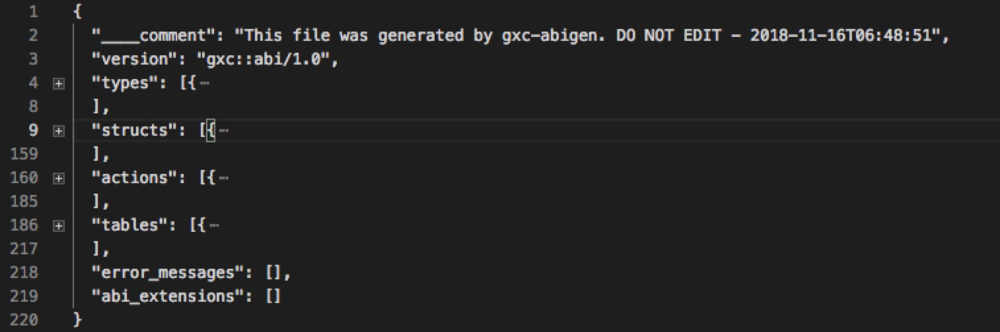

# Análisis de archivos ABI


El archivo abi es la interfaz externa para invocar la action de contrato inteligente, definiendo los parámetros de la acción y los campos de la table. Cuando normalmente llamamos a una acción, suele ser el caso de que la llamada a la acción falle debido a los elementos que faltan en el archivo abi. Por lo tanto, este tutorial analiza el archivo abi y, cuando se produce un error de archivo Abi durante el desarrollo del contrato, también puede identificar la causa del problema.

El archivo Abi contiene cuatro campos importantes: types、structs、actions、tables.



## types

El campo types define los alias personalizados para los tipos durante el desarrollo del contrato, por ejemplo:

```cpp
// El contrato se define como sigue
typedef std::string mystring;
// @abi action
void appyourcom(mystring comname,std::string compub);
...

// La abi generada se define de la siguiente manera
"types": [{
	"new_type_name": "mystring",
	"type": "string"
	}
],
```

## structs

El campo structs define el nombre de la table, el tipo de campo que contiene, el nombre de la action y el tipo de parámetros que contiene

```json
// 以红包合约abi文件为例，structs包含了table的定义和字段、action的定义和字段等详细定义
"structs": [{
	.......
	{
	  "name": "record",
	  "base": "",
	  "fields": [{
	      "name": "packet_issuer",
	      "type": "uint64"
	    },{
	      "name": "accounts",
	      "type": "account[]"
	    }
	  ]
	},{
	  "name": "issue",
	  "base": "",
	  "fields": [{
	      "name": "pubkey",
	      "type": "string"
	    },{
	      "name": "number",
	      "type": "uint64"
	    }
	  ]
	}
	......
}
```

## actions

El campo de actions--name, type (como name ), payable (tipo bool--si se llama a la action para adjuntar activos--es una de las interfaces externas definidas)

```json
"actions": [{
	"name": "issue",
	"type": "issue",
	"payable": true
},
.....
{
	"name": "close",
	"type": "close",
	"payable": false
}
],
```

## tables

El campo de table contiene la tabla de varios índices definida, el name (nombre de table, tal como se define en el contrato), index_type (tipo de índice de clave principal, i64), key_names (nombre de miembro de clave principal), key_types (tipo de miembro de clave principal), type (igual que el nombre de la tabla)


```json
"tables": [{
	"name": "packet",
	"index_type": "i64",
	"key_names": [
		"issuer"
	],
	"key_types": [
		"uint64"
	],
	"type": "packet"
	}
	.....
],
```