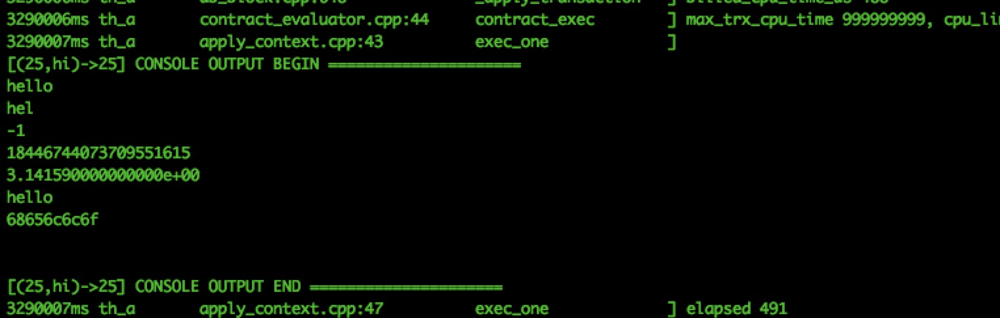

# Depuración de contrato


En el proceso de desarrollo de contratos inteligentes, la depuración también es muy importante, en la actualidad, la forma de depurar contratos inteligentes, principalmente es utilizar interfaces de cadena de bloque GXChain proporcionadas print para imprimir registros relacionados a la consola witness, por lo que local estructuras, una cadena privada o un inicio local de un nodo de red de prueba sincrónica, es necesario para la depuración del contrato inteligente.


Para iniciar la depuración, se requieren dos operaciones:
#### 1. Modifique el archivo config.ini local de la siguiente manera:
```
[logger.default]
level=debug
appenders=stderr,FILE
```

#### 2. Traiga el parámetro `--contracts-console` para el inicio del administrador witness_node

El modo de depuración print, logra una variedad de tipos de parámetros de sobrecarga. Cadena de soporte, int, punto flotante, hexadecimal, etc.

::: tip Propina:
Agregue "\n" al registro de impresión, de lo contrario no se imprimirá.
:::


## print

Diferentes funciones de print se sobrecargan según parámetros diferentes, y las siguientes funciones se llaman internamente, como se muestra en la figura, un tipo diferente de resultado de impresión


## prints
```cpp
//Imprimir cadena const char*
prints("hello");
Imprimir: hello
```

## prints_l
```cpp
//Imprime los primeros caracteres de una cadena.
prints_l("hello",3);
Imprimir：hel
```
## printi
```cpp
//Imprime los primeros caracteres de la cadena, el parámetro es de tipo int64_t
printi(-1);
Imprimir：-1
```
## printui
```cpp
//Imprima el número sin firmar con el tipo uint64_t como parámetro
printui(-1);
Imprimir：18446744073709551615
```

## printdf
```cpp
//Imprimir el número de punto flotante, el parámetro es doble
printdf(3.14159);
Imprimir：3.141590000000000e+00
```

## printn
```cpp
//Imprima el resultado del cifrado UInt64 tipo base32
printn(N(hello));
Imprimir：hello
```

## printhex
```cpp
//Imprima en hexadecimal
std::string str="hello";
checksum256 sum;
sha256(str.c_str(),str.length(),&sum);
printhex(sum.hash,32);
Imprimir：2cf24dba5fb0a30e26e83b2ac5b9e29e1b161e5c1fa7425e73043362938b9824
```
