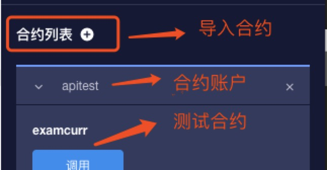

# Desarrollo de contratos e introducción de API.

## Tipo incorporado
Los contratos inteligentes de GXChain, además de todos los tipos compatibles con la sintaxis de C ++, también proporcionan tipos incorporados de contrato.

### contract\_asset
El tipo de activo en el contrato contiene 2 campos:
```cpp
int64_t     amount;
uint64_t    asset_id;
```
Verifique que la cantidad de contract_asset sea válida, use el método de miembro is_amount_within_range
```cpp
bool is_amount_within_range() const { 
    return -max_amount <= amount && amount <= max_amount; 
}
```


::: warning Apunto
En el tipo contract_asset, donde la cantidad representa el número de activos y los grandes números se almacenan en la cadena. Por ejemplo, la precisión de los activos de GXC es 5,1 GXC en realidad debe expresarse como 1 * 100000 = 100000, es decir, la cantidad es de 100000

El asset_id representa el ID de instancia del activo (por ejemplo, si el ID de activo es 1.3.1, entonces el último 1 de su ID de instancia).
:::

Un ejemplo de un tipo de contrato de contract_asset se puede encontrar en el contrato del banco.

### signature

Tipo de firma dentro del contrato, definición de la estructura:
```cpp
struct signature {
   uint8_t data[65];
};
```

Example：
```cpp
void verify(checksum256 hash, std::string pub_key, signature sig)
{   
    print(pub_key, "\n");
    assert_recover_key(&hash, &sig, pub_key.c_str(), pub_key.length());
} 
 ```


### public\_key
El tipo de clave pública en el contrato, la definición de la estructura:
```cpp
struct public_key {
   char data[33];
};
```


### checksum256
El tipo de contrato sha256 incorporado, la definición de la estructura:
```cpp
struct ALIGNED(checksum256) {
   uint8_t hash[32];
};
```

Example：
```cpp
void issue(const std::string& question, const checksum256& hashed_answer)
{   
    uint64_t owner = get_trx_sender();
    records.emplace(owner, [&](auto &p) {
            p.issuer = owner;
            p.question = question;
            p.hashed_answer = hashed_answer;
    }); 
}  
```


### checksum160
El tipo ripemd160 incorporado del contrato, la definición de la estructura:
```cpp
struct ALIGNED(checksum160) {
   uint8_t hash[20];
};
```

### checksum512
Tipo Sha512 dentro del contrato, definición de la estructura:
```cpp
struct ALIGNED(checksum512) {
   uint8_t hash[64];
};
```

### block\_id\_type
El tipo block_id_type incorporado del contrato, la definición de la estructura:
```cpp
typedef struct checksum160      block_id_type;
```
## API incorporada


Desarrolle contratos inteligentes en GXChain, puede llamar a la API integrada para lograr características más completas

| belong | api name | description |
| --- | --- | --- |
| <graphenelib/action.h> | current_receiver | Devuelve el ID de instancia de la cuenta de contrato actual (es decir, el último dígito del ID de cuenta) |
| <graphenelib/action.h> | get_action_asset_id | Devuelve el ID de instancia de activo enviado por esta llamada al contrato (es decir, el último dígito del ID de activo)|
| <graphenelib/action.h> | get_action_asset_amount | Devuelve el número de activos enviados al contrato por esta llamada. |
| <graphenelib/asset.h> | withdraw_asset | Transfiera los activos de la cuenta del contrato actual a la cuenta de la cadena |
| <graphenelib/asset.h> | get_balance | Obtenga el saldo de un activo en la cuenta en la cadena |
| <graphenelib/crypto.h> | sha1 | Calcula el sha1 de los datos. |
| <graphenelib/crypto.h> | sha256 | Cálculo del sha256 de los datos. |
| <graphenelib/crypto.h> | sha512 | Cálculo del sha512 de los datos. |
| <graphenelib/crypto.h> | ripemd160 | Calcular los datos de ripem160. |
| <graphenelib/crypto.h> | assert_recover_key | Verifique que la firma y el hash dados puedan recuperar la clave pública |
| <graphenelib/global.h> | get_head_block_num | Obtener el último número de bloque |
| <graphenelib/global.h> | get_head_block_id | Consigue el último hash de bloque |
| <graphenelib/global.h> | get_block_id_for_num | Obtener el hash de bloque especificado |
| <graphenelib/global.h> | get_head_block_time | Obtenga el tiempo del último bloque, devuelva el valor en segundos |
| <graphenelib/global.h> | get_trx_sender | Obtenga el instance_id de la cuenta que llamó al contrato |
| <graphenelib/global.h> | get_account_id | Obtenga el instance_id de la cuenta que llamó al contrato |
| <graphenelib/global.h> | get_account_name_by_id | Obtenga un nombre de cuenta basado en el ID de instancia de cuenta |
| <graphenelib/global.h> | get_asset_id | Obtenga el instance_id del activo basado en el nombre del activo |
| <graphenelib/global.h> | read_transaction | Lea la transacción actual de datos serializados. |
| <graphenelib/global.h> | transaction_size | La longitud de los datos después de la transacción actual se serializa |
| <graphenelib/global.h> | expiration | Obtener tiempo de expiración de la transacción |
| <graphenelib/global.h> | tapos_block_num | Devuelve el número de bloque al que hace referencia la transacción. |
| <graphenelib/global.h> | tapos_block_prefix | Devuelve el ID de bloque de la referencia de transacción (los segundos 32 dígitos) |
| <graphenelib/action.h> | read_action_data | Leer datos de acción actuales |
| <graphenelib/action.h> | action_data_size | Devuelve el número de bytes necesarios para leer los datos de acción actuales |
| <graphenelib/action.h> | send_inline      | Acción de llamada en línea |
| <graphenelib/action.hpp> | unpack_action_data | Deserializar los datos de acción actuales en un objeto de acción definido |
| <graphenelib/system.h> | graphene_assert | Si no se cumple la condición, interrumpa la ejecución de este contrato y renueve todos los estados |
| <graphenelib/system.h> | graphene_assert_message | Si no se cumple la condición, interrumpa la ejecución de este contrato y renueve todos los estados |
| <graphenelib/system.h> | print | Imprimir para el registro al depurar |


### current\_receiver

**Tipo de función:** `uint64_t current_receiver()`

**Archivo de encabezado:** `<graphenelib/action.h>`

**Descripción de la función:** devuelve el ID de instancia de la cuenta de contrato actual (es decir, el último dígito del ID de cuenta)

**Valor de retorno:** devuelve el ID de instancia de la cuenta de contrato actual.

**Ejemplo:**

```cpp
// @abi action
void examcurr(){
    uint64_t ins_id = current_receiver();
    print("current contract account id: ", ins_id, "\n");
}
```

**Tipo de función:** `uint64_t get_action_asset_id ()`
**Archivo de encabezado:** `<graphenelib / action.h>`
**Descripción funcional:** devuelve el ID de instancia de activo (es decir, el último dígito del ID de activo) enviado al contrato por esta llamada.
**Valor de retorno:** el retorno 0 significa que la acción no tiene activos adjuntos, el retorno no cero significa el id de instancia del activo
**Ejemplo:**
  

```cpp
// @abi action
void examgetast(){
    uint64_t ast_id = get_action_asset_id();
    print("call action asset id: ",ast_id,"\n");
}
```

### get\_action\_asset\_amount

**Tipo de función:** `uint64_t get_action_asset_id ()`
**Archivo de encabezado:** `<graphenelib / action.h>`
**Descripción funcional:** devuelve el ID de instancia de activo (es decir, el último dígito del ID de activo) enviado al contrato por esta llamada.
**Valor de retorno:** el retorno 0 significa que la acción no tiene activos adjuntos, el retorno no cero significa el id de instancia del activo
**Ejemplo:**


```cpp
//get_action_asset_amount 
// @abi action
void examgetamo(){
    int64_t amount = get_action_asset_amount();
    print("call action asset amount: ",amount,"\n");      
}
```


### withdraw\_asset

**Tipo de función:** `void retirada_asset (uint64_t from, uint64_t to, uint64_t asset_id, int64_t cantidad)`
**Archivo de encabezado:** `<graphenelib / asset.h>`
**Descripción funcional:** transfiera los activos del contrato actual a una cuenta externa
**Parámetros:**


Parámetro | Tipo | Descripción
---|---|---
from | uint64_t | 
to   | uint64_t | 
asset_id | uint64_t | 
amount | int64_t | 

**Ejemplo::**

```cpp
// @abi action
void examwith(uint64_t from,uint64_t to, uint64_t asset_id, int64_t amount){
    withdraw_asset(from,to,asset_id,amount);
    print("withdraw_asset example\n");
}
```


### get\_balance

**Tipo de función:** `int64_t get_balance (cuenta int64_t, int64_t asset_id)`
**Archivo de encabezado:** `<graphenelib / asset.h>`
**Descripción funcional:** Obtenga un saldo de activos en la cuenta en la cadena
**Valor de retorno:** devuelve el saldo de un activo en la cuenta en la cadena
**Parámetros:**

Parámetro | Tipo | Descripción
---|---|---
account | int64_t | Cuanta en cadena instace_id
asset_id | int64_t | Activo designadnstance_id

**Ejemplo:**

```cpp
// @abi action
void examgetbl(int64_t account, int64_t asset_id){
    int64_t balance = get_balance(account, asset_id);
    print("account balance: ",balance,"\n");
}
```

### sha1

**El tipo de función del activo especificado:** `void sha1 (const char * data, uint32_t length, checksum160 * hash)`
**Archivo de encabezado:** `<graphenelib / crypto.h>`
**Descripción funcional:** Sha1 para el cálculo de datos.
**Parámetros:**

Parámetro | Tipo | Descripción
---|---|---
data | const char* | La primera dirección de la cadena utilizada para calcular sha1
length | uint32_t | Longitud de la cadena de datos
hash | checksum160* | Participa en el sha1 para almacenar cálculos.

**Ejemplo:**

```cpp
// @abi action
void examsha1(std::string data){
    checksum160 hash;
    sha1(data.c_str(),data.length(),&hash);
    printhex(hash.hash,20);
    print("\n");
}
```

### sha256

**Tipo de función:** `void sha256 (const char * data, uint32_t length, checksum256 * hash)`
**Archivo de encabezado:** `<graphenelib / crypto.h>`
**Descripción funcional:** sha256 para el cálculo de datos.
**Parámetros:**


Parámetro | Tipo | Descripción
---|---|---
data | const char* | La primera dirección de la cadena utilizada para calcular sha256
length | uint32_t | Longitud de la cadena de datos
hash | checksum256* | Participa en el sha256 para almacenar cálculos.

**Ejemplo:**

```cpp
// @abi action
void examsha25(std::string data){
    checksum256 hash;
    sha256(data.c_str(),data.length(),&hash);
    printhex(hash.hash,32);
    print("\n");
}
```


### sha512

**Tipo de función:** `void sha512 (const char * data, uint32_t length, checksum512 * hash)`
**Archivo de encabezado:** `<graphenelib / crypto.h>`
**Descripción funcional:** sha512 para el cálculo de datos.
**Parámetros:**

Parámetro | Tipo | Descripción
---|---|---
data | const char* | La primera dirección de la cadena utilizada para calcular sha512
length | uint32_t | Longitud de la cadena de datos
hash | checksum512* | Participa en el sha512 para almacenar cálculos.

**Ejemplo:**

```cpp
// @abi action
void examsha512(std::string data){
    checksum512 hash;
    sha512(data.c_str(),data.length(),&hash);
    printhex(hash.hash,64);
    print("\n");
}
```


### ripemd160

**Tipo de función:** `void ripemd160 (const char * data, uint32_t length, checksum160 * hash)`
**Archivo de encabezado:** `<graphenelib / crypto.h>`
**Descripción funcional:** calcular datos para ripem160
**Parámetros:**

Parámetro | Tipo | Descripción
---|---|---
data | const char* | La primera dirección de la cadena utilizada para calcular ripem160
length | uint32_t | Longitud de la cadena de datos
hash | checksum160* | Consulte el findemd160 para almacenar cálculos

**Ejemplo:**

```cpp
// @abi action
void examripemd(std::string data){
    checksum160 hash;
    ripemd160(data.c_str(),data.length(),&hash);
    printhex(hash.hash,20);
    print("\n");
}
```

### assert\_recover\_key

**Tipo de función:** `void assert_recover_key (const checksum256 * digest, const signature * sig, const char * pub, uint32_t publen);`
**Archivo de encabezado:** `<graphenelib / crypto.h>`
**Descripción funcional:** verifique que la firma y el hash dados puedan recuperar la clave pública
**Parámetros:**

Parámetro | Tipo | Descripción
---|---|---
data | const checksum256* | Valor de hash Sha256
sig | const signature* | Los datos después de firmar la cadena original.
pub | const char* | Clave pública ([formato hexadecimal: ver gxbjs / src / ecc / PublicKey.js](https://github.com/gxchain/gxbjs/blob/master/lib/ecc/src/PublicKey.js#L161))
publen | uint32_t | Lontitud de clave pública

**Ejemplo:**

```cpp
// @abi action
void examrecover(checksum256 hash,signature sig,std::string pkey)
{
    assert_recover_key(&hash, &sig, pkey.c_str(), pkey.length());
}
```

### get\_head\_block\_num

**Tipo de función:** `int64_t get_head_block_num ()`
**Archivo de encabezado:** `<graphenelib / global.h>`
**Descripción funcional:** Volver al último número de bloque
**Valor de retorno:** devuelve el último número de bloque
**Ejemplo:**

```cpp
// @abi action
void examgetnum(){
    int64_t head_num = get_head_block_num();
    print("head block num: ",head_num, "\n");
}
```

### get\_head\_block\_id

**Tipo de función:** void get_head_block_id (checksum160 * hash)
**Archivo de encabezado:** <graphenelib / global.h>
**Descripción funcional:** obtén el último hash de bloque
**Parámetros:**

Parámetro | Tipo | Descripción
---|---|---
hash | checksum160* | Obtener el valor hash del último bloque

**Ejemplo:**

```cpp
// @abi action
void examgetid(){
    checksum160 block_hash;
    get_head_block_id(&block_hash);
    printhex(block_hash.hash,20);
    print("\n");
}
```


### get\_block\_id\_for\_num

**Tipo de función:** `void get_block_id_for_num(checksum160* hash, uint32_t block_num)`

**Archivo de encabezado:**`<graphenelib/global.h>`

**Descripción funcional:** obtener el hash de bloque especificado

**Parámetros:**

Parámetro | Tipo | Descripción
---|---|---
hash | checksum160* | Obtener el valor hash del bloque especificado
block_num | uint32_t | Número de bloque especificado

**Ejemplo:**

```cpp
// @abi action
void examidnum(){
    checksum160 block_hash;
    get_block_id_for_num(&block_hash,1);             //get the hash of first block 
    printhex(block_hash.hash,20);
    print("\n");
}
```


### get\_head\_block\_time

**Tipo de función:** `int64_t get_head_block_time()`

**Archivo de encabezado:**`<graphenelib/global.h>`

**Descripción funcional:** tiempo para obtener el último bloque, devolver el valor en segundos

**Valor de retorno:** devuelve el último tiempo de bloqueo

**Ejemplo:**

```cpp
// @abi action
void examgettime(){
    int64_t head_time;
    head_time = get_head_block_time();
    print("head block time: ",head_time,"\n");
}
```


### get\_trx\_sender

**Tipo de función:** `uint64_t get_trx_sender()`

**Archivo de encabezado:**`<graphenelib/global.h>`

**Descripción funcional:** 

**Valor de retorno:** 

**Ejemplo:**

```cpp
// @abi action
void examgettrx(){
    uint64_t sender_id;
    sender_id = get_trx_sender();
    print("call action instance id: ",sender_id,"\n");
}
```


### get\_account\_id

**Tipo de función:** `int64_t get_account_id(const char * data, uint32_t length)`

**Archivo de encabezado:**`<graphenelib/global.h>`

**Descripción funcional:** obtener el instance_id de la cuenta de acuerdo con el nombre de la cuenta

**Valor de retorno:**  el retorno -1 significa que no hay nombre de cuenta, el valor de retorno> = 0 significa el id de instancia de la cuenta

**Parámetros:**

Parámetro | Tipo | Descripción
---|---|---
data | const char* | Nombre de cuenta, por ejemplo nathan
length | uint32_t | Lontitud de cuenta nombre，Por ejemplo la lontitud de nathan es 6

Devuelve el instance_id de la cuenta si la cuenta existe, o -1 si la cuenta no existe

**Ejemplo:**

```cpp
// @abi action
void examgetacid(std::string data){
    int64_t acc_id;
    acc_id = get_account_id(data.c_str(), data.length());
    print("account id: ",acc_id,"\n");
}
```

### get\_account\_name\_by\_id

**Tipo de función:** `int64_t get_account_name_by_id(array_ptr<char> data, size_t buffer_size, int64_t account_id)`

**Archivo de encabezado:**`<graphenelib/global.h>`

**Descripción funcional:** obtener el nombre de la cuenta de acuerdo con la identificación de la instancia de la cuenta

**Valor de retorno:**  Devolver -1 significa que no hay cuenta, valor de retorno 0 significa obtener el nombre de la cuenta correctamente.


**Parámetros:**

Parámetro | Tipo | Descripción
---|---|---
data | const char* | Nombre de cuenta, por ejemplo nathan
length | uint32_t | Lontitud de cuenta nombre，Por ejemplo la lontitud de nathan es 6
account_id | int64_t | instance id o id de instance account

Devuelve 0 si la cuenta existe, o -1 si la cuenta no existe


**Ejemplo:**

```cpp
// @abi action
void examgetname(int64_t accid){
    char data[65]={0};
    int64_t result;
    result = get_account_name_by_id(data,65,accid);
    print(static_cast<const char*>data,"\n");
}
```

### get\_asset\_id

**Tipo de función:** `int64_t get_asset_id(const char * data, uint32_t length)`

**Archivo de encabezado:**`<graphenelib/global.h>`

**Descripción funcional:** obtenga el instance_id del activo basado en el nombre del activo

**Valor de retorno:** retorno -1 significa que no hay tal nombre de activo, valor de retorno> = 0 significa el id de instancia del activo

**Parámetros:**

Parámetro | Tipo | Descripción
---|---|---
data | const char* | Nombre del activo
length | uint32_t | La longitud del nombre del activo, como la longitud de GXC es 3

**Ejemplo:**

```cpp
// @abi action
void examassid(std::string data){
    int64_t assid;
    assid = get_asset_id(data.c_str(),data.length());
    print("asset id: ",assid,"\n");
}
```

### read\_transaction

**Tipo de función:** `int read_transaction(char* dst, uint32_t dst_size)`

**Archivo de encabezado:**`<graphenelib/global.h>`

**Descripción funcional:** leer los datos serializados de la transacción actual a dst

**Valor de retorno:** cuando dst_size es 0, devuelve el número de bytes necesarios para la lectura; cuando dst_size no es 0, devuelve el número de bytes realmente leídos (el valor mínimo de dst_size y el tamaño de transacción)


**Parámetros:**

Parámetro | Tipo | Descripción
---|---|---
dst | char* | Puntero para recibir el buffer de datos de lectura.
dst_size | uint32_t | Longitud para leer

**Ejemplo:**

```cpp
// @abi action
void examreadtrx(){
    int dwsize;
    dwsize =transaction_size();
    char* pBuffer = new char[dwsize];
    uint32_t size = read_transaction(pBuffer,dwsize);
    delete[] pBuffer;
}
```

### transaction\_size

**Tipo de función:** `int transaction_size()`

**Archivo de encabezado:**`<graphenelib/global.h>`

**Descripción funcional:** obtener la longitud de los datos después de la serialización de la transacción actual

**Valor de retorno:** devuelve la longitud de los datos serializados

**Ejemplo:**

```cpp
// @abi action
void examtrxsize(){
    int dwsize;
    dwsize =transaction_size();
    print("the size of the serialize trx: ",dwsize,"\n");
}
```

### expiration

**Tipo de función:** `uint64_t expiration()`

**Archivo de encabezado:**`<graphenelib/global.h>`

**Descripción funcional:** obtener tiempo de expiración de la transacción

**Valor de retorno:** Tiempo de vencimiento de la transacción de retorno

**Ejemplo:**

```cpp
// @abi action
void exampira(){
    uint64_t timenum = expiration();
    print("the expiration time: ", timenum,"\n");
}
```


### tapos\_block\_num

**Tipo de función:** `int tapos_block_num()`

**Archivo de encabezado:**`<graphenelib/global.h>`

**Descripción funcional:** obtener el número de bloque de la referencia de transacción

**Valor de retorno:** devuelve el número de bloque de la referencia de transacción

**Ejemplo:**

```cpp
// @abi action
void examtapnum(){
    uint64_t tapos_num;
    tapos_num = tapos_block_num();
    print("ref block num: ",tapos_num,"\n");
}
```


### tapos\_block\_prefix

**Tipo de función:** `uint64_t tapos_block_prefix()`

**Archivo de encabezado:**`<graphenelib/global.h>`

**Descripción funcional:**  Obtenga el ID de bloque de la referencia de transacción (los segundos 32 dígitos)

**Valor de retorno:** devuelve el ID de bloque de la referencia de transacción (los segundos 32 dígitos)

**Ejemplo:**

```cpp
// @abi action
void examtappre(){
    uint64_t tapos_prefix;
    tapos_prefix = tapos_block_prefix();
    print("ref block id: ",tapos_prefix,"\n");
}
```


### read\_action\_data

**Tipo de función:** `uint32_t read_action_data( void* msg, uint32_t len )`

**Archivo de encabezado:**`<graphenelib/action.h>`

**Descripción funcional:** leer los datos de acción actuales

**Valor de retorno:** devuelve el número de bytes realmente leídos. Si len es 0, se devuelve el número de bytes necesarios para la lectura.

**Parámetros:**

Parámetro | Tipo | Descripción
---|---|---
msg | void* | Puntero de buffer de recepción
len | uint32_t | Longitud de lectura

**Ejemplo:**

```cpp
// @abi action
void examract(uint64_t num,std::string number){
    auto size = action_data_size();
    char *buffer = static_cast<char*>(malloc(size));
    read_action_data((void*)buffer,size);
    printhex(buffer,size);
    print("\n");
}
```

### action\_data\_size

**Tipo de función:** `uint32_t action_data_size()`

**Archivo de encabezado:**`<graphenelib/action.h>`

**Descripción funcional:** el número de bytes necesarios para leer los datos de acción actuales

**Valor de retorno:**  devuelve el número de bytes necesarios para la lectura

**Ejemplo:**

```cpp
// @abi action
void examrasize(uint64_t num,std::string number){
    auto size = action_data_size();
    print("size: ", size,"\n");
}
```

### send\_inline

**Tipo de función:** `void send_inline(char *serialized_action, size_t size)`

**Archivo de encabezado:**`<graphenelib/action.h>`

**Descripción funcional:** acción de ejecución en línea (generalmente mediante la construcción de una acción y la ejecución indirecta de la acción a través de su método de miembro de envío, su implementación interna es send_inline, llamada de contrato cruzado)

### unpack\_action\_data

**Tipo de función:** `T unpack_action_data()`

**Archivo de encabezado:**`<graphenelib/action.hpp>`

**Descripción funcional:** desempaquetar datos de acción actuales

**Valor de retorno:** devuelve la estructura de acción después de desempaquetar

**Ejemplo:**

```cpp
struct myaction {
    uint64_t num;
    std::string name;
  
    GRAPHENE_SERIALIZE(myaction,(num)(name))
};
// @abi action
void examupact(uint64_t num,std::string name){
    auto my = unpack_action_data<myaction>();
    print(my.name,"\n");
}
```

### graphene\_assert

**Tipo de función:** `void graphene_assert(uint32_t test, const char* msg)`

**Archivo de encabezado:**`<graphenelib/system.h>`

**Descripción funcional:** Si no se cumple la condición, interrumpa la ejecución de este contrato y renueve todos los estados


**Parámetros:**

Parámetro | Tipo | Descripción
---|---|---
test | uint32_t | Condición de verificación
msg | const char* | Deshacer el mensaje de salida si no se cumple la condición


**Ejemplo:**

```cpp
// @abi action
void examassert(){
    uint64_t number=1;
    graphene_assert(number == 1, "wrong!");
}
```


### graphene\_assert\_message

**Tipo de función:** `void graphene_assert_message(uint32_t test, const char* msg, uint32_t msg_len)`

**Archivo de encabezado:**`<graphenelib/system.h>`

**Descripción funcional:** Si no se cumple la condición, interrumpa la ejecución de este contrato y renueve todos los estados


**Parámetros:**

Parámetro | Tipo | Descripción
---|---|---
test | uint32_t | Condición de verificación
msg | const char* | Deshacer el mensaje de salida si no se cumple la condición
msg_len | uint32_t | Lontitud de contento de mensaje

**Ejemplo:**

```cpp
// @abi action
void examassmsg(){
    uint64_t number=1;
    std::string msg = "wrong!!!";
    graphene_assert_message(number == 1, msg.c_str(),msg.length()); 
}
```


### print

**Tipo de función:** `void print(const char* ptr)`

**Archivo de encabezado:**`<graphenelib/system.h>`

**Descripción funcional:**  imprimir para registro cuando se realiza la depuración (para un uso detallado, verifique la depuración del contrato)


**Parámetros:**
Parámetro | Tipo | Descripción
---|---|---
ptr | const char* | Contenido del cuerpo del mensaje depurado

**Ejemplo:**

```cpp
// @abi action
void examprint(){
    print("example example example!!!\n");
}
```

### Ejemplo

El contrato de muestra para el uso de api se ha implementado en la red de prueba, que puede ser probada por el cliente IDE, [haga clic para ver la fuente del contrato](./question.html), `apitest` de la cuenta del contrato



## Llamada a través del contrato


### instrucciones
GXChain admite llamadas entre contratos y es compatible con cuentas de pago que establecen tarifas de ram. Ejemplos de llamadas de contrato cruzado son Usuario -> contrato_A -> contrato_B. Para contrato contrato_B, el Usuario es el llamador original y el contrato_A es remitente.
Límite de nivel de llamada entre contratos: no más de tres contratos en la cadena de llamadas. Es decir: Usuario -> contrato_A -> contrato_B -> contrato_C, si se excede el número de capas, se terminará la ejecución. (Si la cadena de llamadas forma una llamada en bucle, también terminará la ejecución)
El recurso RAM utilizado en el contrato, la cuenta de pago se puede establecer en las siguientes cuatro identidades:

| ram_fee payer | instrucción |
| --- | --- | 
| 0 | Cuenta de contrato en sí (igual que \_slef) |
| \_self | Cuenta de contrato en sí (igual que 0) |
| sender | Contrato de cuenta de llamada |
| original | La cuenta de llamada original del contrato, llamada de contrato cruzado, llame a la cuenta para el inicio |


### Ejemplo
`contract_A` -> `contract_B`, `contract_A` contract llama a `contract_B` contract.
1. Construya la acción en `contract_A`, incluyendo el ID de cuenta / nombre de cuenta `contract_B`, nombre de acción, parámetro, cuenta de llamada (\_self), activos adicionales
2. Llame al método de envío de la acción para completar la llamada de contrato cruzado.

```cpp

#contract_b Contrato
···
void hi(std::string name,uint64_t number)
{
    ···
}
···
#contract_A contrato
···
struct param {
    std::string name;
    uint64_t number;
};


void inlinecall(uint64_t con_b_id, std::string con_b_name){

    param par{"hello", 100};

    // Método  1：Al construir una acción, utilice el ID de cuenta del contrato
    action contract_b_id(con_b_id, N(hi), std::move(par), _self, {1000, 1});
    contract_b_id.send();

    // Método 2: al construir una acción, use el nombre de la cuenta del contrato
    action contract_b_name(con_b_name, N(hi), std::move(par), _self, {1000,1});
    contract_b_name.send();
}
···
```


## Tabla de índice múltiple

#### <a name="index"></a>index
* [Perfil de almacenamiento de contrato](#smart_contract_storage_brief_introduction)
* [El código de ejemplo](#example)
* [Defina el tipo de almacenamiento](#define_type)
* [Aumentar](#add)
* [Eliminar](#delete)
* [Comprobar](#find)
* [cambiar](#modify)


### <a name="smart_contract_storage_brief_introduction"></a>Perfil de almacenamiento de contrato

Se utiliza para conservar los datos del contrato de almacenamiento.
Los datos deben almacenarse en unidades de instancias de la clase C ++, por lo que las clases C ++ almacenadas deben definirse en el contrato. Cada clase tiene una tabla, similar a una sola tabla en una base de datos relacional. La diferencia es que tiene las siguientes características: 
>Soporte para multiples índices.
>La indexación conjunta no es compatible
>Sólo la clave principal es única.
>El tipo de índice solo admite el tipo uint64_t
>Si desea usar una cadena como un índice, debe usar uint64_t string_to_name (string str) en la biblioteca del contrato para convertir la cadena a uint64_t. La longitud de la cadena está limitada a 12 caracteres y solo puede incluir ([az]. [1-5 ]) Un total de 32 caracteres.
>Para índices distintos de la clave principal, cuando hay varios valores de índice de registro, el objeto adquirido es el registro insertado más antiguo.
>Soporte para adiciones y eliminaciones.

El siguiente contenido es alrededor del ejemplo para ilustrar

[go_back](#index)  


### <a name="example"></a>Código de muestra

```cpp
#include <graphenelib/contract.hpp>
#include <graphenelib/dispatcher.hpp>
#include <graphenelib/multi_index.hpp>
#include <graphenelib/print.hpp>

using namespace graphene;

class multindex : public contract
{
    struct offer;

  public:
    multindex(uint64_t id)
        : contract(id)
        , offers(_self, _self)
    {
    }

    //@abi action
    void additem(uint64_t i1, uint64_t i2, std::string name)
    {
        uint64_t pk = offers.available_primary_key();
        print("pk=", pk);
        offers.emplace(0, [&](auto &o) {
            o.id = pk;
            o.idx1 = i1;
            o.idx2 = i2;
            o.stringidx = graphenelib::string_to_name(name.c_str());
        });
    }

    //@abi action
    void getbypk(uint64_t key)
    {
        auto it = offers.find(key);
        if (it != offers.end()) {
            dump_item(*it);
        }
    }

    //@abi action
    void getbyidx1(uint64_t key)
    {
        auto idx = offers.template get_index<N(idx1)>();
        auto matched_offer_itr = idx.lower_bound(key);
        if (matched_offer_itr != idx.end()) {
            dump_item(*matched_offer_itr);
        }
    }

    //@abi action
    void getbyidx2(uint64_t key)
    {
        auto idx = offers.template get_index<N(idx2)>();
        auto matched_offer_itr = idx.lower_bound(key);
        if (matched_offer_itr != idx.end()) {
            dump_item(*matched_offer_itr);
        }
    }
    
    //@abi action
    void getbystring(std::string key)
    {
        auto idx = offers.template get_index<N(stringidx)>();
        auto matched_offer_itr = idx.lower_bound(N(key));
        if (matched_offer_itr != idx.end()) {
            dump_item(*matched_offer_itr);
        }
    }

  private:
    void dump_item(const offer &o)
    {
        print("offer.id:", o.id, "\n");
        print("offer.idx1:", o.idx1, "\n");
        print("offer.idx2:", o.idx2, "\n");
        graphenelib::name n;
        n.value = o.stringidx;
        print("offer.stringidx:", n.to_string().c_str(), "\n");
    }

  private:
    //@abi table offer i64
    struct offer {
        uint64_t id;
        uint64_t idx1;
        uint64_t idx2;
        uint64_t stringidx;

        uint64_t primary_key() const { return id; }

        uint64_t by_index1() const { return idx1; }

        uint64_t by_index2() const { return idx2; }
        
        uint64_t by_stringidx() const {return stringidx; }

        GRAPHENE_SERIALIZE(offer, (id)(idx1)(idx2)(stringidx))
    };

    typedef multi_index<N(offer), offer,
                        indexed_by<N(idx1), const_mem_fun<offer, uint64_t, &offer::by_index1>>,
                        indexed_by<N(idx2), const_mem_fun<offer, uint64_t, &offer::by_index2>>,
                        indexed_by<N(stringidx), const_mem_fun<offer, uint64_t, &offer::by_stringidx>>>
        offer_index;

    offer_index offers;
};

GRAPHENE_ABI(multindex, (additem)(getbypk)(getbyidx1)(getbyidx2)(getbystring))

```


### <a name="define_type"></a>Definir el tipo de almacenamiento

```cpp
private:
    //@abi table offer i64
    struct offer {
        uint64_t id;
        uint64_t idx1;
        uint64_t idx2;
        uint64_t stringidx;

        uint64_t primary_key() const { return id; }

        uint64_t by_index1() const { return idx1; }

        uint64_t by_index2() const { return idx2; }
        
        uint64_t by_stringidx() const {return stringidx; }

        GRAPHENE_SERIALIZE(offer, (id)(idx1)(idx2)(stringidx))
    };

    typedef multi_index<N(offer), offer,
        indexed_by<N(idx1), const_mem_fun<offer, uint64_t, &offer::by_index1>>,
        indexed_by<N(idx2), const_mem_fun<offer, uint64_t, &offer::by_index2>>,
        indexed_by<N(stringidx), const_mem_fun<offer, uint64_t, &offer::by_stringidx>>> offer_index;
    offer_index offers;
```

El tipo debe estar anotado // @ abi table offer i64
@abi tabla de escritura fija
La oferta es un nombre de tabla, que se puede personalizar de acuerdo con los requisitos del negocio y no puede exceder los 12 caracteres y solo puede ser [a-z] [1-5]. Un total de 32 caracteres, comenzando con letras y.
I64 es el tipo de índice, puede escribir i64


Para struct offer {...} es una clase c ++ normal, la parte inferior GRAPHENE_SERIALIZE (offer, (id) (idx1) (idx2) (stringidx) se usa para la serialización
GRAPHEN_SERIALIZE (nombre del tipo, (nombre del campo 1) (nombre del campo 2) (nombre del campo 3) (nombre del campo 4) ...)


Uint64_t primary_key () const {return id;} El nombre de la función y el tipo de este código son fijos, no se pueden cambiar, se usan para especificar una clave primaria única, aquí id como la clave primaria


Las otras 3 funciones se utilizan para definir el índice secundario.

El siguiente código se usa para definir un índice basado en una clase de c ++ definida:  
```cpp
typedef multi_index<N(offer), offer,  
    indexed_by<N(idx1), const_mem_fun<offer, uint64_t, &offer::by_index1>>,  
    indexed_by<N(idx2), const_mem_fun<offer, uint64_t, &offer::by_index2>>,  
    indexed_by<N(stringidx), const_mem_fun<offer, uint64_t, &offer::by_stringidx>>>  offer_index;  

typedef multi_index<N(offer), offer,esta línea de código N(offer) debe ser consistente con la oferta en el comentario '//@abi table offer i64'
, offerse utiliza para especificar el nombre de tipo definido previamente
``` 

```cpp
indexed_by<N(idx1), const_mem_fun<offer, uint64_t, &offer::by_index1>>,
    const_mem_fun<offer, uint64_t, &offer::by_index1>

// Este código define un índice secundario. Una tabla puede definir hasta 16 índices secundarios
//N (idx1) se utiliza para definir el nombre del índice
// El primer parámetro de los corchetes angulares es el nombre del tipo de oferta definido anteriormente, el segundo parámetro es el tipo del índice y el tercer parámetro es el nombre de la función en la clase de oferta llamada por el índice

```

Finalmente, debe definir la instancia de índice del índice en las ofertas de contract_index del contrato, en el constructor del contrato necesita usar el contrato _self (ID del contrato) para inicializar: 
```cpp
    multindex(uint64_t id)
        : contract(id)
        , offers(_self, _self)
    {}
```
[go_back](#index)  


#### <a name="add"></a>Aumentar
```cpp
uint64_t pk = offers.available_primary_key();
print("pk=", pk);
offers.emplace(0, [&](auto &o) {
    o.id = pk;
    o.idx1 = i1;
    o.idx2 = i2;
    o.stringidx = graphenelib::string_to_name(name.c_str());
});
```
`uint64_t pk = offers.available_primary_key ()` se usa para obtener la siguiente clave primaria válida de la clave primaria autoincrementante, o puede especificarla usted mismo


```cpp
offers.emplace(0, [&](auto &o) {  
    o.id = pk;  
    o.idx1 = i1;  
    o.idx2 = i2;  
    o.stringidx = graphenelib::string_to_name(name.c_str());  
});
```

Insertar un objeto con una expresión lambda para asignar un valor al objeto recién agregado o

`o.stringidx = graphenelib::string_to_name(name.c_str())`Esta es la implementación del tipo de cadena como un índice. No se admite el uso directo de una cadena como un índice.

[go_back](#index)  


#### <a name="delete"></a>删

Por favor lea [primero](#find)
La eliminación generalmente se elimina a través del iterador de la tabla, generalmente llama a encontrar para encontrar el iterador del objeto que se eliminará para eliminar
`offers.erase (it)` es un iterador para encontrar el objeto devuelto

[go_back](#index)  


#### <a name="find"></a>Cancelar
```cpp
auto idx = offers.template get_index<N(stringidx)>();
auto matched_offer_itr = idx.lower_bound(N(key));
if (matched_offer_itr != idx.end()) {
    dump_item(*matched_offer_itr);
}
```


`auto idx = offers.template get_index <N (stringidx)> ()` Obtenga el índice del nombre de la tabla de ofertas `stringidx`, la tabla de ofertas tiene 4 índices, uno es el índice de clave principal y los otros tres niveles son `idx1`, `idx2`, `stringidx`, clave principal La búsqueda del índice es más conveniente. No es necesario obtener el índice por el nombre del índice y, a continuación, buscar la key correspondiente según el índice, pero se ofrece `offers.find (pk)`, que también es un iterador del objeto devuelto.
`auto matched_offer_itr = idx.lower_bound(N(key))` encuentra el objeto de clave principal correspondiente a la clave de cadena por índice y devuelve el iterador correspondiente `matched_offer_itr`

[go_back](#index)  


#### <a name="modify"></a>cambiar

Por favor lea [primero](#find) 

La modificación de un objeto generalmente se modifica mediante el iterador del objeto y la expresión lambda.

```cpp
offers.modify(it, 0, [&](auto &o) {
  //
  o.idx1 = 1000;
});
```
[go_back](#index)  
