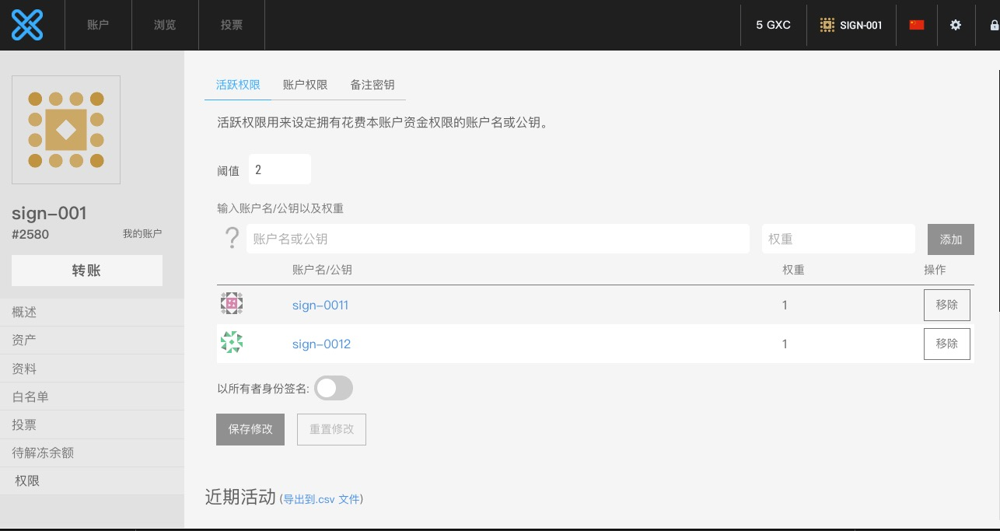
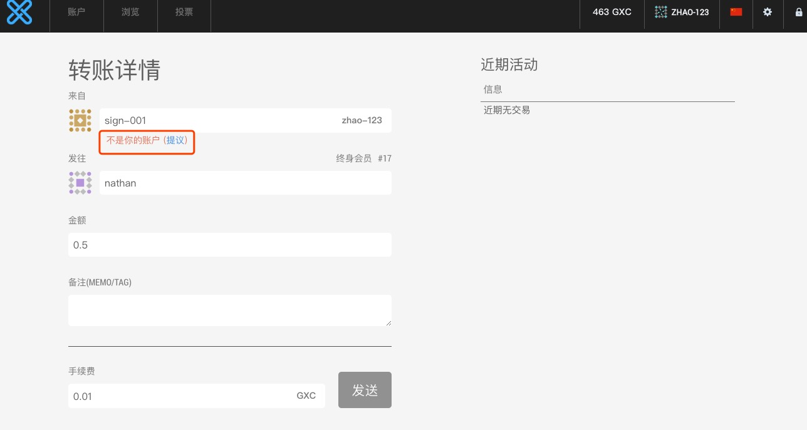
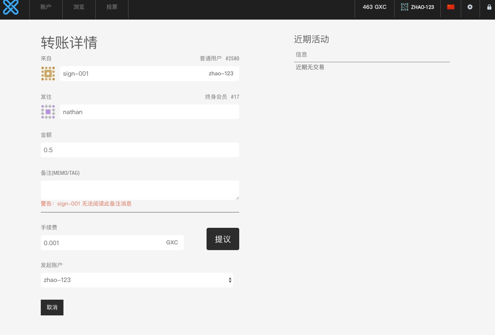
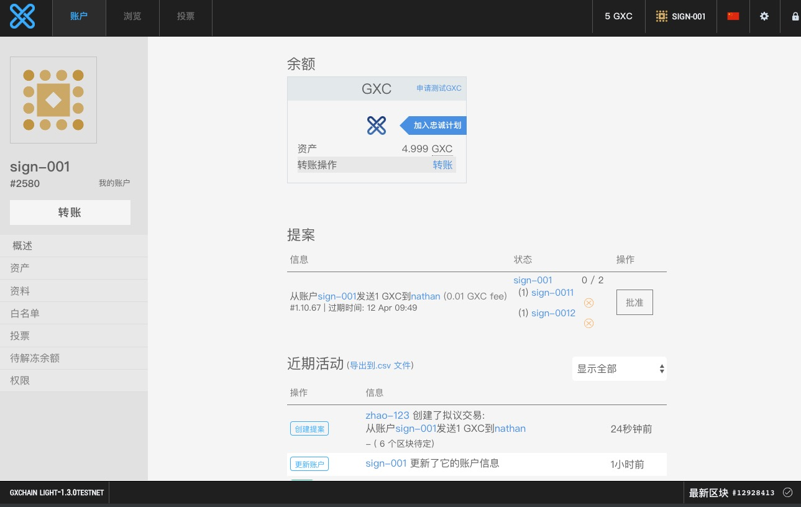
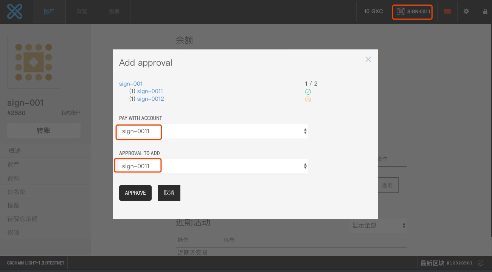
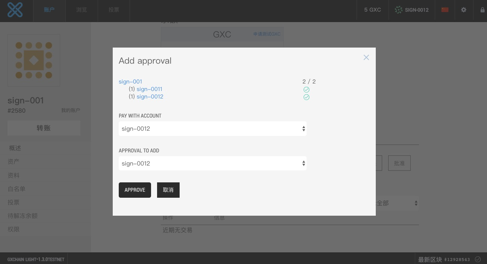
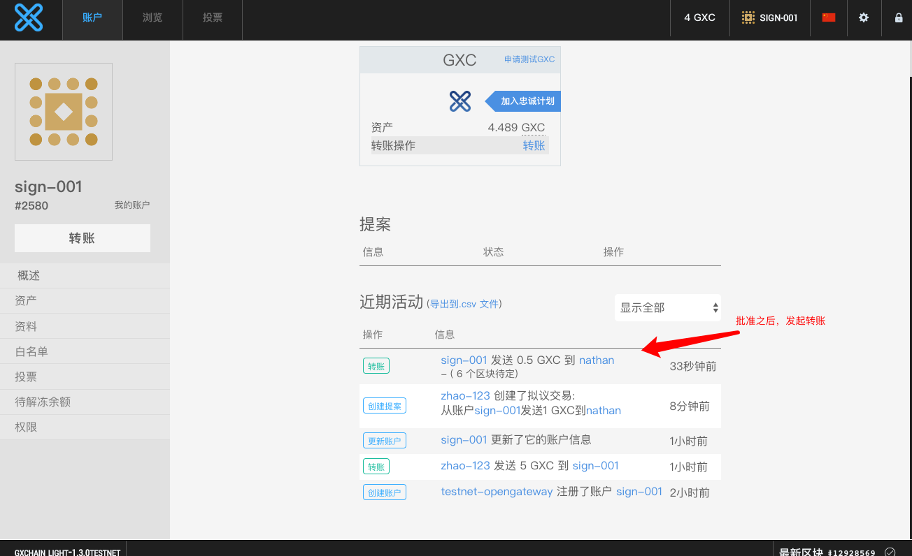

# 多重签名使用教程

GXChain支持多重签名，本篇教程讲解如何在GXChain上使用多重签名转账

## 使用网页钱包操作

### 设置多签账户

使用网页钱包创建账户，并打开网页钱包权限页面，添加子账户来控制该账户的资产，并更新账户信息。



其中阈值表示控制该账户资金所需要的权重之和，假设阈值为2，则只要任意权重之和相加超过阈值的子账户，可以控制该账户资产。

这里创建一个`sign-001`账户，并将其权限下发给`sign-0011`和`sign-0012`两个子账户，并将两个子账户导入到不同的钱包中，两个子账户权重分别为1。阈值为2，表示只有两个账户全部同意，才可以将`sign-001`账户的资金转出。

### 通过提案发起转账

控制多签账户的资产，需要得到权重之和不低于阈值的多个子账户同意。我们可以使用发起转账提案，并得到子账户批准的方式，来发起转账。首先我们先使用任意账户发起提案交易，交易的转出方为多签账户`sign-001`。

在转账页面，设置转出账户为`sign-001`，此时若没有该账户的权限，则会提示（提议），点击“提议”，发起提案交易。



点击提议，发起提案交易



此时，在`sign-001`账户页面，会显示一个待审批的提案，如下图所示：



### 多签账户批准提案

我们分别使用`sign-0011`和`sign-0012`账户同意提案，来控制资产的转出

在`sign-0011`账户下，批准提案





两个账户全部审批通过，转账发起



## 通过命令行操作

除了使用网页钱包操作多签账户之外，我们还可以使用命令行工具操作，以下是命令行工具的使用过程：

### 设置多签账户

首先将账户的ower公钥导入到钱包中，只有ower权限可以更新账户信息。然后调用update_account_multisig接口，将`up-acc`账户的阈设置为2，子账户设置为`sign-0011`与`sign-0012`，权重均为1，示例如下：

```bash
unlocked >>> update_account_multisig up-acc active 2 ["sign-0011","sign-0012"] [1,1] GXC true
update_account_multisig up-acc active 2 ["sign-0011","sign-0012"] [1,1] GXC true
{
  "ref_block_num": 19363,
  "ref_block_prefix": 343029264,
  "expiration": "2019-04-11T12:09:39",
  "operations": [[
      6,{
        "fee": {
          "amount": 100,
          "asset_id": "1.3.1"
        },
        "account": "1.2.2588",
        "owner": {
          "weight_threshold": 1,
          "account_auths": [],
          "key_auths": [[
              "GXC7j49cCKfXVoNGSvW2ApDmYWx8xJ3AHmLiD8JiRSFcZHJpiyj3r",
              1
            ]
          ],
          "address_auths": []
        },
        "active": {
          "weight_threshold": 2,
          "account_auths": [[
              "1.2.2581",
              1
            ],[
              "1.2.2582",
              1
            ]
          ],
          "key_auths": [],
          "address_auths": []
        },
        "extensions": {}
      }
    ]
  ],
  "extensions": [],
  "signatures": [
    "2041586e855597b2d8b042bb23f2ee7d780d6c3308b1419e3d02f26e79159fc60a7ed8dfa88c1b70144fcbd99dbbccb3eeab134b7527491a1d5c0c4327f84023b8",
    "205eae1625d57bb5aa5e5c5e9562661565233b65eb017fa3c9627a15c038995d7b2f12c9d9a382b4bf3ac7ecc7ba839813391661eb8be495104962cab0152ad978"
  ]
}
```

查看账户信息

```bash
unlocked >>> get_account up-acc
get_account up-acc
{
  "id": "1.2.2588",
  "membership_expiration_date": "1970-01-01T00:00:00",
  "merchant_expiration_date": "1970-01-01T00:00:00",
  "datasource_expiration_date": "1970-01-01T00:00:00",
  "data_transaction_member_expiration_date": "1970-01-01T00:00:00",
  "registrar": "1.2.251",
  "referrer": "1.2.251",
  "lifetime_referrer": "1.2.251",
  "merchant_auth_referrer": "1.2.0",
  "datasource_auth_referrer": "1.2.0",
  "network_fee_percentage": 2000,
  "lifetime_referrer_fee_percentage": 3000,
  "referrer_rewards_percentage": 0,
  "name": "up-acc",
  "vm_type": "",
  "vm_version": "",
  "code": "",
  "code_version": "",
  "abi": {
    "version": "gxc::abi/1.0",
    "types": [],
    "structs": [],
    "actions": [],
    "tables": [],
    "error_messages": [],
    "abi_extensions": []
  },
  "owner": {
    "weight_threshold": 1,
    "account_auths": [],
    "key_auths": [[
        "GXC7j49cCKfXVoNGSvW2ApDmYWx8xJ3AHmLiD8JiRSFcZHJpiyj3r",
        1
      ]
    ],
    "address_auths": []
  },
  "active": {
    "weight_threshold": 2,
    "account_auths": [[
        "1.2.2581",
        1
      ],[
        "1.2.2582",
        1
      ]
    ],
    "key_auths": [],
    "address_auths": []
  },
  "options": {
    "memo_key": "GXC86XEStCe75CQfUovQhV9DfyigtDDDBQ1eVq8NEJTN9X2f8ZYmc",
    "voting_account": "1.2.5",
    "num_witness": 0,
    "num_committee": 0,
    "votes": [],
    "extensions": []
  },
  "statistics": "2.6.2475",
  "whitelisting_accounts": [],
  "blacklisting_accounts": [],
  "whitelisted_accounts": [],
  "blacklisted_accounts": [],
  "owner_special_authority": [
    0,{}
  ],
  "active_special_authority": [
    0,{}
  ],
  "top_n_control_flags": 0
}
```
### 通过提案发起转账

使用一个其他账户发起一个转账提案，发起提案的过程可以参考[手工发起提案](./cli_wallet.html#_2-7-发起提案)，调用过程如下：

```bash
unlocked >>> begin_builder_transaction
begin_builder_transaction
0

unlocked >>> add_operation_to_builder_transaction 0 [0,{"from":"1.2.2588","to":"1.2.426","amount":{"amount":3,"asset_id":"1.3.1"},"extensions":[]}]
add_operation_to_builder_transaction 0 [0,{"from":"1.2.2588","to":"1.2.426","amount":{"amount":3,"asset_id":"1.3.1"},"extensions":[]}]
null

unlocked >>> propose_builder_transaction2 0 zhao-123 "2019-04-12T09:05:50" 3600 false
propose_builder_transaction2 0 zhao-123 "2019-04-12T09:05:50" 3600 false
{
  "ref_block_num": 20541,
  "ref_block_prefix": 1834785891,
  "expiration": "2019-04-11T12:09:57",
  "operations": [[
      22,{
        "fee": {
          "amount": 100,
          "asset_id": "1.3.1"
        },
        "fee_paying_account": "1.2.426",
        "expiration_time": "2019-04-12T09:05:50",
        "proposed_ops": [{
            "op": [
              0,{
                "fee": {
                  "amount": 0,
                  "asset_id": "1.3.0"
                },
                "from": "1.2.2588",
                "to": "1.2.426",
                "amount": {
                  "amount": 3,
                  "asset_id": "1.3.1"
                },
                "extensions": []
              }
            ]
          }
        ],
        "review_period_seconds": 3600,
        "extensions": []
      }
    ]
  ],
  "extensions": [],
  "signatures": [
    "1f1847dd87f3cf6fcb5b53c31a36594750abe736ef421f30a167f359cd2139fdc769e6f8932217f8358692910cc540c9cb369d2b98ac89a6b2e7773ad76023d8f9"
  ]
}
unlocked >>> set_fees_on_builder_transaction 0 GXC
set_fees_on_builder_transaction 0 GXC
{
  "amount": 100,
  "asset_id": "1.3.1"
}

unlocked >>> sign_builder_transaction 0 true
sign_builder_transaction 0 true
{
  "ref_block_num": 20550,
  "ref_block_prefix": 2020486643,
  "expiration": "2019-04-11T12:10:24",
  "operations": [[
      22,{
        "fee": {
          "amount": 100,
          "asset_id": "1.3.1"
        },
        "fee_paying_account": "1.2.426",
        "expiration_time": "2019-04-12T09:05:50",
        "proposed_ops": [{
            "op": [
              0,{
                "fee": {
                  "amount": 0,
                  "asset_id": "1.3.0"
                },
                "from": "1.2.2588",
                "to": "1.2.426",
                "amount": {
                  "amount": 3,
                  "asset_id": "1.3.1"
                },
                "extensions": []
              }
            ]
          }
        ],
        "review_period_seconds": 3600,
        "extensions": []
      }
    ]
  ],
  "extensions": [],
  "signatures": [
    "1f66088961466d345442bd91e38f2c77caa7af0cb7ad1a6daac25691928cb27b7140d2c714a2d6d771231533fc69af21006ae779d7c75bcad5c6e8c30b7e28b8a7"
  ]
}
```

### 多签账户批准提案

我们将`sign-0011`和`sign-0012`账户分别导入到不同的钱包，去批准转账的提案，完成转账。

我们首先通过`get_full_accounts`接口获取账户`up-acc`信息，里面包含待审批的提案。

```bash
# ~/code/testnet [20:43:01]
➜ curl --data '{
    "jsonrpc": "2.0",
        "method": "call",
        "params": [0, "get_full_accounts", [["up-acc"],false]],
        "id": 1
}' https://testnet.gxchain.org | json_pp

  % Total    % Received % Xferd  Average Speed   Time    Time     Time  Current
                                 Dload  Upload   Total   Spent    Left  Speed
100  2614  100  2483  100   131  28412   1498 --:--:-- --:--:-- --:--:-- 28540
{
   "result" : [
      [
         "up-acc",
         {
            "assets" : [],
            "proposals" : [
               {
                  "available_active_approvals" : [],
                  "proposed_transaction" : {
                     "ref_block_num" : 0,
                     "expiration" : "2019-04-12T09:05:50",
                     "operations" : [
                        [
                           0,
                           {
                              "extensions" : [],
                              "from" : "1.2.2588",
                              "fee" : {
                                 "amount" : 0,
                                 "asset_id" : "1.3.0"
                              },
                              "amount" : {
                                 "amount" : 3,
                                 "asset_id" : "1.3.1"
                              },
                              "to" : "1.2.426"
                           }
                        ]
                     ],
                     "extensions" : [],
                     "ref_block_prefix" : 0
                  },
                  "available_owner_approvals" : [],
                  "available_key_approvals" : [],
                  "expiration_time" : "2019-04-12T09:05:50",
                  "review_period_time" : "2019-04-12T08:05:50",
                  "id" : "1.10.68",    //待审批提案id
                  "required_active_approvals" : [
                     "1.2.2588"
                  ],
                  "required_owner_approvals" : []
               }
            ],
            "lifetime_referrer_name" : "testnet-opengateway",
            "settle_orders" : [],
            "pledge_balances" : [],
            "call_orders" : [],
            "votes" : [],
            "vesting_balances" : [],
            "withdraws" : [],
            "limit_orders" : [],
            "balances" : [
               {
                  "owner" : "1.2.2588",
                  "id" : "2.5.1183",
                  "balance" : 398900,
                  "asset_type" : "1.3.1"
               }
            ],
            "registrar_name" : "testnet-opengateway",
            "referrer_name" : "testnet-opengateway",
            "account" : {
               "vm_version" : "",
               "merchant_auth_referrer" : "1.2.0",
               "options" : {
                  "memo_key" : "GXC86XEStCe75CQfUovQhV9DfyigtDDDBQ1eVq8NEJTN9X2f8ZYmc",
                  "extensions" : [],
                  "voting_account" : "1.2.5",
                  "num_committee" : 0,
                  "num_witness" : 0,
                  "votes" : []
               },
               "code_version" : "",
               "lifetime_referrer_fee_percentage" : 3000,
               "network_fee_percentage" : 2000,
               "code" : "",
               "whitelisting_accounts" : [],
               "registrar" : "1.2.251",
               "statistics" : "2.6.2475",
               "whitelisted_accounts" : [],
               "abi" : {
                  "types" : [],
                  "actions" : [],
                  "error_messages" : [],
                  "structs" : [],
                  "abi_extensions" : [],
                  "tables" : [],
                  "version" : "gxc::abi/1.0"
               },
               "membership_expiration_date" : "1970-01-01T00:00:00",
               "name" : "up-acc",
               "data_transaction_member_expiration_date" : "1970-01-01T00:00:00",
               "vm_type" : "",
               "lifetime_referrer" : "1.2.251",
               "blacklisted_accounts" : [],
               "datasource_auth_referrer" : "1.2.0",
               "merchant_expiration_date" : "1970-01-01T00:00:00",
               "owner_special_authority" : [
                  0,
                  {}
               ],
               "referrer" : "1.2.251",
               "owner" : {
                  "account_auths" : [],
                  "address_auths" : [],
                  "key_auths" : [
                     [
                        "GXC7j49cCKfXVoNGSvW2ApDmYWx8xJ3AHmLiD8JiRSFcZHJpiyj3r",
                        1
                     ]
                  ],
                  "weight_threshold" : 1
               },
               "top_n_control_flags" : 0,
               "active_special_authority" : [
                  0,
                  {}
               ],
               "active" : {
                  "account_auths" : [
                     [
                        "1.2.2581",
                        1
                     ],
                     [
                        "1.2.2582",
                        1
                     ]
                  ],
                  "weight_threshold" : 2,
                  "address_auths" : [],
                  "key_auths" : []
               },
               "datasource_expiration_date" : "1970-01-01T00:00:00",
               "referrer_rewards_percentage" : 0,
               "id" : "1.2.2588",
               "blacklisting_accounts" : []
            },
            "statistics" : {
               "total_core_in_orders" : 0,
               "id" : "2.6.2475",
               "pending_fees" : 0,
               "lifetime_fees_paid" : 1100,
               "pending_vested_fees" : 0,
               "most_recent_op" : "2.9.203645",
               "removed_ops" : 0,
               "total_ops" : 5,
               "owner" : "1.2.2588"
            },
            "locked_balances" : []
         }
      ]
   ],
   "jsonrpc" : "2.0",
   "id" : 1
}
```

其中待审批提案id为`1.10.68`，然后我们通过`approve_proposal`接口批准提案，

```bash
#sign-0011账户
unlocked >>> approve_proposal sign-0011 1.10.68 {"active_approvals_to_add":["1.2.2581"],"active_approvals_to_remove":[],"owner_approvals_to_add":[],"owner_approvals_to_remove":[],"key_approvals_to_add":[],"key_approvals_to_remove":[]} true
approve_proposal sign-0011 1.10.68 {"active_approvals_to_add":["1.2.2581"],"active_approvals_to_remove":[],"owner_approvals_to_add":[],"owner_approvals_to_remove":[],"key_approvals_to_add":[],"key_approvals_to_remove":[]} true
{
  "ref_block_num": 21385,
  "ref_block_prefix": 327711213,
  "expiration": "2019-04-11T12:52:54",
  "operations": [[
      23,{
        "fee": {
          "amount": 100,
          "asset_id": "1.3.1"
        },
        "fee_paying_account": "1.2.2581",
        "proposal": "1.10.68",
        "active_approvals_to_add": [
          "1.2.2581"
        ],
        "active_approvals_to_remove": [],
        "owner_approvals_to_add": [],
        "owner_approvals_to_remove": [],
        "key_approvals_to_add": [],
        "key_approvals_to_remove": [],
        "extensions": []
      }
    ]
  ],
  "extensions": [],
  "signatures": [
    "1f6e013eb76dc4ee2003a3eb5cf7bb00fc3f4b65726dd806f677287a4355dc8f68324be2154453b624582b58eb391be45dcf54c2bac770b3891705746073c3cdf8"
  ]
}
#sign-0012账户
unlocked >>> approve_proposal sign-0012 1.10.68 {"active_approvals_to_add":["1.2.2582"],"active_approvals_to_remove":[],"owner_approvals_to_add":[],"owner_approvals_to_remove":[],"key_approvals_to_add":[],"key_approvals_to_remove":[]} true
approve_proposal sign-0012 1.10.68 {"active_approvals_to_add":["1.2.2582"],"active_approvals_to_remove":[],"owner_approvals_to_add":[],"owner_approvals_to_remove":[],"key_approvals_to_add":[],"key_approvals_to_remove":[]} true
{
  "ref_block_num": 21469,
  "ref_block_prefix": 4281063318,
  "expiration": "2019-04-11T12:57:06",
  "operations": [[
      23,{
        "fee": {
          "amount": 100,
          "asset_id": "1.3.1"
        },
        "fee_paying_account": "1.2.2582",
        "proposal": "1.10.68",
        "active_approvals_to_add": [
          "1.2.2582"
        ],
        "active_approvals_to_remove": [],
        "owner_approvals_to_add": [],
        "owner_approvals_to_remove": [],
        "key_approvals_to_add": [],
        "key_approvals_to_remove": [],
        "extensions": []
      }
    ]
  ],
  "extensions": [],
  "signatures": [
    "1f73b70d636477bb77346e0d9846d93bffa601ca13778fa10d1a4b87e7f55d951e396d9bee0843fb5c17fe94f3093e4253f22ff2cb639aa9965e74e3bfb3e1bb21"
  ]
}
```
此时两个子账户批准了提案，`up-acc`账户转账成功