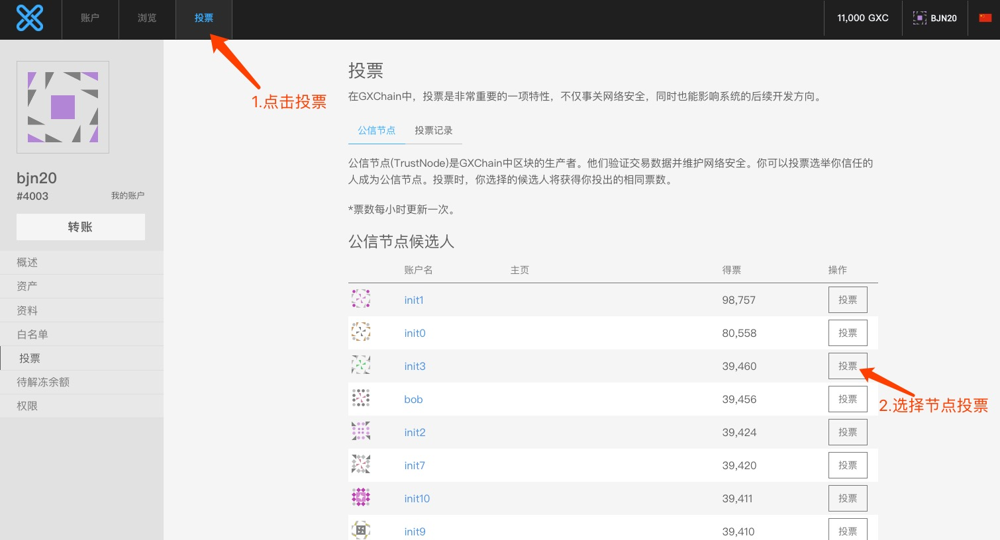
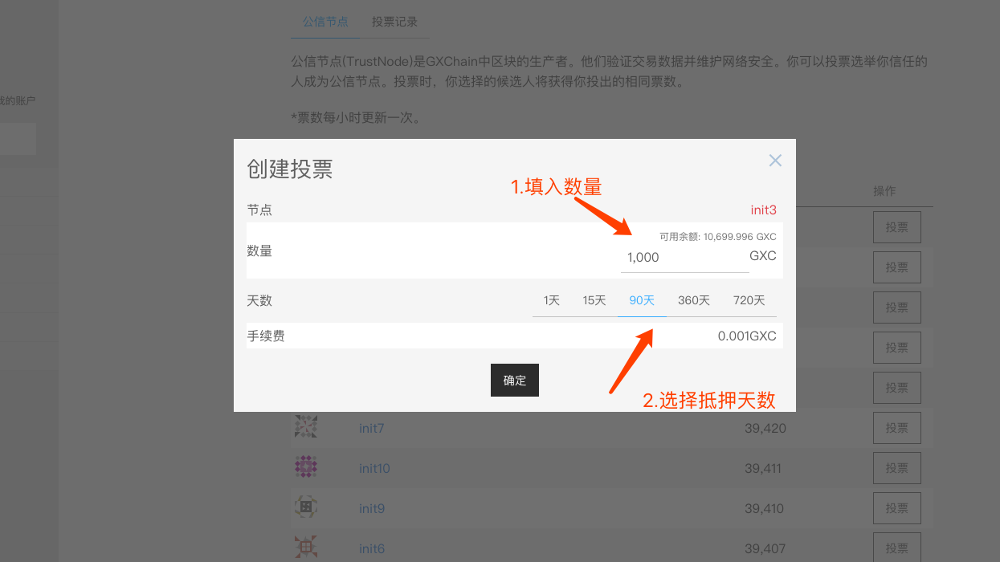
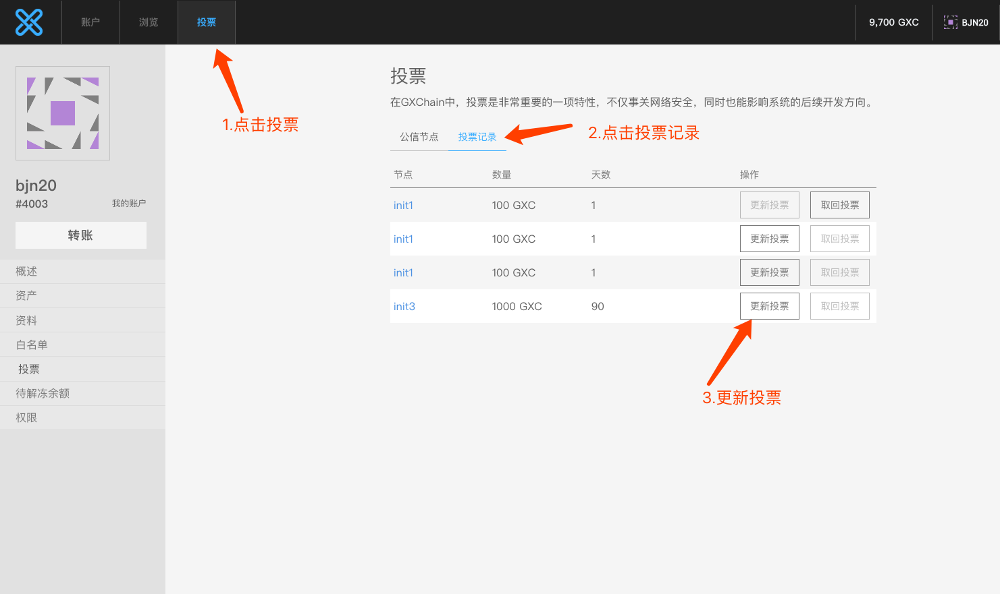
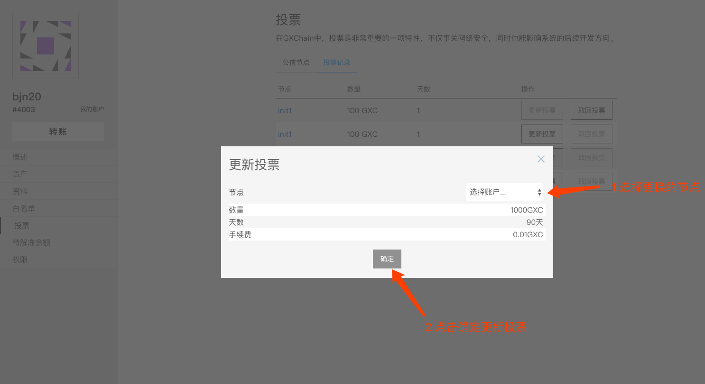
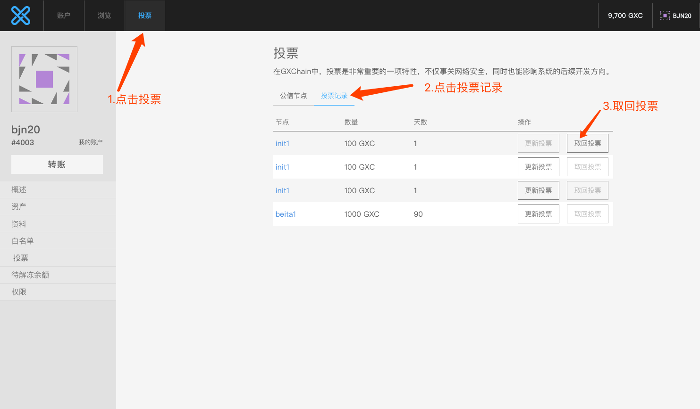
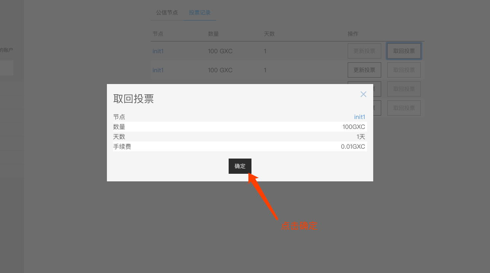
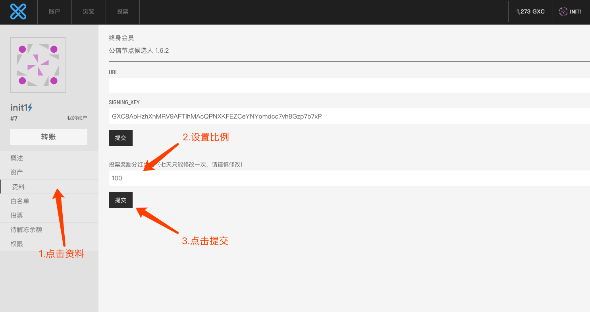
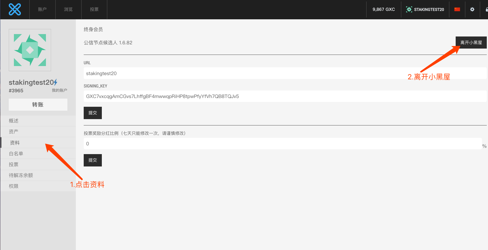
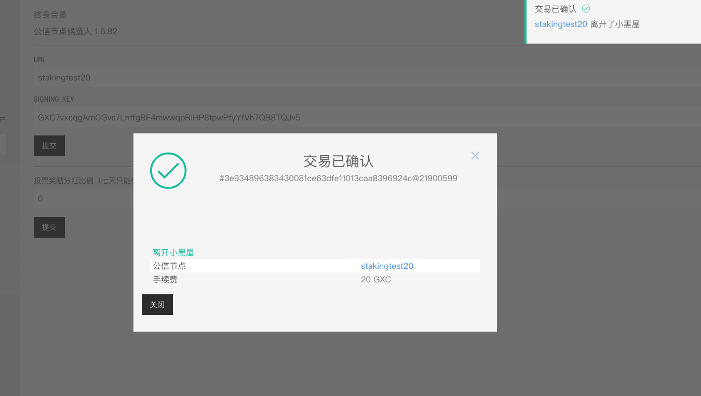

# Staking 投票教程

本文档简绍如何通过钱包进行关于staking投票的操作,以及公信节点关于staking的操作

## 1.创建staking投票
### 1.1 使用网页钱包
访问[公信宝网页钱包](https://wallet.gxb.io),导入私钥, 按下图创建投票




一个账号最多可以创建10次抵押投票,如果要创建新的抵押投票,需将之前的投票取回

### 1.2 使用cli_wallet
启动最新的`cli_wallet`
- [cli_wallet使用教程](./cli_wallet.md)

使用`cli_wallet`工具创建投票对象,具体命令如下

#### staking\_create
**接口定义：** `signed_transaction staking_create(account_id_type owner,
 asset amount, witness_id_type wit_id,string program_id,uint32_t weight,uint32_t days,bool broadcast = false)`

**功能说明：** 进行抵押投票,每个账户最多创建10次抵押投票,每次最少抵押1GXC,精度为100000

**参数：**

参数 | 类型 | 描述
---|---|---
owner | account_id_type | 抵押账户
amount | asset | 资产类型和数量
wit_id | witness_id_type | 投票节点
program_id | string | 投票类型
weight | uint32_t | 每票权重
days | uint32_t | 抵押天数
broadcast | bool | 是否广播

现在测试网有五种投票类型分别为
program_id | weight | days
---|---|---
1 | 1 | 90
2 | 2 | 360
3 | 4 | 720
4 | 1 | 15
5 | 1 | 1

在`cli_wallet`中使用以下命令查看
```bash
get_object 2.0.0
```

`program_id`,`weight`,`days`必须一一对应，否则无法生成抵押投票

**示例：**  
```bash 
unlocked >>> staking_create 1.2.4003 {"asset_id":1.3.1,"amount":10000000} 1.6.1 "5" 1 1 true
staking_create 1.2.4003 {"asset_id":1.3.1,"amount":10000000} 1.6.1 "5" 1 1 true
{
  "ref_block_num": 60329,
  "ref_block_prefix": 1685676398,
  "expiration": "2020-02-24T08:43:09",
  "operations": [[
      80,{
        "fee": {
          "amount": 100,
          "asset_id": "1.3.1"
        },
        "owner": "1.2.4003",
        "trust_node": "1.6.1",
        "amount": {
          "amount": 10000000,
          "asset_id": "1.3.1"
        },
        "program_id": "5",
        "weight": 1,
        "staking_days": 1,
        "extensions": []
      }
    ]
  ],
  "extensions": [],
  "signatures": [
    "1f1f862c111133bb8559448466457a1371b93fac2dd879641e8eeac585668ec0ab53302acce904bcf01f4282f7d86db1a309cec1c52b4899012b47fec925096c48"
  ]
}
```
这里由账户1.2.4003向公信节点1.6.1抵押投票了100GXC,投票类型为5,每票权重为1,抵押天数为1

## 2.更新staking投票

### 2.1 使用网页钱包



### 2.2 使用cli_wallet
使用`cli_wallet`工具更新投票对象,具体命令如下
#### staking\_update
**接口定义：** `signed_transaction staking_update(account_id_type owner,staking_id_type stak_id,
witness_id_type wit_id,bool broadcast)`

**功能说明：** 更新已经存在并未过期的抵押,为其更换抵押投票的节点

**参数：**

参数 | 类型 | 描述
---|---|---
owner | account_id_type | 抵押账户
stak_id | staking_id_type | 抵押对象id
wit_id | witness_id_type | 更换节点
broadcast | bool | 是否广播
**示例：**  
```bash 
unlocked >>> staking_update 1.2.4003 1.27.10135 1.6.2 true
staking_update 1.2.4003 1.27.10135 1.6.2 true
{
  "ref_block_num": 60677,
  "ref_block_prefix": 4124334596,
  "expiration": "2020-02-24T09:00:51",
  "operations": [[
      81,{
        "fee": {
          "amount": 100,
          "asset_id": "1.3.1"
        },
        "owner": "1.2.4003",
        "trust_node": "1.6.2",
        "staking_id": "1.27.10135",
        "extensions": []
      }
    ]
  ],
  "extensions": [],
  "signatures": [
    "2077cdda0c83a371a5f5179ea6d1a5a003c5b4a4eb88fb6fa9c7040b741cda7ece650d50c34187d2610a3ee62fcda20a0a1325ee931286484e91f3be9e8f53f5f6"
  ]
}
```
这里将1.2.4003账户持有的抵押投票对象1.27.10135从节点1.6.1更新抵押到节点1.6.2

## 3.取回staking投票
### 3.1 使用网页钱包


### 3.2 使用cli_wallet
使用`cli_wallet`工具取回投票对象,具体命令如下
#### staking\_claim
**接口定义：** `signed_transaction staking_claim(account_id_type owner,staking_id_type stak_id,bool broadcast)`

**功能说明：** 取回存在并已经到期的抵押

**参数：**

参数 | 类型 | 描述
---|---|---
owner | account_id_type | 抵押账户
stak_id | staking_id_type | 抵押对象id
broadcast | bool | 是否广播


**示例：**  
```bash 
unlocked >>> staking_claim 1.2.22 1.27.63 true
staking_claim 1.2.22 1.27.63 true
{
  "ref_block_num": 61110,
  "ref_block_prefix": 2114490568,
  "expiration": "2020-02-24T09:22:48",
  "operations": [[
      82,{
        "fee": {
          "amount": 100,
          "asset_id": "1.3.1"
        },
        "owner": "1.2.22",
        "staking_id": "1.27.63",
        "extensions": []
      }
    ]
  ],
  "extensions": [],
  "signatures": [
    "1f78d527787651dbc77e27b94fd0c41449551899467ee110ded3fe8a04237d117413182a744778a8af45c8f8243ff5d4720a62bda2c1e721d3b12d11d5bd6e322f"
  ]
}
```
这里将1.2.22账户持有的抵押投票对象1.27.63取回

## 4.节点设置投票分红奖励

### 4.1 使用网页钱包

### 4.2 使用cli_wallet
使用`cli_wallet`工具设置分红比例,具体命令如下
#### witness_set_commission
**接口定义：** `signed_transaction witness_set_commission(string witness_name,
uint32_t commission_rate,string fee_asset_symbol,bool broadcast)`

**功能说明：** 节点设置投票分红奖励

**参数：**

参数 | 类型 | 描述
---|---|---
witness_name | string | 节点名字
commission_rate | uint32_t | 分红比例
fee_asset_symbol | string | 分红资产
broadcast | bool | 是否广播

分红比例为[0,1000]‰,设置时间间隔为604800s,设置一次手续费为20GXC

**示例：**  
```bash 
unlocked >>> witness_set_commission 1.6.1 751 GXC true
witness_set_commission 1.6.1 751 GXC true
{
  "ref_block_num": 61371,
  "ref_block_prefix": 3908095067,
  "expiration": "2020-02-24T09:36:00",
  "operations": [[
      83,{
        "fee": {
          "amount": 2000000,
          "asset_id": "1.3.1"
        },
        "witness": "1.6.1",
        "witness_account": "1.2.6",
        "commission_rate": 751,
        "extensions": []
      }
    ]
  ],
  "extensions": [],
  "signatures": [
    "200f64822acee6fecb610fbfdf7d348739497ce04a3e9a70f42c5a0ecc4ad0977f38a8391ea42fee2894eb9f1419188b19326a7fa981fafd873cbbf0c286388ff9"
  ]
}
```
这里节点1.6.1将分红比例调整为751‰(75.1％)

## 5.节点解禁

### 5.1 使用网页钱包



### 5.2 使用cli_wallet
使用`cli_wallet`工具解除被禁止的节点,具体命令如下
#### witness_unbanned

**接口定义：** `signed_transaction witness_unbanned(string witness_name,string fee_asset_symbol,bool broadcast)`

**功能说明：** 节点解禁

**参数：**

参数 | 类型 | 描述
---|---|---
witness_name | string | 节点名字
fee_asset_symbol | string | 解禁资产
broadcast | bool | 是否广播

一个在出块队列中的节点，如果一段时间内丢失区块过多，就会被禁止，解禁一个节点需要20GXC 

**示例：**  
```bash 
unlocked >>> witness_unbanned stakingtest20 GXC true
witness_unbanned stakingtest20 GXC true
{
  "ref_block_num": 61738,
  "ref_block_prefix": 630819173,
  "expiration": "2020-02-24T09:54:39",
  "operations": [[
      84,{
        "fee": {
          "amount": 2000000,
          "asset_id": "1.3.1"
        },
        "witness": "1.6.82",
        "witness_account": "1.2.3965",
        "extensions": []
      }
    ]
  ],
  "extensions": [],
  "signatures": [
    "1f566a75da026321e47be96d2052533181bdcf75e52e4bdd4c35ec64444341a75c15bb4a4028dc1a540f03533c716fbf07a711a523621e9139acd463fb0aa8300c"
  ]
}
```
这里将被禁止的节点1.6.82解禁


